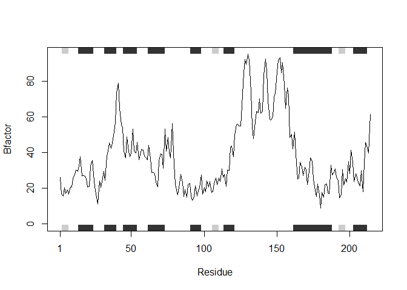

Homework for class 6
================
Emily Kimball
10/17/2019

``` r
# Can you improve this analysis code?
library(bio3d)
s1 <- read.pdb("4AKE") # kinase with drug
```

    ##   Note: Accessing on-line PDB file

``` r
s2 <- read.pdb("1AKE") # kinase no drug
```

    ##   Note: Accessing on-line PDB file
    ##    PDB has ALT records, taking A only, rm.alt=TRUE

``` r
s3 <- read.pdb("1E4Y") # kinase with drug
```

    ##   Note: Accessing on-line PDB file

``` r
s1.chainA <- trim.pdb(s1, chain="A", elety="CA")
s2.chainA <- trim.pdb(s2, chain="A", elety="CA")
s3.chainA <- trim.pdb(s3, chain="A", elety="CA")
s1.b <- s1.chainA$atom$b
s2.b <- s2.chainA$atom$b
s3.b <- s3.chainA$atom$b
plotb3(s1.b, sse=s1.chainA, typ="l", ylab="Bfactor")
```

<!-- -->

``` r
plotb3(s2.b, sse=s2.chainA, typ="l", ylab="Bfactor")
```

<!-- -->

``` r
plotb3(s3.b, sse=s3.chainA, typ="l", ylab="Bfactor")
```

<!-- --> \`\`

``` r
auto <- function(x, chain_choice = "A"){
  s1 <- read.pdb(x)
  s1.chainA <- trim.pdb(s1, chain = chain_choice, elety = "CA")
  s1.b <- s1.chainA$atom$b
  plotb3(s1.b, sse = s1.chainA, typ = "l", ylab = "Bfactor")
}
```

``` r
auto("4AKE",chain_choice = "B")
```

    ##   Note: Accessing on-line PDB file

    ## Warning in get.pdb(file, path = tempdir(), verbose = FALSE): C:
    ## \Users\EMILYK~1\AppData\Local\Temp\Rtmpk7oB8f/4AKE.pdb exists. Skipping
    ## download

<!-- -->

\#make a working snippet
