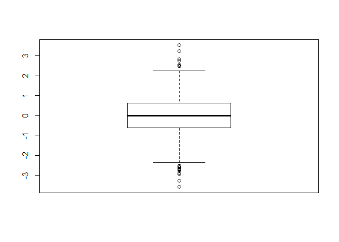
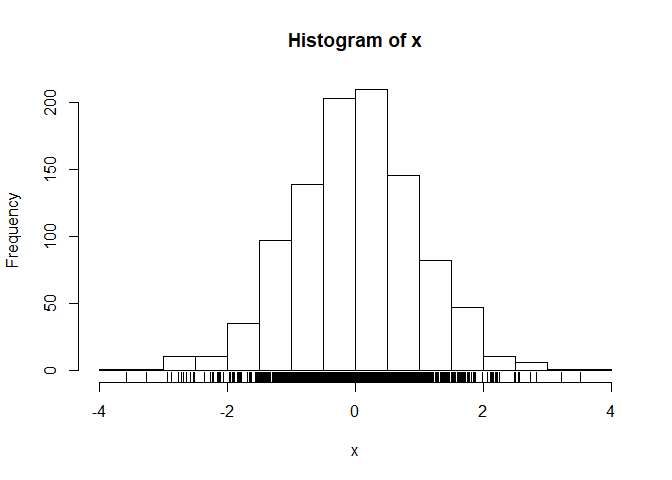
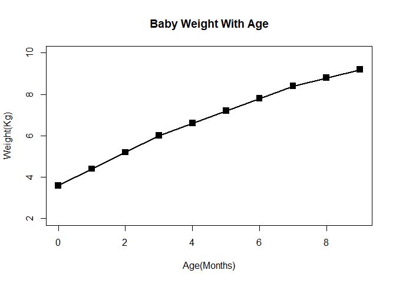
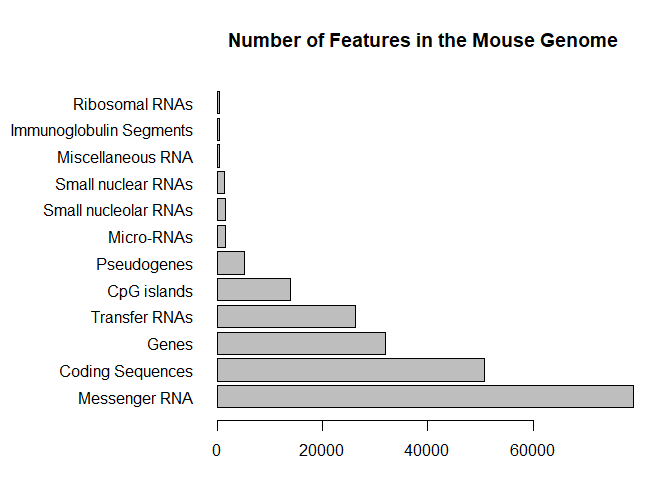

Class 5 R
================
Emily Kimball
October 15 2019

``` r
# Class5 Data visualization 
x <- rnorm(1000)
mean(x)
```

    ## [1] -0.005061789

``` r
sd(x) 
```

    ## [1] 0.9897556

``` r
# dont put any spaces at the beggining otherwise code wont run  
summary(x)
```

    ##      Min.   1st Qu.    Median      Mean   3rd Qu.      Max. 
    ## -3.568643 -0.607066  0.007969 -0.005062  0.628042  3.524518

``` r
boxplot(x)
```

<!-- -->

``` r
hist(x)
rug(x)
```

<!-- -->

``` r
# run function shows the tassels at the end to show where the data lies 

# start of in class work 


baby <- read.table("bimm143_05_rstats/weight_chart.txt", header = T)
baby
```

    ##    Age Weight
    ## 1    0    3.6
    ## 2    1    4.4
    ## 3    2    5.2
    ## 4    3    6.0
    ## 5    4    6.6
    ## 6    5    7.2
    ## 7    6    7.8
    ## 8    7    8.4
    ## 9    8    8.8
    ## 10   9    9.2

``` r
# getting the graph to have lines and plots 
#pch makes squares, cex makes the dots bigger
plot(baby$Age, baby$Weight, type = "o", pch = 15, cex = 1.5, lwd = 2, ylim = c(2, 10), xlab = "Age(Months)", ylab = "Weight(Kg)", main = "Baby Weight With Age")
```

<!-- -->

``` r
#making a bar graph look at the differences in how the data is inputted
#sep "/t" is tab, read.delim takes acount to all the features we put in the baby plot
mouse <- read.delim("bimm143_05_rstats/feature_counts.txt")
par(mar=c(3.1,11.1,4.1,2))
barplot(mouse$Count, names.arg = mouse$Feature, horiz = TRUE, las = 1,
        main = "Number of Features in the Mouse Genome")
```

<!-- -->

``` r
#adding color to the graphs 
#col = rainbow(10) will give the rainbow colors 
#margins are too large error, to fix click the broom on the plots page
# this givees the rainbow plot  col=rainbow(nrow(male)), 

Male <- read.delim("bimm143_05_rstats/male_female_counts.txt")

barplot(Male$Count, names.arg=Male$Sample, col=c("blue2", "red2"), 
        las=2, ylab="Counts")
```

<!-- -->

``` r
# last part 
updown <- read.delim("bimm143_05_rstats/up_down_expression.txt")
updown
```

    ##                    Gene  Condition1  Condition2      State
    ## 1                 A4GNT -3.68086100 -3.44013550 unchanging
    ## 2                  AAAS  4.54795800  4.38641260 unchanging
    ## 3                 AASDH  3.71906950  3.47872760 unchanging
    ## 4                  AATF  5.07847200  5.01519160 unchanging
    ## 5                  AATK  0.47114208  0.55986420 unchanging
    ## 6            AB015752.4 -3.68086100 -3.59213900 unchanging
    ## 7                 ABCA7  3.44842200  3.82665090 unchanging
    ## 8             ABCA9-AS1 -3.68086100 -3.59213900 unchanging
    ## 9                ABCC11 -3.52885800 -1.85517320 unchanging
    ## 10                ABCC3  0.93057376  3.26030400         up
    ## 11                ABCC5  4.60042520  5.49944350         up
    ## 12            ABCC5-AS1 -3.68086100 -3.44013550 unchanging
    ## 13              ABCC6P1 -0.72150310 -0.27021074 unchanging
    ## 14                ABCD1  2.68059560  3.38004300 unchanging
    ## 15               ABHD11  4.41365600  3.95218160 unchanging
    ## 16               ABI3BP -1.20692980 -3.59213900 unchanging
    ## 17                 ABL1  6.35836200  6.08146500 unchanging
    ## 18               ABLIM2 -1.94389530 -1.11820770 unchanging
    ## 19                  ABO -3.68086100 -3.59213900 unchanging
    ## 20                 ABP1 -3.68086100 -3.59213900 unchanging
    ## 21                ABTB2  0.55860496  0.46675485 unchanging
    ## 22           AC000036.4 -3.68086100 -3.59213900 unchanging
    ## 23           AC000123.4 -2.52885800 -2.44013570 unchanging
    ## 24           AC002064.5 -3.68086100 -3.59213900 unchanging
    ## 25           AC002115.7 -3.68086100 -3.59213900 unchanging
    ## 26           AC002306.1 -3.68086100 -1.85517320 unchanging
    ## 27           AC002401.1  0.86345950  1.01929580 unchanging
    ## 28           AC002456.2 -3.68086100 -3.59213900 unchanging
    ## 29           AC002467.7 -1.52885800 -1.44013570 unchanging
    ## 30          AC002472.13 -3.68086100 -3.59213900 unchanging
    ## 31           AC002472.9 -1.94389530  0.01929582 unchanging
    ## 32           AC002480.4 -3.68086100 -3.59213900 unchanging
    ## 33           AC002553.1 -3.68086100 -3.59213900 unchanging
    ## 34           AC002992.4 -3.68086100 -3.59213900 unchanging
    ## 35           AC003077.1 -3.68086100 -3.59213900 unchanging
    ## 36           AC003084.2 -3.68086100 -3.59213900 unchanging
    ## 37           AC003088.1 -3.68086100 -3.59213900 unchanging
    ## 38           AC003665.1  0.27849698  0.55986420 unchanging
    ## 39           AC004009.3 -3.68086100 -3.59213900 unchanging
    ## 40           AC004012.1 -3.68086100 -3.59213900 unchanging
    ## 41           AC004014.3 -3.68086100 -3.59213900 unchanging
    ## 42           AC004051.2 -3.68086100 -3.59213900 unchanging
    ## 43           AC004054.1 -3.68086100 -3.59213900 unchanging
    ## 44           AC004223.1  2.19906260  2.05171730 unchanging
    ## 45           AC004231.2  0.37803268 -1.11820770 unchanging
    ## 46           AC004383.5 -3.68086100 -3.59213900 unchanging
    ## 47           AC004448.6 -3.68086100 -3.59213900 unchanging
    ## 48           AC004741.4 -3.52885800 -3.44013550 unchanging
    ## 49           AC004744.3 -3.68086100 -3.59213900 unchanging
    ## 50           AC004837.4 -3.68086100 -3.59213900 unchanging
    ## 51           AC004837.5 -3.68086100 -3.59213900 unchanging
    ## 52           AC004862.6 -3.68086100 -3.59213900 unchanging
    ## 53           AC004869.3 -3.68086100 -3.59213900 unchanging
    ## 54           AC004870.4 -0.20692979 -3.44013550 unchanging
    ## 55           AC004876.1 -3.68086100 -3.59213900 unchanging
    ## 56           AC005003.1  0.27849698  0.88179230 unchanging
    ## 57           AC005008.2 -3.68086100 -3.59213900 unchanging
    ## 58           AC005029.1 -3.68086100 -3.59213900 unchanging
    ## 59           AC005154.5 -1.94389530 -1.44013570 unchanging
    ## 60           AC005276.1 -3.68086100 -3.59213900 unchanging
    ## 61           AC005281.2 -3.68086100 -3.59213900 unchanging
    ## 62           AC005304.1 -3.68086100 -3.59213900 unchanging
    ## 63           AC005304.2 -1.20692980 -1.11820770 unchanging
    ## 64           AC005484.5  2.35378530  2.41784500 unchanging
    ## 65           AC005519.4 -1.20692980 -0.11820772 unchanging
    ## 66           AC005522.7 -3.52885800 -3.59213900 unchanging
    ## 67           AC005534.8 -3.68086100 -1.85517320 unchanging
    ## 68           AC005550.3 -3.68086100 -3.59213900 unchanging
    ## 69           AC005592.1 -3.68086100 -3.59213900 unchanging
    ## 70           AC005594.1  0.99470407  1.14482670 unchanging
    ## 71          AC005609.17 -2.52885800 -3.44013550 unchanging
    ## 72           AC005703.2 -3.68086100 -3.59213900 unchanging
    ## 73           AC005895.4 -3.68086100 -3.59213900 unchanging
    ## 74           AC006116.1 -3.52885800 -1.85517320 unchanging
    ## 75           AC006156.1 -3.68086100 -3.59213900 unchanging
    ## 76           AC006156.2 -3.68086100 -3.59213900 unchanging
    ## 77           AC006157.2 -3.68086100 -3.59213900 unchanging
    ## 78           AC006159.3 -3.68086100 -3.59213900 unchanging
    ## 79           AC006262.2 -3.52885800 -3.44013550 unchanging
    ## 80           AC006271.2 -3.68086100 -3.59213900 unchanging
    ## 81           AC006372.1 -3.68086100 -3.59213900 unchanging
    ## 82           AC006378.3 -3.68086100 -3.59213900 unchanging
    ## 83           AC006445.1 -3.68086100 -3.59213900 unchanging
    ## 84           AC006482.1 -3.68086100 -3.59213900 unchanging
    ## 85          AC006547.13  0.47114208  1.14482670 unchanging
    ## 86          AC006946.15 -3.52885800 -3.44013550 unchanging
    ## 87           AC007099.2 -3.68086100 -3.59213900 unchanging
    ## 88           AC007163.6 -3.68086100 -3.59213900 unchanging
    ## 89           AC007255.7 -0.35893290 -1.11820770 unchanging
    ## 90           AC007275.2 -3.68086100 -3.59213900 unchanging
    ## 91           AC007278.3 -3.68086100 -3.59213900 unchanging
    ## 92           AC007285.6 -3.52885800 -3.59213900 unchanging
    ## 93           AC007365.3 -3.68086100 -3.59213900 unchanging
    ## 94           AC007403.2 -3.68086100 -3.59213900 unchanging
    ## 95           AC007405.8 -2.52885800 -3.59213900 unchanging
    ## 96           AC007563.5  0.17158182  0.95218160 unchanging
    ## 97           AC007731.1 -3.68086100 -0.85517323 unchanging
    ## 98           AC007879.2 -3.68086100 -3.59213900 unchanging
    ## 99           AC007879.3 -3.68086100 -3.59213900 unchanging
    ## 100          AC007879.7 -3.68086100 -3.59213900 unchanging
    ## 101          AC007920.1 -3.68086100 -3.59213900 unchanging
    ## 102          AC007952.1 -3.68086100 -3.59213900 unchanging
    ## 103          AC007952.5 -3.52885800 -3.59213900 unchanging
    ## 104          AC007956.1  0.79307020  0.88179230 unchanging
    ## 105          AC007970.1 -3.68086100 -3.44013550 unchanging
    ## 106          AC008069.1 -3.68086100 -3.59213900 unchanging
    ## 107          AC008069.3 -3.68086100 -3.59213900 unchanging
    ## 108          AC008073.9 -3.68086100 -3.59213900 unchanging
    ## 109          AC008103.5  1.05610470  1.41784510 unchanging
    ## 110          AC008163.4 -3.68086100 -3.59213900 unchanging
    ## 111          AC008268.1 -3.68086100 -3.59213900 unchanging
    ## 112          AC008278.3 -3.68086100 -3.59213900 unchanging
    ## 113          AC008440.5  2.25250170  2.62595340 unchanging
    ## 114          AC009110.1 -3.68086100 -3.59213900 unchanging
    ## 115          AC009113.1  3.30403180  3.11445300 unchanging
    ## 116          AC009133.1  5.74726700  5.79587840 unchanging
    ## 117          AC009229.6 -3.68086100 -3.59213900 unchanging
    ## 118          AC009232.2 -3.68086100 -3.59213900 unchanging
    ## 119          AC009312.1 -3.68086100 -3.59213900 unchanging
    ## 120          AC009505.4 -3.68086100 -3.59213900 unchanging
    ## 121          AC009508.1 -3.68086100 -3.59213900 unchanging
    ## 122          AC009784.3 -3.68086100 -3.59213900 unchanging
    ## 123          AC010105.1 -3.68086100 -3.59213900 unchanging
    ## 124          AC010136.2 -3.68086100 -3.59213900 unchanging
    ## 125          AC010336.2  3.75654440  3.63668000 unchanging
    ## 126          AC010547.1 -3.52885800 -3.44013550 unchanging
    ## 127          AC010606.1 -3.68086100 -3.59213900 unchanging
    ## 128          AC010723.1 -3.68086100 -3.59213900 unchanging
    ## 129          AC010729.1 -3.68086100 -3.59213900 unchanging
    ## 130          AC010733.4 -3.52885800 -3.59213900 unchanging
    ## 131          AC010883.5 -0.52885790 -3.44013550 unchanging
    ## 132          AC010894.3 -1.94389530 -1.44013570 unchanging
    ## 133          AC010974.3 -3.68086100 -3.59213900 unchanging
    ## 134          AC010997.1 -3.68086100 -3.59213900 unchanging
    ## 135          AC011193.1 -3.68086100 -3.59213900 unchanging
    ## 136          AC011325.1 -3.68086100 -3.44013550 unchanging
    ## 137          AC011995.3 -3.68086100 -3.59213900 unchanging
    ## 138          AC011998.1 -3.68086100 -3.59213900 unchanging
    ## 139          AC012074.2 -3.68086100 -3.44013550 unchanging
    ## 140          AC012123.1  2.60042520  2.82665090 unchanging
    ## 141          AC012215.1  2.22602960  1.95218160 unchanging
    ## 142          AC012307.2 -3.68086100 -3.59213900 unchanging
    ## 143          AC012368.1 -3.68086100 -3.59213900 unchanging
    ## 144          AC012506.3 -3.68086100 -3.59213900 unchanging
    ## 145          AC012652.1  6.89635750  6.68010200 unchanging
    ## 146          AC012668.3 -3.68086100 -3.59213900 unchanging
    ## 147          AC013401.1 -3.52885800 -3.59213900 unchanging
    ## 148          AC013413.1 -3.68086100 -3.59213900 unchanging
    ## 149          AC013727.2 -3.68086100 -3.59213900 unchanging
    ## 150          AC015804.1 -3.68086100 -3.59213900 unchanging
    ## 151          AC015813.1 -3.68086100 -3.59213900 unchanging
    ## 152          AC015871.2  0.17158182  0.55986420 unchanging
    ## 153          AC015987.1  7.23019800  7.28948450 unchanging
    ## 154          AC016683.6  4.02573100  4.61514660 unchanging
    ## 155          AC016689.1 -3.68086100 -3.59213900 unchanging
    ## 156          AC016710.1 -3.68086100 -3.59213900 unchanging
    ## 157          AC016722.1 -3.68086100 -3.59213900 unchanging
    ## 158          AC016722.2 -3.68086100 -3.59213900 unchanging
    ## 159          AC016722.3 -3.68086100 -3.59213900 unchanging
    ## 160          AC016722.4  2.22602960  2.39275430 unchanging
    ## 161          AC016751.2 -3.68086100 -3.59213900 unchanging
    ## 162          AC016831.7 -3.68086100 -3.44013550 unchanging
    ## 163          AC016903.1 -3.68086100 -3.59213900 unchanging
    ## 164          AC017053.1 -3.68086100 -3.59213900 unchanging
    ## 165          AC017076.5 -3.68086100 -3.44013550 unchanging
    ## 166          AC017104.6 -3.68086100 -3.59213900 unchanging
    ## 167         AC017116.11 -1.20692980 -0.63278085 unchanging
    ## 168          AC018642.1  0.27849698  1.01929580 unchanging
    ## 169          AC018705.5 -3.68086100 -3.59213900 unchanging
    ## 170          AC018730.3 -3.52885800 -3.44013550 unchanging
    ## 171          AC018878.3 -3.68086100 -3.44013550 unchanging
    ## 172          AC019100.3 -3.52885800 -3.59213900 unchanging
    ## 173          AC019186.1 -3.68086100 -3.59213900 unchanging
    ## 174          AC019294.1 -3.68086100 -3.59213900 unchanging
    ## 175          AC019330.1 -3.68086100 -3.59213900 unchanging
    ## 176          AC019349.2 -3.68086100 -3.59213900 unchanging
    ## 177          AC020743.2 -3.68086100 -3.59213900 unchanging
    ## 178          AC020763.1 -1.52885800 -0.63278085 unchanging
    ## 179          AC021016.8 -3.68086100 -3.59213900 unchanging
    ## 180          AC021066.1  0.47114208  0.36721915 unchanging
    ## 181          AC021188.4 -3.68086100 -3.59213900 unchanging
    ## 182          AC021593.1  2.08585200  1.64732710 unchanging
    ## 183          AC022182.1 -3.68086100 -3.59213900 unchanging
    ## 184          AC022201.5 -0.94389530  0.14482673 unchanging
    ## 185          AC022431.2 -3.52885800 -3.59213900 unchanging
    ## 186          AC022431.3 -3.68086100 -3.59213900 unchanging
    ## 187          AC022596.1  1.05610470  1.64732710 unchanging
    ## 188          AC022884.1 -3.68086100 -3.59213900 unchanging
    ## 189          AC023469.2 -3.68086100 -3.59213900 unchanging
    ## 190          AC023672.2 -3.68086100 -3.59213900 unchanging
    ## 191          AC023797.1 -3.68086100 -3.44013550 unchanging
    ## 192          AC024580.1 -1.52885800  1.01929580 unchanging
    ## 193          AC024592.1 -3.68086100 -3.59213900 unchanging
    ## 194          AC026188.1 -3.68086100 -3.59213900 unchanging
    ## 195          AC026703.1  0.37803268  0.64732707 unchanging
    ## 196          AC034207.1 -1.20692980 -0.85517323 unchanging
    ## 197          AC034220.3  0.55860496  0.46675485 unchanging
    ## 198          AC058791.2 -2.52885800 -0.27021074 unchanging
    ## 199          AC062020.1 -3.68086100 -3.59213900 unchanging
    ## 200          AC062021.1 -3.68086100 -3.59213900 unchanging
    ## 201          AC062032.1 -3.68086100 -3.59213900 unchanging
    ## 202          AC064834.1 -3.68086100 -3.59213900 unchanging
    ## 203          AC064871.3 -0.94389530 -1.11820770 unchanging
    ## 204          AC064874.1 -3.68086100 -3.59213900 unchanging
    ## 205          AC067959.1 -3.68086100 -3.59213900 unchanging
    ## 206          AC067960.1 -3.68086100 -3.59213900 unchanging
    ## 207          AC068057.2 -3.68086100 -3.59213900 unchanging
    ## 208          AC068280.1 -3.68086100 -3.59213900 unchanging
    ## 209          AC068542.1 -3.68086100 -3.59213900 unchanging
    ## 210          AC068580.5 -3.68086100 -3.59213900 unchanging
    ## 211          AC068831.8  4.29769040  3.95218160 unchanging
    ## 212          AC069277.2 -3.52885800 -2.44013570 unchanging
    ## 213          AC069363.1 -3.68086100 -3.59213900 unchanging
    ## 214          AC069394.1 -3.68086100 -3.59213900 unchanging
    ## 215          AC069513.3  2.53723120  2.44250750 unchanging
    ## 216          AC072062.3 -3.68086100 -3.59213900 unchanging
    ## 217          AC073071.1 -3.68086100 -3.59213900 unchanging
    ## 218          AC073072.5 -3.52885800 -3.59213900 unchanging
    ## 219          AC073130.3 -3.68086100 -3.44013550 unchanging
    ## 220          AC073133.2 -3.68086100 -3.59213900 unchanging
    ## 221          AC073218.1 -3.68086100 -3.59213900 unchanging
    ## 222          AC073218.3 -3.68086100 -3.59213900 unchanging
    ## 223          AC073343.1  1.64106700  1.68914720 unchanging
    ## 224          AC073610.1  5.85052000  5.93055150 unchanging
    ## 225          AC073626.2 -3.68086100 -3.59213900 unchanging
    ## 226          AC073636.1 -3.68086100 -3.59213900 unchanging
    ## 227          AC073934.6 -3.68086100 -3.59213900 unchanging
    ## 228          AC074286.1  0.99470407  1.01929580 unchanging
    ## 229          AC074389.5 -3.68086100 -3.59213900 unchanging
    ## 230          AC074391.1 -3.68086100 -3.59213900 unchanging
    ## 231          AC078799.1 -3.68086100 -0.27021074 unchanging
    ## 232          AC078851.1 -3.68086100 -3.59213900 unchanging
    ## 233          AC078852.1 -3.68086100 -3.59213900 unchanging
    ## 234          AC078942.1 -3.68086100 -3.59213900 unchanging
    ## 235          AC079062.1  4.36595960  4.27411000 unchanging
    ## 236          AC079117.1 -3.68086100 -3.59213900 unchanging
    ## 237          AC079305.8 -3.68086100 -3.59213900 unchanging
    ## 238          AC079612.2 -3.68086100 -3.59213900 unchanging
    ## 239          AC079767.2  3.21260900  3.28778480 unchanging
    ## 240          AC079790.2 -3.68086100 -3.44013550 unchanging
    ## 241          AC079807.4 -3.68086100 -3.59213900 unchanging
    ## 242          AC083862.1 -3.68086100 -3.59213900 unchanging
    ## 243          AC083864.3 -3.68086100 -3.59213900 unchanging
    ## 244          AC084018.1 -3.68086100 -3.59213900 unchanging
    ## 245          AC084018.1  1.89740680  2.11445300 unchanging
    ## 246          AC084082.3 -3.68086100 -3.59213900 unchanging
    ## 247          AC084851.1 -3.68086100 -3.44013550 unchanging
    ## 248          AC087289.1  0.37803268  0.88179230 unchanging
    ## 249          AC087590.3  4.47114200  4.84063500 unchanging
    ## 250          AC087859.1 -3.52885800 -2.44013570 unchanging
    ## 251          AC090044.2 -3.68086100 -3.59213900 unchanging
    ## 252          AC090164.1 -3.68086100 -3.59213900 unchanging
    ## 253          AC090286.4 -3.68086100 -3.59213900 unchanging
    ## 254          AC090939.1 -1.52885800 -1.11820770 unchanging
    ## 255          AC090952.5 -3.68086100 -3.59213900 unchanging
    ## 256          AC091177.1 -1.94389530 -0.27021074 unchanging
    ## 257          AC091609.1 -0.94389530 -0.44013572 unchanging
    ## 258          AC091729.7 -3.68086100 -3.59213900 unchanging
    ## 259          AC091814.3 -3.68086100 -3.59213900 unchanging
    ## 260          AC091878.1  0.64106710  0.64732707 unchanging
    ## 261          AC091969.1 -3.68086100 -3.59213900 unchanging
    ## 262          AC092067.1 -3.68086100 -3.59213900 unchanging
    ## 263          AC092070.1 -3.68086100 -3.59213900 unchanging
    ## 264          AC092117.1 -3.52885800 -0.85517323 unchanging
    ## 265          AC092159.2 -1.20692980 -0.27021074 unchanging
    ## 266         AC092214.10 -3.52885800 -3.59213900 unchanging
    ## 267          AC092275.1 -3.68086100 -3.44013550 unchanging
    ## 268          AC092594.1 -3.52885800 -3.44013550 unchanging
    ## 269          AC092619.1 -3.68086100 -3.59213900 unchanging
    ## 270          AC092635.1 -3.68086100 -3.59213900 unchanging
    ## 271          AC092660.1 -3.68086100 -3.59213900 unchanging
    ## 272          AC092661.1 -3.68086100 -3.59213900 unchanging
    ## 273          AC093162.2 -3.52885800 -1.44013570 unchanging
    ## 274          AC093415.3 -3.68086100 -3.59213900 unchanging
    ## 275          AC093627.8 -3.68086100 -3.59213900 unchanging
    ## 276          AC093639.1 -3.68086100 -3.59213900 unchanging
    ## 277         AC093734.14 -1.94389530 -0.63278085 unchanging
    ## 278          AC093822.1 -3.68086100 -3.59213900 unchanging
    ## 279          AC093838.7 -3.68086100 -0.44013572 unchanging
    ## 280          AC096559.1 -3.68086100 -3.59213900 unchanging
    ## 281         AC096579.13 -3.52885800 -3.44013550 unchanging
    ## 282          AC096669.2 -3.68086100 -3.59213900 unchanging
    ## 283          AC097381.1 -3.68086100 -3.44013550 unchanging
    ## 284          AC097382.5 -3.68086100 -3.59213900 unchanging
    ## 285          AC097468.4 -3.68086100 -3.59213900 unchanging
    ## 286          AC097468.5 -3.68086100 -3.59213900 unchanging
    ## 287          AC097468.7 -3.68086100 -3.59213900 unchanging
    ## 288          AC097495.2 -3.68086100 -3.59213900 unchanging
    ## 289          AC097532.2 -3.68086100 -3.59213900 unchanging
    ## 290          AC097713.3 -3.68086100 -3.59213900 unchanging
    ## 291          AC097713.4 -3.68086100 -3.59213900 unchanging
    ## 292          AC098617.1 -3.68086100 -3.44013550 unchanging
    ## 293          AC098617.2 -3.68086100 -3.44013550 unchanging
    ## 294          AC098820.3 -1.52885800 -3.44013550 unchanging
    ## 295          AC098820.4 -3.68086100 -3.59213900 unchanging
    ## 296          AC098973.2 -3.68086100 -3.59213900 unchanging
    ## 297          AC099344.2 -3.68086100 -3.59213900 unchanging
    ## 298          AC099489.1 -3.68086100 -3.44013550 unchanging
    ## 299          AC100748.2  1.64106700  1.46675490 unchanging
    ## 300          AC100830.3 -3.68086100 -1.85517320 unchanging
    ## 301          AC103705.1 -3.68086100 -3.59213900 unchanging
    ## 302          AC103710.1 -3.68086100 -3.59213900 unchanging
    ## 303          AC103810.1  0.79307020  1.41784510 unchanging
    ## 304          AC103876.1 -3.68086100 -3.59213900 unchanging
    ## 305          AC104076.3 -3.52885800 -3.59213900 unchanging
    ## 306          AC104113.3 -0.35893290  0.26030394 unchanging
    ## 307          AC104135.4 -3.52885800 -2.44013570 unchanging
    ## 308          AC104537.1 -3.68086100 -3.59213900 unchanging
    ## 309          AC104654.1 -3.68086100 -3.59213900 unchanging
    ## 310          AC104655.3 -1.94389530 -3.44013550 unchanging
    ## 311          AC104777.4 -3.68086100 -3.59213900 unchanging
    ## 312          AC104809.3 -3.68086100 -3.59213900 unchanging
    ## 313          AC104809.4 -3.52885800 -3.59213900 unchanging
    ## 314          AC104942.1  1.68059550  2.08342620 unchanging
    ## 315          AC105052.1 -2.52885800 -1.85517320 unchanging
    ## 316          AC105339.1 -3.68086100 -3.59213900 unchanging
    ## 317          AC105344.2 -3.52885800 -3.59213900 unchanging
    ## 318          AC105398.3 -3.68086100 -3.59213900 unchanging
    ## 319          AC105750.1 -3.68086100 -3.59213900 unchanging
    ## 320          AC105760.2 -0.94389530 -1.44013570 unchanging
    ## 321          AC106876.2 -3.68086100 -3.59213900 unchanging
    ## 322          AC107218.3 -3.68086100 -3.44013550 unchanging
    ## 323          AC108004.2 -3.68086100 -3.59213900 unchanging
    ## 324          AC108056.1 -3.68086100 -3.59213900 unchanging
    ## 325          AC108134.2 -3.68086100 -3.59213900 unchanging
    ## 326          AC108676.1 -3.52885800 -3.59213900 unchanging
    ## 327          AC108938.5  3.60042520  3.69941570 unchanging
    ## 328          AC109309.4 -3.68086100 -3.59213900 unchanging
    ## 329          AC109326.1 -3.68086100 -3.44013550 unchanging
    ## 330          AC109460.2 -3.52885800 -2.44013570 unchanging
    ## 331          AC110781.5 -3.68086100 -3.59213900 unchanging
    ## 332          AC112229.7  2.99470400  3.35428020 unchanging
    ## 333          AC113607.1 -3.68086100 -3.59213900 unchanging
    ## 334          AC113607.3 -3.68086100 -3.59213900 unchanging
    ## 335         AC114730.11  0.05610465 -0.11820772 unchanging
    ## 336          AC114730.5 -3.68086100 -3.59213900 unchanging
    ## 337          AC114730.8 -2.52885800 -3.59213900 unchanging
    ## 338          AC114803.3 -3.68086100 -3.59213900 unchanging
    ## 339          AC114808.2 -3.68086100 -3.59213900 unchanging
    ## 340          AC114813.1 -3.68086100 -3.59213900 unchanging
    ## 341          AC114814.3 -3.68086100 -3.59213900 unchanging
    ## 342          AC116366.6 -1.52885800 -1.11820770 unchanging
    ## 343          AC116609.2 -3.68086100 -3.59213900 unchanging
    ## 344          AC118344.1  0.17158182 -0.85517323 unchanging
    ## 345          AC118754.4 -3.68086100 -3.59213900 unchanging
    ## 346          AC120498.2 -3.68086100 -3.59213900 unchanging
    ## 347          AC123023.1 -3.68086100 -3.59213900 unchanging
    ## 348          AC124789.1 -3.68086100 -3.59213900 unchanging
    ## 349          AC128709.2 -3.68086100 -3.59213900 unchanging
    ## 350          AC128709.4 -3.68086100 -3.59213900 unchanging
    ## 351          AC130689.5 -3.68086100 -3.59213900 unchanging
    ## 352          AC131971.3  5.06733200  4.92180820 unchanging
    ## 353          AC133485.1  2.25250170  1.14482670 unchanging
    ## 354          AC133528.2 -2.52885800 -1.11820770 unchanging
    ## 355          AC133633.2 -3.68086100 -3.59213900 unchanging
    ## 356          AC133680.1 -2.52885800 -3.59213900 unchanging
    ## 357          AC135050.2 -3.52885800 -0.63278085 unchanging
    ## 358          AC136940.1 -3.68086100 -3.59213900 unchanging
    ## 359          AC144525.1 -3.68086100 -3.59213900 unchanging
    ## 360          AC217773.1 -2.52885800 -3.59213900 unchanging
    ## 361          AC233264.5 -3.68086100 -3.59213900 unchanging
    ## 362               ACAT1  5.77948100  5.30805700 unchanging
    ## 363               ACBD4  1.17158190  1.14482670 unchanging
    ## 364               ACBD6  4.29769040  4.07556400 unchanging
    ## 365               ACCN1 -3.68086100 -3.59213900 unchanging
    ## 366                 ACE  0.55860496  0.72978930 unchanging
    ## 367                ACHE -3.68086100 -3.59213900 unchanging
    ## 368               ACIN1  6.95596500  6.92290350 unchanging
    ## 369                ACLY  6.94078350  7.01107550 unchanging
    ## 370               ACOT1 -2.52885800 -1.85517320 unchanging
    ## 371                ACPT -3.68086100 -3.59213900 unchanging
    ## 372               ACRBP  0.17158182 -0.85517323 unchanging
    ## 373               ACRV1 -1.52885800 -1.11820770 unchanging
    ## 374               ACSF2  3.57966640  3.82665090 unchanging
    ## 375               ACSL4  6.72617050  7.54428240 unchanging
    ## 376              ACSM2A -3.68086100 -3.59213900 unchanging
    ## 377               ACSM3  3.96299530  3.40535430 unchanging
    ## 378               ACSS1  4.97893670  3.92618630       down
    ## 379              ACTL7A -3.68086100 -3.59213900 unchanging
    ## 380               ACTL9 -3.68086100 -3.59213900 unchanging
    ## 381               ACTN1  6.48516230  6.79468150 unchanging
    ## 382              ACTR1B  4.88053270  4.62056000 unchanging
    ## 383              ACVR1B  5.56389900  5.79348370 unchanging
    ## 384                ACY1  2.49351000  2.55986430 unchanging
    ## 385              ADAM17  6.10049800  6.12019730 unchanging
    ## 386              ADAM19  4.99861900  5.01929570 unchanging
    ## 387              ADAM32 -1.94389530 -0.63278085 unchanging
    ## 388               ADAM6 -3.68086100 -3.59213900 unchanging
    ## 389             ADAMTS1  3.04099750  2.98612880 unchanging
    ## 390            ADAMTS14 -2.52885800 -3.44013550 unchanging
    ## 391            ADAMTS20 -3.68086100 -3.59213900 unchanging
    ## 392             ADAMTS5  0.37803268 -1.11820770 unchanging
    ## 393             ADAMTS7  2.82869400  2.08342620 unchanging
    ## 394            ADAMTSL4 -2.52885800  0.26030394 unchanging
    ## 395               ADCK4  3.47114200  3.43022900 unchanging
    ## 396               ADCY5  4.22602940  1.88179220       down
    ## 397               ADH1B -3.52885800 -3.59213900 unchanging
    ## 398                ADH4 -3.68086100 -3.59213900 unchanging
    ## 399             ADIPOR2  7.03719660  7.01313450 unchanging
    ## 400                ADM2  3.64106700  3.95218160 unchanging
    ## 401                ADSS  5.57443000  5.56267930 unchanging
    ## 402         AE000661.37 -2.52885800 -3.44013550 unchanging
    ## 403          AF003626.1 -3.68086100 -3.59213900 unchanging
    ## 404          AF015720.3 -3.68086100 -3.59213900 unchanging
    ## 405          AF064858.8 -2.52885800 -3.59213900 unchanging
    ## 406          AF131216.6  1.60042510  1.20372030 unchanging
    ## 407          AF131217.1 -3.68086100 -3.59213900 unchanging
    ## 408          AF178030.2 -3.68086100 -3.59213900 unchanging
    ## 409          AF196972.9 -3.52885800 -3.44013550 unchanging
    ## 410          AF240627.2 -3.68086100 -3.59213900 unchanging
    ## 411              AFG3L2  6.17677400  5.91080400 unchanging
    ## 412              AGAP10  3.72853000  4.08342650 unchanging
    ## 413               AGAP6  3.31663200  3.30133100 unchanging
    ## 414           AGBL5-AS1 -3.68086100 -3.59213900 unchanging
    ## 415                AGRN  7.79813300  8.03407800 unchanging
    ## 416               AGTR2 -3.68086100 -3.59213900 unchanging
    ## 417              AGTRAP  3.51553630  3.34122400 unchanging
    ## 418               AHDC1  3.88053300  3.73977350 unchanging
    ## 419                AHI1  4.07105500  4.26722340 unchanging
    ## 420               AHNAK  6.62848950  7.61175250         up
    ## 421              AHNAK2  3.65105100  5.18191600         up
    ## 422                AIG1  5.30403200  4.95218200 unchanging
    ## 423                AIRE -3.68086100 -3.59213900 unchanging
    ## 424          AJ239322.3 -3.68086100 -3.59213900 unchanging
    ## 425          AKAP11-IT1 -3.68086100 -3.59213900 unchanging
    ## 426             AKAP17A  3.61069350  3.62595320 unchanging
    ## 427             AKIRIN1  6.29927870  6.35428000 unchanging
    ## 428               AKTIP  4.67571300  4.73977330 unchanging
    ## 429          AL031780.1 -3.52885800 -1.44013570 unchanging
    ## 430          AL034372.1 -3.68086100 -3.59213900 unchanging
    ## 431          AL034548.1  4.69514370  4.64732740 unchanging
    ## 432          AL035541.1 -3.68086100 -3.59213900 unchanging
    ## 433          AL049840.1 -0.35893290  0.64732707 unchanging
    ## 434          AL078611.1  1.82869410  1.26030390 unchanging
    ## 435          AL078621.3 -3.68086100 -3.59213900 unchanging
    ## 436          AL096869.5 -3.68086100 -3.59213900 unchanging
    ## 437          AL109616.1 -3.52885800 -2.44013570 unchanging
    ## 438          AL109761.5 -0.35893290 -0.85517323 unchanging
    ## 439          AL109767.1 -3.68086100 -3.59213900 unchanging
    ## 440          AL117340.1 -3.68086100 -3.59213900 unchanging
    ## 441          AL121656.5 -3.68086100 -3.59213900 unchanging
    ## 442          AL132709.5 -3.68086100 -3.59213900 unchanging
    ## 443          AL132709.7 -3.68086100 -3.59213900 unchanging
    ## 444          AL132709.8 -3.68086100 -3.59213900 unchanging
    ## 445          AL136307.2 -2.52885800 -2.44013570 unchanging
    ## 446          AL139035.1 -1.94389530 -1.11820770 unchanging
    ## 447          AL157871.2  1.11499820  1.08342620 unchanging
    ## 448          AL158821.1 -1.52885800 -0.85517323 unchanging
    ## 449          AL158835.1 -3.68086100 -3.59213900 unchanging
    ## 450         AL161668.12 -3.68086100 -3.59213900 unchanging
    ## 451          AL162853.2  1.32912310  1.84526660 unchanging
    ## 452          AL163195.3 -3.68086100 -3.59213900 unchanging
    ## 453          AL353997.3 -3.68086100 -3.59213900 unchanging
    ## 454          AL354696.2 -2.52885800 -3.44013550 unchanging
    ## 455          AL354733.1 -3.68086100 -3.59213900 unchanging
    ## 456          AL354889.1 -3.68086100 -3.59213900 unchanging
    ## 457          AL355390.1 -3.68086100 -3.59213900 unchanging
    ## 458          AL355490.1 -3.68086100 -3.59213900 unchanging
    ## 459          AL356356.4  0.93057376  1.01929580 unchanging
    ## 460          AL358976.1 -3.68086100 -3.59213900 unchanging
    ## 461          AL360001.1 -3.68086100 -2.44013570 unchanging
    ## 462          AL390763.1 -3.68086100 -3.59213900 unchanging
    ## 463          AL391137.1 -3.68086100 -3.59213900 unchanging
    ## 464          AL391244.1 -3.68086100 -3.44013550 unchanging
    ## 465          AL450226.2 -3.68086100 -3.59213900 unchanging
    ## 466          AL513122.1 -3.68086100 -1.85517320 unchanging
    ## 467          AL513497.1  3.29132100  3.46675470 unchanging
    ## 468          AL583842.1 -3.68086100 -3.59213900 unchanging
    ## 469          AL583842.6  2.08585200  2.78868300 unchanging
    ## 470          AL589842.1 -3.52885800 -3.59213900 unchanging
    ## 471          AL589988.1  6.15939240  5.84988300 unchanging
    ## 472          AL590303.1 -3.52885800 -3.59213900 unchanging
    ## 473          AL591845.1 -0.35893290 -1.44013570 unchanging
    ## 474          AL592528.1 -3.68086100 -3.59213900 unchanging
    ## 475          AL593851.1 13.17332900 12.87306700 unchanging
    ## 476          AL596225.1 -3.68086100 -3.59213900 unchanging
    ## 477          AL627171.1 -3.68086100 -3.59213900 unchanging
    ## 478          AL627443.1 -3.68086100 -3.59213900 unchanging
    ## 479          AL645730.2 -3.68086100 -3.59213900 unchanging
    ## 480          AL669918.1  4.60556840  4.43022900 unchanging
    ## 481          AL671710.1  2.62088920  2.44250750 unchanging
    ## 482          AL929472.1 -3.68086100 -3.59213900 unchanging
    ## 483               ALAS2 -3.68086100 -3.59213900 unchanging
    ## 484             ALDH1L1  3.35378530  1.31475160       down
    ## 485         ALDH1L1-AS1 -3.52885800 -3.59213900 unchanging
    ## 486         ALDH1L1-AS2 -0.94389530 -3.59213900 unchanging
    ## 487             ALDH5A1  4.88899470  4.75953670 unchanging
    ## 488             ALDH6A1  6.48516230  6.18739800 unchanging
    ## 489               ALDOB -3.68086100 -2.44013570 unchanging
    ## 490              ALKBH7  2.53723120  2.74968890 unchanging
    ## 491              ALKBH8  3.80205900  3.64732720 unchanging
    ## 492             ALOX12B -3.68086100 -3.44013550 unchanging
    ## 493              ALOX15 -3.68086100 -0.63278085 unchanging
    ## 494             ALOX5AP -3.68086100 -3.59213900 unchanging
    ## 495                ALPP -0.94389530  1.46675490 unchanging
    ## 496              ALPPL2  0.55860496  2.62595340         up
    ## 497                ALX4 -1.20692980 -3.44013550 unchanging
    ## 498               AMELX -3.68086100 -3.59213900 unchanging
    ## 499              AMIGO1  3.82869390  3.62595320 unchanging
    ## 500              AMIGO2  3.14356730  4.81725200         up
    ## 501         AMMECR1-IT1 -3.68086100 -3.59213900 unchanging
    ## 502                 AMN  4.10049870  3.80779200 unchanging
    ## 503              AMOTL2  5.31663230  6.64201300         up
    ## 504               AMY2B  3.59008310  3.45468190 unchanging
    ## 505             ANAPC10  3.76576280  3.28778480 unchanging
    ## 506              ANAPC2  4.09319400  3.93490360 unchanging
    ## 507              ANGEL1  4.47676660  4.54285760 unchanging
    ## 508             ANGPTL1  2.60042520  3.63668000 unchanging
    ## 509             ANGPTL5 -3.68086100 -3.59213900 unchanging
    ## 510             ANGPTL7 -3.52885800 -3.59213900 unchanging
    ## 511         ANKRD10-IT1 -1.52885800  0.64732707 unchanging
    ## 512             ANKRD11  6.24921940  6.38323160 unchanging
    ## 513             ANKRD28  7.44555660  7.00177050 unchanging
    ## 514            ANKRD30B -3.68086100 -3.59213900 unchanging
    ## 515             ANKRD31  0.47114208 -0.85517323 unchanging
    ## 516             ANKRD43  3.26555800  2.70961120 unchanging
    ## 517             ANKRD44  1.60042510  1.31475160 unchanging
    ## 518              ANKRD5  4.09319400  3.96074370 unchanging
    ## 519             ANKRD53 -3.68086100 -1.85517320 unchanging
    ## 520              ANKZF1  3.60042520  3.40535430 unchanging
    ## 521                ANO8  2.88053320  2.68914720 unchanging
    ## 522              ANTXR1  6.86667630  6.41005130 unchanging
    ## 523              ANTXRL -3.68086100 -3.59213900 unchanging
    ## 524               ANXA1  7.99813030  7.02543070       down
    ## 525               ANXA2  7.52371000  8.28480400         up
    ## 526               ANXA3  4.93057350  5.83365960 unchanging
    ## 527             ANXA8L2 -3.68086100 -1.44013570 unchanging
    ## 528                AOAH -3.68086100 -3.59213900 unchanging
    ## 529                AOC3 -0.52885790 -0.44013572 unchanging
    ## 530          AP000221.2 -3.68086100 -3.59213900 unchanging
    ## 531          AP000253.1 -3.68086100 -2.44013570 unchanging
    ## 532          AP000266.7 -3.68086100 -3.59213900 unchanging
    ## 533          AP000295.7  2.91408560  2.89971420 unchanging
    ## 534         AP000304.12  5.35072500  5.12591800 unchanging
    ## 535          AP000320.6 -3.68086100 -3.59213900 unchanging
    ## 536         AP000322.54 -2.52885800 -1.44013570 unchanging
    ## 537          AP000346.2 -1.52885800 -0.63278085 unchanging
    ## 538          AP000431.2 -3.68086100 -3.59213900 unchanging
    ## 539          AP000442.1  0.71906954  0.01929582 unchanging
    ## 540          AP000442.4 -3.68086100 -3.59213900 unchanging
    ## 541          AP000459.4 -3.68086100 -3.59213900 unchanging
    ## 542          AP000462.2 -3.68086100 -3.59213900 unchanging
    ## 543          AP000473.5 -1.52885800  0.72978930 unchanging
    ## 544          AP000474.1 -3.68086100 -3.59213900 unchanging
    ## 545          AP000475.2 -3.68086100 -3.59213900 unchanging
    ## 546          AP000476.1 -3.68086100 -3.44013550 unchanging
    ## 547          AP000552.1 -1.20692980 -0.44013572 unchanging
    ## 548          AP000692.9 -3.68086100 -1.85517320 unchanging
    ## 549          AP000867.1 -0.72150310  0.14482673 unchanging
    ## 550          AP000936.3 -1.94389530 -1.85517320 unchanging
    ## 551          AP000974.1 -3.68086100 -3.44013550 unchanging
    ## 552          AP001042.1 -3.68086100 -3.59213900 unchanging
    ## 553          AP001046.5 -3.52885800 -2.44013570 unchanging
    ## 554          AP001058.3 -3.68086100 -3.59213900 unchanging
    ## 555          AP001062.9 -3.68086100 -3.59213900 unchanging
    ## 556          AP001187.9 -3.68086100 -3.59213900 unchanging
    ## 557          AP001257.1 -3.68086100 -3.59213900 unchanging
    ## 558          AP001347.6  0.27849698  0.46675485 unchanging
    ## 559         AP001432.11  1.68059550  1.98612890 unchanging
    ## 560          AP001434.2 -3.68086100 -3.59213900 unchanging
    ## 561          AP001465.5 -3.68086100 -3.59213900 unchanging
    ## 562          AP001476.3 -3.68086100 -3.59213900 unchanging
    ## 563          AP001476.4 -3.68086100 -3.59213900 unchanging
    ## 564          AP001604.3 -3.68086100 -3.59213900 unchanging
    ## 565          AP001619.1 -3.52885800 -2.44013570 unchanging
    ## 566          AP001625.5 -3.68086100 -3.59213900 unchanging
    ## 567          AP001626.1 -3.68086100 -3.59213900 unchanging
    ## 568          AP001628.7 -3.68086100 -3.59213900 unchanging
    ## 569          AP001885.1 -3.68086100 -3.59213900 unchanging
    ## 570          AP001891.1 -3.68086100 -3.59213900 unchanging
    ## 571          AP002008.1 -3.68086100 -3.59213900 unchanging
    ## 572          AP002856.6 -3.68086100 -3.59213900 unchanging
    ## 573          AP002954.3 -3.52885800 -2.44013570 unchanging
    ## 574         AP003068.12 -3.52885800 -3.44013550 unchanging
    ## 575         AP003419.11  2.22602960  2.82665090 unchanging
    ## 576         AP003419.15 -3.68086100 -3.59213900 unchanging
    ## 577          AP003716.1  1.32912310  0.95218160 unchanging
    ## 578          AP003774.4 -3.68086100 -3.59213900 unchanging
    ## 579          AP003774.6 -3.68086100 -3.59213900 unchanging
    ## 580          AP003774.7 -3.68086100 -3.59213900 unchanging
    ## 581         AP006216.11 -1.52885800 -3.59213900 unchanging
    ## 582         AP006216.12 -3.68086100 -3.44013550 unchanging
    ## 583          AP006285.6 -3.68086100 -3.59213900 unchanging
    ## 584               AP1S1  4.54795800  4.46675500 unchanging
    ## 585               AP1S3  3.88053300  4.39906800 unchanging
    ## 586               AP2A2  4.31034560  4.09902330 unchanging
    ## 587               AP3S2  5.30403200  5.12971970 unchanging
    ## 588               APAF1  6.78402470  6.83831360 unchanging
    ## 589               APBA2  3.85484620  3.80779200 unchanging
    ## 590               APBB2  5.50180900  5.85907170 unchanging
    ## 591              APCDD1  0.37803268 -0.63278085 unchanging
    ## 592                APIP  3.55860470  3.47872760 unchanging
    ## 593              APITD1  2.71906970  1.76931760 unchanging
    ## 594                APLF  1.47114200  1.51406050 unchanging
    ## 595               APLP1  5.20585160  5.01929570 unchanging
    ## 596               APOA2 -3.68086100 -3.59213900 unchanging
    ## 597               APOC3 -3.68086100 -3.59213900 unchanging
    ## 598               APOC4 -3.68086100 -3.59213900 unchanging
    ## 599                APOE  3.48236940  3.23228980 unchanging
    ## 600                APOH -3.68086100 -3.59213900 unchanging
    ## 601               APOL1 -3.68086100 -0.63278085 unchanging
    ## 602               APOL4 -1.94389530 -3.59213900 unchanging
    ## 603              APOLD1  3.82869390  4.05171730 unchanging
    ## 604              APPBP2  6.38253400  7.01313450 unchanging
    ## 605                AQP5 -3.68086100 -1.11820770 unchanging
    ## 606                 AQR  6.30719300  6.04166360 unchanging
    ## 607           ARAP1-AS2 -0.52885790  0.14482673 unchanging
    ## 608                 ARC -3.52885800 -3.44013550 unchanging
    ## 609               ARCN1  7.88159300  7.80363270 unchanging
    ## 610             ARFGAP2  5.43403800  5.39906800 unchanging
    ## 611               ARGFX -3.68086100 -3.59213900 unchanging
    ## 612              ARGLU1  5.59526350  5.99449250 unchanging
    ## 613        ARHGAP22-IT1 -3.68086100 -3.59213900 unchanging
    ## 614            ARHGAP27  3.05610440  3.12971970 unchanging
    ## 615        ARHGAP31-AS1 -2.52885800 -3.59213900 unchanging
    ## 616             ARHGAP5  6.25414000  6.40535400 unchanging
    ## 617             ARHGAP9 -3.52885800 -3.44013550 unchanging
    ## 618             ARHGDIG -0.94389530 -0.11820772 unchanging
    ## 619            ARHGEF10  4.84618140  5.02338840 unchanging
    ## 620            ARHGEF11  5.63101340  5.70452260 unchanging
    ## 621        ARHGEF19-AS1  0.86345950  0.80779165 unchanging
    ## 622             ARHGEF4  2.53723120  2.86364480 unchanging
    ## 623             ARHGEF7  5.47114200  5.26030400 unchanging
    ## 624         ARHGEF7-IT1 -3.68086100 -3.59213900 unchanging
    ## 625              ARID1A  6.95697100  6.74473900 unchanging
    ## 626               ARID2  7.35302070  7.20281840 unchanging
    ## 627              ARID3C -3.68086100 -3.44013550 unchanging
    ## 628                ARL1  7.32912300  7.08734100 unchanging
    ## 629              ARL17B  1.55860500  1.88179220 unchanging
    ## 630                ARL2  4.44268560  4.34776700 unchanging
    ## 631               ARL4A  5.14002700  5.67880540 unchanging
    ## 632               ARL4C  8.12084800  7.35671470       down
    ## 633                ARL9 -2.52885800 -2.44013570 unchanging
    ## 634               ARMC5  2.32912300  2.44250750 unchanging
    ## 635               ARMC8  5.03338500  4.77903270 unchanging
    ## 636               ARNT2  5.47957100  5.14106460 unchanging
    ## 637              ARPC1B  5.80653240  5.81253000 unchanging
    ## 638               ARPC2  6.84073930  6.81016300 unchanging
    ## 639               ARPC5  7.66958700  7.50091170 unchanging
    ## 640              ARPC5L  5.15764300  5.15232130 unchanging
    ## 641                ARR3 -2.52885800 -3.44013550 unchanging
    ## 642                ARV1  4.29769040  3.87274720 unchanging
    ## 643                ASB1  5.17850100  4.96074340 unchanging
    ## 644               ASB10 -3.68086100 -3.59213900 unchanging
    ## 645               ASB11 -3.68086100 -3.59213900 unchanging
    ## 646                ASB4 -3.68086100 -3.59213900 unchanging
    ## 647                ASB7  4.69996070  4.43638130 unchanging
    ## 648                ASB8  5.02188870  4.97349200 unchanging
    ## 649               ASCC3  5.94078350  6.33465150 unchanging
    ## 650               ASCL2 -3.68086100 -3.59213900 unchanging
    ## 651               ASF1A  5.54795800  5.50530800 unchanging
    ## 652               ASF1B  6.56785730  6.21807530 unchanging
    ## 653               ASH1L  6.72498940  6.97031600 unchanging
    ## 654               ASH2L  5.69031050  5.36399560 unchanging
    ## 655           ASMTL-AS1 -1.20692980  0.46675485 unchanging
    ## 656           ASMTL-AS1 -1.20692980  0.46675485 unchanging
    ## 657                ASPH  7.38328270  7.43791530 unchanging
    ## 658             ASPSCR1  2.51553630  2.46675500 unchanging
    ## 659                ASS1  5.77263830  5.58500400 unchanging
    ## 660               ATAD1  6.17331460  6.04770470 unchanging
    ## 661              ATAD3C  1.96299520  2.14482670 unchanging
    ## 662             ATF7IP2  1.82869410  2.28778460 unchanging
    ## 663               ATG10  6.34612300  6.18374540 unchanging
    ## 664          ATP11A-AS1 -3.68086100 -3.59213900 unchanging
    ## 665              ATP11B  6.34304760  6.48021700 unchanging
    ## 666             ATP13A3  8.33494100  8.43446200 unchanging
    ## 667              ATP1A1 10.80597400  9.97203700       down
    ## 668            ATP1A1OS  6.82208100  5.97771640       down
    ## 669              ATP1A3 -0.52885790  0.72978930 unchanging
    ## 670              ATP2A1 -0.06942624  0.36721915 unchanging
    ## 671              ATP2A3  4.77035000  4.70452260 unchanging
    ## 672              ATP2B3 -0.35893290 -3.44013550 unchanging
    ## 673               ATP5E  6.51690200  6.55280260 unchanging
    ## 674               ATP5H  6.32756760  5.99449250 unchanging
    ## 675               ATP5J  5.65601730  5.48170500 unchanging
    ## 676            ATP6AP1L  1.42533850  1.55986430 unchanging
    ## 677            ATP6V0A1  5.85700460  5.51114900 unchanging
    ## 678            ATP6V0D2 -3.68086100 -3.44013550 unchanging
    ## 679            ATP6V1G1  5.71906950  5.95218200 unchanging
    ## 680              ATP8A2 -3.68086100 -3.44013550 unchanging
    ## 681              ATRNL1  3.55860470  2.74968890 unchanging
    ## 682               ATXN1  1.75654420  2.31475160 unchanging
    ## 683              ATXN10  6.70236350  6.54570630 unchanging
    ## 684              ATXN1L  5.93057400  5.78145100 unchanging
    ## 685               ATXN2  5.89950230  5.76198800 unchanging
    ## 686               ATXN3  4.41365600  4.05171730 unchanging
    ## 687               ATXN7  4.48236940  4.54854900 unchanging
    ## 688             ATXN7L1  3.07105500  2.78868300 unchanging
    ## 689            AURKAIP1  3.93874760  3.61514640 unchanging
    ## 690               AURKC -1.94389530 -1.44013570 unchanging
    ## 691          AY269186.1 -3.68086100 -3.59213900 unchanging
    ## 692                 B2M  6.91304900  6.89301900 unchanging
    ## 693            B3GALNT2  5.83527660  5.93707500 unchanging
    ## 694              B3GNT2  4.73323700  4.31475160 unchanging
    ## 695              B3GNT5  6.41804840  6.56689100 unchanging
    ## 696             B3GNTL1  0.17158182  0.26030394 unchanging
    ## 697            B4GALNT3  3.89740680  3.72978900 unchanging
    ## 698             B4GALT4  4.26555820  4.15977700 unchanging
    ## 699             B4GALT7  2.66096660  2.44250750 unchanging
    ## 700           BACH1-IT2 -3.68086100 -3.59213900 unchanging
    ## 701               BACH2  1.47114200  0.64732707 unchanging
    ## 702                BAG3  3.05610440  3.90859220 unchanging
    ## 703            BAIAP2L1  5.23601400  5.24285900 unchanging
    ## 704               BARD1  6.23435450  6.06963900 unchanging
    ## 705              BARHL1 -3.68086100 -3.59213900 unchanging
    ## 706               BATF2 -3.68086100 -3.59213900 unchanging
    ## 707                 BAX  4.61069350  4.37364530 unchanging
    ## 708                BBC3  0.47114208  0.95218160 unchanging
    ## 709                BBS1  4.74726700  4.51986600 unchanging
    ## 710               BBS10  4.87628360  4.75953670 unchanging
    ## 711                 BBX  6.85376600  7.06468340 unchanging
    ## 712                BCAM  6.39000500  6.37684770 unchanging
    ## 713               BCAS1 -3.68086100  1.60425830         up
    ## 714               BCAS3  4.07105500  4.38641260 unchanging
    ## 715               BCAS4  5.96699700  5.86820360 unchanging
    ## 716               BCAT2  4.16462900  3.97771640 unchanging
    ## 717             BCDIN3D  3.43692640  3.12971970 unchanging
    ## 718                BCHE  3.29132100  1.41784510       down
    ## 719                BCL2  4.17158170  4.48467700 unchanging
    ## 720                BCL3 -0.94389530 -0.44013572 unchanging
    ## 721               BCL7B  4.57443000  4.29457400 unchanging
    ## 722                 BCR  6.62848950  6.26030400 unchanging
    ## 723              BDKRB2 -3.68086100 -1.11820770 unchanging
    ## 724                BDNF -1.52885800 -3.44013550 unchanging
    ## 725               BEND5  1.82869410  1.31475160 unchanging
    ## 726               BEST3 -3.68086100 -3.59213900 unchanging
    ## 727             BHLHA15 -1.20692980 -0.27021074 unchanging
    ## 728              BHLHA9 -3.68086100 -3.59213900 unchanging
    ## 729                BLID -3.68086100 -3.59213900 unchanging
    ## 730                 BLK -3.68086100 -3.59213900 unchanging
    ## 731                BMI1  6.33532800  6.47125600 unchanging
    ## 732                BMP3  3.17158200 -0.85517323       down
    ## 733                BMP7 -3.68086100  2.39275430         up
    ## 734                BMS1  6.09502360  6.07556400 unchanging
    ## 735               BNIPL -0.35893290  0.95218160 unchanging
    ## 736                 BOC  5.79981700  6.89190050         up
    ## 737                BOP1  4.16462900  4.47275350 unchanging
    ## 738                BPTF  7.44699000  7.22874930 unchanging
    ## 739               BPY2B -3.68086100 -3.59213900 unchanging
    ## 740               BRCA1  5.79081400  5.93272920 unchanging
    ## 741               BRCA2  5.43692640  5.63667960 unchanging
    ## 742                BRD9  4.16462900  4.09902330 unchanging
    ## 743                BRF2  3.66096690  3.45468190 unchanging
    ## 744                BRI3  4.41365600  4.06765900 unchanging
    ## 745               BRIP1  5.78175450  5.48467700 unchanging
    ## 746               BRMS1  4.15764300  3.96925500 unchanging
    ## 747              BRMS1L  3.77492280  3.75953650 unchanging
    ## 748           BRWD1-AS1 -3.68086100 -3.59213900 unchanging
    ## 749           BRWD1-IT2 -3.68086100 -3.59213900 unchanging
    ## 750               BSCL2  4.57966660  4.75462100 unchanging
    ## 751             BSN-AS1 -3.68086100 -3.59213900 unchanging
    ## 752               BSPRY  3.50456500  3.55986450 unchanging
    ## 753               BTBD2  5.53723100  5.29795650 unchanging
    ## 754               BTBD9  3.99470400  4.15232130 unchanging
    ## 755                BTF3  7.51894700  7.41784500 unchanging
    ## 756                BTG2  4.27849700  3.34122400 unchanging
    ## 757                BTG3  5.52913400  5.42095100 unchanging
    ## 758                BTG4 -2.52885800 -2.44013570 unchanging
    ## 759              BTN1A1 -3.68086100 -3.59213900 unchanging
    ## 760               BTNL8 -3.68086100 -3.59213900 unchanging
    ## 761                BUB1  6.70356300  6.53571220 unchanging
    ## 762               BUD31  5.36595960  5.30133100 unchanging
    ## 763          BX004987.6 -3.68086100 -3.59213900 unchanging
    ## 764          BX255923.1 -3.52885800 -3.59213900 unchanging
    ## 765          BX255925.1 -0.94389530 -0.11820772 unchanging
    ## 766                BZW1  8.06172900  8.11013000 unchanging
    ## 767           C10orf103  3.91408560  3.89971420 unchanging
    ## 768           C10orf105 -1.20692980 -3.59213900 unchanging
    ## 769           C10orf113 -3.68086100 -3.59213900 unchanging
    ## 770           C10orf128  1.42533850 -3.44013550       down
    ## 771           C10orf129 -3.68086100 -3.44013550 unchanging
    ## 772             C10orf2  3.71906950  4.09902330 unchanging
    ## 773            C10orf46  7.17418050  7.20912080 unchanging
    ## 774            C10orf54 -2.52885800 -1.44013570 unchanging
    ## 775            C10orf57  5.43403800  5.03559800 unchanging
    ## 776            C10orf71 -3.68086100 -3.59213900 unchanging
    ## 777            C10orf93 -2.52885800 -2.44013570 unchanging
    ## 778            C10orf95  3.69031050  3.55986450 unchanging
    ## 779            C10orf96 -3.68086100 -3.59213900 unchanging
    ## 780             C11orf2  4.37803270  4.27411000 unchanging
    ## 781            C11orf24  3.80205900  3.81725200 unchanging
    ## 782            C11orf30  5.51280100  5.41161350 unchanging
    ## 783            C11orf35  0.37803268  0.64732707 unchanging
    ## 784            C11orf40 -3.68086100 -3.59213900 unchanging
    ## 785            C11orf46  5.08216670  4.74473950 unchanging
    ## 786            C11orf54  5.20246120  5.10289570 unchanging
    ## 787            C11orf58  7.36520200  7.16811940 unchanging
    ## 788            C11orf72 -3.68086100 -3.44013550 unchanging
    ## 789            C11orf73  3.78402500  3.99449250 unchanging
    ## 790            C11orf75  2.66096660  3.27410980 unchanging
    ## 791            C11orf93  2.14356730  1.14482670 unchanging
    ## 792            C12orf24  1.64106700  1.88179220 unchanging
    ## 793            C12orf29  5.24921940  5.13729300 unchanging
    ## 794            C12orf32  5.63856030  5.31140850 unchanging
    ## 795            C12orf35  6.66096640  5.95003270       down
    ## 796            C12orf44  4.76576300  4.74473950 unchanging
    ## 797            C12orf56  0.79307020  0.80779165 unchanging
    ## 798            C12orf68 -3.52885800 -1.85517320 unchanging
    ## 799            C12orf70 -3.52885800 -2.44013570 unchanging
    ## 800            C12orf77 -3.68086100 -3.59213900 unchanging
    ## 801        C13orf44-AS1 -3.68086100 -3.59213900 unchanging
    ## 802           C14orf105 -3.68086100 -3.59213900 unchanging
    ## 803           C14orf119  5.10049870  4.87727700 unchanging
    ## 804           C14orf132  4.51553630  3.63668000 unchanging
    ## 805           C14orf162 -3.68086100 -3.59213900 unchanging
    ## 806            C14orf21  5.08216670  4.99865630 unchanging
    ## 807            C14orf28  0.93057376  1.91741620 unchanging
    ## 808            C14orf43  5.19565630  5.19648900 unchanging
    ## 809            C14orf49 -0.72150310  1.01929580 unchanging
    ## 810            C15orf24  5.41365600  5.45770930 unchanging
    ## 811            C15orf43 -3.68086100 -3.59213900 unchanging
    ## 812            C15orf54 -3.68086100 -3.59213900 unchanging
    ## 813            C15orf58  2.05610470  1.98612890 unchanging
    ## 814            C15orf63  3.90577030  3.88179230 unchanging
    ## 815            C16orf45 -2.52885800 -0.44013572 unchanging
    ## 816            C16orf57  5.01417400  4.87274740 unchanging
    ## 817             C16orf7  2.44842200  2.58223200 unchanging
    ## 818            C16orf79  0.37803268  0.26030394 unchanging
    ## 819           C17orf106  2.96299530  2.91741630 unchanging
    ## 820           C17orf109  0.64106710  0.95218160 unchanging
    ## 821            C17orf48  1.51553620  1.01929580 unchanging
    ## 822            C17orf57  1.60042510  2.20372030 unchanging
    ## 823            C17orf72  1.05610470  0.26030394 unchanging
    ## 824            C17orf80  5.48795030  5.29457400 unchanging
    ## 825            C17orf99 -3.68086100 -3.59213900 unchanging
    ## 826            C18orf26 -2.52885800 -3.59213900 unchanging
    ## 827            C19orf25  2.93057370  2.51406050 unchanging
    ## 828            C19orf33  1.17158190  1.84526660 unchanging
    ## 829            C19orf39  0.17158182  0.14482673 unchanging
    ## 830            C19orf46  1.64106700  2.17457410 unchanging
    ## 831            C19orf55  3.47114200  3.65789630 unchanging
    ## 832            C19orf60  0.79307020  0.95218160 unchanging
    ## 833            C19orf63  6.82869430  6.61920830 unchanging
    ## 834            C19orf68  1.55860500  2.01929570 unchanging
    ## 835            C19orf71 -0.06942624  0.14482673 unchanging
    ## 836            C19orf76 -3.52885800 -1.85517320 unchanging
    ## 837            C1orf106  2.89740680  2.86364480 unchanging
    ## 838            C1orf123  3.99470400  4.01107550 unchanging
    ## 839            C1orf129 -3.68086100 -3.59213900 unchanging
    ## 840            C1orf150 -3.68086100 -3.59213900 unchanging
    ## 841            C1orf168  3.56917430  4.70452260 unchanging
    ## 842            C1orf170 -3.68086100 -3.59213900 unchanging
    ## 843            C1orf177 -3.68086100 -3.59213900 unchanging
    ## 844            C1orf185 -3.68086100 -3.59213900 unchanging
    ## 845            C1orf187 -2.52885800 -3.44013550 unchanging
    ## 846            C1orf190  0.71906954 -0.85517323 unchanging
    ## 847            C1orf216  4.11499830  4.07556400 unchanging
    ## 848             C1orf31  3.37803270  3.53714420 unchanging
    ## 849             C1orf38  1.51553620  0.46675485 unchanging
    ## 850             C1orf50  2.51553630  2.41784500 unchanging
    ## 851             C1orf54  2.37803270  2.01929570 unchanging
    ## 852                C1QA -3.68086100 -3.59213900 unchanging
    ## 853               C1QL3 -0.52885790  0.64732707 unchanging
    ## 854               C1QL4 -0.06942624  0.46675485 unchanging
    ## 855             C1QTNF2 -2.52885800 -3.44013550 unchanging
    ## 856             C1QTNF4 -3.68086100 -3.59213900 unchanging
    ## 857           C20orf103 -3.68086100 -3.59213900 unchanging
    ## 858           C20orf123 -3.68086100 -3.59213900 unchanging
    ## 859           C20orf151  1.64106700  1.08342620 unchanging
    ## 860           C20orf195 -0.35893290 -1.85517320 unchanging
    ## 861            C20orf27  3.45982700  3.65789630 unchanging
    ## 862            C20orf46 -3.52885800 -2.44013570 unchanging
    ## 863            C20orf62 -3.68086100 -3.59213900 unchanging
    ## 864             C21orf2  2.64106700  2.53714420 unchanging
    ## 865            C21orf33  5.24592900  5.10289570 unchanging
    ## 866            C21orf49 -3.68086100 -3.44013550 unchanging
    ## 867            C22orf24 -3.52885800 -3.59213900 unchanging
    ## 868            C22orf31 -3.68086100 -3.59213900 unchanging
    ## 869            C22orf32  4.01803640  3.72978900 unchanging
    ## 870            C22orf33 -3.68086100 -3.59213900 unchanging
    ## 871            C22orf43 -3.52885800 -1.85517320 unchanging
    ## 872               C2CD3  5.36595960  5.24636460 unchanging
    ## 873              C2CD4B -3.68086100 -3.59213900 unchanging
    ## 874             C2orf16  2.44842200  2.46675500 unchanging
    ## 875             C2orf40 -3.68086100 -3.59213900 unchanging
    ## 876             C2orf42  3.05610440  2.96925500 unchanging
    ## 877             C2orf47  3.60042520  4.03559800 unchanging
    ## 878             C2orf51 -3.68086100 -3.59213900 unchanging
    ## 879             C2orf62 -0.35893290 -0.11820772 unchanging
    ## 880             C2orf65  3.60042520  3.58223220 unchanging
    ## 881             C2orf68  5.04478930  4.81252960 unchanging
    ## 882             C2orf73 -3.52885800 -2.44013570 unchanging
    ## 883             C2orf74 -3.68086100 -3.44013550 unchanging
    ## 884             C2orf77  1.55860500  0.64732707 unchanging
    ## 885                  C3 -0.35893290  0.88179230 unchanging
    ## 886             C3orf36 -3.68086100 -3.59213900 unchanging
    ## 887             C3orf39  4.62596000  4.54285760 unchanging
    ## 888             C3orf52  2.82869400  2.91741630 unchanging
    ## 889             C3orf80  0.71906954 -0.44013572 unchanging
    ## 890                 C4A  0.47114208  1.36721920 unchanging
    ## 891               C4BPA -3.68086100 -3.59213900 unchanging
    ## 892             C4orf21  4.43114380  4.20372000 unchanging
    ## 893             C4orf37 -2.52885800 -3.59213900 unchanging
    ## 894             C4orf40 -3.68086100 -3.59213900 unchanging
    ## 895             C4orf44 -1.52885800 -1.11820770 unchanging
    ## 896             C4orf50 -3.68086100 -3.59213900 unchanging
    ## 897               C5AR1 -0.06942624 -0.27021074 unchanging
    ## 898             C5orf15  6.86453250  6.71847400 unchanging
    ## 899             C5orf25  3.80205900  3.53714420 unchanging
    ## 900             C5orf32  4.30403200  4.15977700 unchanging
    ## 901             C5orf50 -3.68086100 -3.59213900 unchanging
    ## 902             C5orf54  3.36596000  2.91741630 unchanging
    ## 903              C6orf1  1.55860500  1.72978930 unchanging
    ## 904            C6orf112 -1.94389530 -1.85517320 unchanging
    ## 905            C6orf123 -3.68086100 -3.59213900 unchanging
    ## 906            C6orf132  3.35378530  3.98612880 unchanging
    ## 907            C6orf145  2.37803270  2.31475160 unchanging
    ## 908            C6orf186 -0.72150310 -0.85517323 unchanging
    ## 909            C6orf203  2.99470400  2.95218160 unchanging
    ## 910            C6orf221 -3.68086100 -3.59213900 unchanging
    ## 911            C6orf226  0.27849698  0.26030394 unchanging
    ## 912              C6orf3 -0.20692979 -1.44013570 unchanging
    ## 913             C6orf35  3.61069350  3.54854900 unchanging
    ## 914             C6orf47  4.07105500  3.98612880 unchanging
    ## 915             C6orf52  0.71906954  0.14482673 unchanging
    ## 916             C6orf62  7.73792900  7.83015970 unchanging
    ## 917             C6orf97  2.71906970  2.49060150 unchanging
    ## 918            C7orf28B  6.37049870  6.29118300 unchanging
    ## 919             C7orf46  2.71906970  2.08342620 unchanging
    ## 920             C7orf57  1.27849700  0.26030394 unchanging
    ## 921             C7orf61 -3.52885800 -3.44013550 unchanging
    ## 922             C7orf62 -3.68086100 -3.59213900 unchanging
    ## 923             C7orf63  1.05610470  1.55986430 unchanging
    ## 924                 C8B -3.68086100 -3.59213900 unchanging
    ## 925             C8orf44  0.71906954  1.14482670 unchanging
    ## 926             C8orf75 -3.68086100 -3.44013550 unchanging
    ## 927            C9orf102  4.95495800  4.97771640 unchanging
    ## 928            C9orf103  1.17158190  0.72978930 unchanging
    ## 929            C9orf106 -3.68086100 -3.44013550 unchanging
    ## 930            C9orf116  1.93057370  2.08342620 unchanging
    ## 931            C9orf140  5.07105500  5.41161350 unchanging
    ## 932            C9orf167 -0.35893290  0.95218160 unchanging
    ## 933            C9orf171 -3.68086100 -2.44013570 unchanging
    ## 934             C9orf35 -3.68086100 -3.59213900 unchanging
    ## 935             C9orf38 -2.52885800 -3.44013550 unchanging
    ## 936             C9orf40  4.40187930  3.87274720 unchanging
    ## 937              C9orf5  7.66835900  7.90027100 unchanging
    ## 938             C9orf66  0.27849698 -0.44013572 unchanging
    ## 939             C9orf69  4.12219400  4.39275460 unchanging
    ## 940             C9orf80  4.67081450  4.45468200 unchanging
    ## 941             C9orf95  2.73792860  2.46675500 unchanging
    ## 942             C9orf96 -1.52885800 -2.44013570 unchanging
    ## 943                CA12 -0.72150310  2.20372030 unchanging
    ## 944                 CA8  3.26555800  1.68914720 unchanging
    ## 945              CABIN1  6.07105500  6.01724500 unchanging
    ## 946         CACNA1C-AS1 -3.68086100 -3.59213900 unchanging
    ## 947             CACNA1E -3.68086100 -3.59213900 unchanging
    ## 948            CACNA2D4 -3.68086100 -2.44013570 unchanging
    ## 949              CACNG4 -0.06942624  2.86364480         up
    ## 950              CACNG5 -3.68086100 -3.59213900 unchanging
    ## 951               CADM4  4.32912300  4.53140800 unchanging
    ## 952               CADPS -3.68086100 -3.59213900 unchanging
    ## 953              CADPS2  2.88053320  3.30133100 unchanging
    ## 954               CALB1 -3.52885800 -3.44013550 unchanging
    ## 955               CALCA -3.68086100 -3.59213900 unchanging
    ## 956               CALCB -1.20692980 -1.44013570 unchanging
    ## 957              CALML3 -3.68086100 -3.59213900 unchanging
    ## 958              CALML6 -3.52885800 -3.59213900 unchanging
    ## 959              CAMK1D  2.55860500  2.58223200 unchanging
    ## 960             CAMK2N2  2.51553630  1.41784510 unchanging
    ## 961               CAMLG  5.11138700  4.85907200 unchanging
    ## 962             CAMSAP2  5.81543800  6.00694750 unchanging
    ## 963                CANX 10.14047000 10.13256500 unchanging
    ## 964                CAP2  3.76576280  3.97771640 unchanging
    ## 965               CAPN1  6.10957770  6.05771600 unchanging
    ## 966              CAPN11 -3.68086100 -3.59213900 unchanging
    ## 967               CAPN5  1.75654420  2.84526660 unchanging
    ## 968               CAPN7  6.10776660  6.00487900 unchanging
    ## 969               CAPN8 -3.68086100 -3.44013550 unchanging
    ## 970                CAPS  3.18538760  4.54285760         up
    ## 971              CAPZA3 -3.68086100 -3.59213900 unchanging
    ## 972              CARD16 -3.68086100 -3.59213900 unchanging
    ## 973              CARD17 -3.68086100 -3.59213900 unchanging
    ## 974               CARD9  0.55860496  0.36721915 unchanging
    ## 975               CARKD  4.51006100  4.66838840 unchanging
    ## 976              CASP10  3.77492280  1.91741620       down
    ## 977               CASP4 -3.52885800 -3.59213900 unchanging
    ## 978                 CAT  5.94890070  5.51114900 unchanging
    ## 979            CATSPER2  1.32912310  1.68914720 unchanging
    ## 980            CATSPER3 -1.52885800 -0.63278085 unchanging
    ## 981            CATSPERB  0.27849698 -1.44013570 unchanging
    ## 982               CBLN3  1.42533850  0.88179230 unchanging
    ## 983                CBX7  2.62088920  2.64732700 unchanging
    ## 984               CCBE1 -3.68086100 -3.59213900 unchanging
    ## 985               CCBP2  2.96299530  1.76931760 unchanging
    ## 986            CCDC102A  1.55860500  1.46675490 unchanging
    ## 987            CCDC109B  4.56389900  4.63667960 unchanging
    ## 988              CCDC11  0.86345950  0.46675485 unchanging
    ## 989             CCDC114 -0.35893290 -1.11820770 unchanging
    ## 990             CCDC115  4.68546100  4.60425800 unchanging
    ## 991             CCDC116 -3.68086100 -3.59213900 unchanging
    ## 992             CCDC122  1.79307010  2.08342620 unchanging
    ## 993             CCDC132  5.10776660  4.99449250 unchanging
    ## 994             CCDC138  3.88053300  3.99449250 unchanging
    ## 995            CCDC144B -1.52885800 -0.85517323 unchanging
    ## 996             CCDC160  0.71906954  0.64732707 unchanging
    ## 997             CCDC168 -1.52885800 -1.44013570 unchanging
    ## 998      CCDC169-SOHLH2  1.42533850  1.60425830 unchanging
    ## 999              CCDC19  1.79307010  1.84526660 unchanging
    ## 1000             CCDC24  1.96299520  2.05171730 unchanging
    ## 1001             CCDC25  5.75885440  5.39275460 unchanging
    ## 1002             CCDC38 -3.52885800 -1.85517320 unchanging
    ## 1003             CCDC48 -2.52885800 -1.85517320 unchanging
    ## 1004             CCDC59  4.64106700  4.39906800 unchanging
    ## 1005              CCDC6  7.51006130  7.21986000 unchanging
    ## 1006             CCDC68  2.25250170  2.23228960 unchanging
    ## 1007             CCDC70 -3.68086100 -3.59213900 unchanging
    ## 1008            CCDC85A  1.11499820  1.01929580 unchanging
    ## 1009            CCDC85C  5.94890070  5.65526100 unchanging
    ## 1010            CCDC88C  4.91408600  5.07161700 unchanging
    ## 1011              CCL11 -3.68086100 -3.59213900 unchanging
    ## 1012              CCL20 -3.68086100 -3.59213900 unchanging
    ## 1013              CCL28  2.75654440  2.23228960 unchanging
    ## 1014             CCL4L2 -3.68086100 -3.59213900 unchanging
    ## 1015           CCNB1IP1  5.61834700  5.35428000 unchanging
    ## 1016              CCNE2  6.05985700  5.80541660 unchanging
    ## 1017              CCNG2  7.34227700  7.24723960 unchanging
    ## 1018               CCNJ  4.68546100  4.23229000 unchanging
    ## 1019              CCNL1  4.62088900  5.35102750 unchanging
    ## 1020               CCR7 -3.52885800 -3.59213900 unchanging
    ## 1021             CCT8L2 -3.68086100 -3.59213900 unchanging
    ## 1022               CD14 -3.68086100 -3.59213900 unchanging
    ## 1023              CD160 -2.52885800  0.72978930 unchanging
    ## 1024              CD180 -3.68086100 -3.59213900 unchanging
    ## 1025               CD1E -3.68086100 -3.59213900 unchanging
    ## 1026              CD209 -3.52885800 -2.44013570 unchanging
    ## 1027              CD276  6.15589050  6.09124570 unchanging
    ## 1028              CD2AP  6.95998670  7.03153940 unchanging
    ## 1029             CD2BP2  5.14709900  5.08734130 unchanging
    ## 1030             CD3EAP  3.48236940  3.75953650 unchanging
    ## 1031                CD4  0.37803268 -0.44013572 unchanging
    ## 1032               CD52 -3.68086100 -3.59213900 unchanging
    ## 1033               CD68 -1.20692980 -2.44013570 unchanging
    ## 1034               CD70 -3.68086100 -3.59213900 unchanging
    ## 1035              CD79B -3.68086100 -3.59213900 unchanging
    ## 1036               CD86 -3.68086100 -3.59213900 unchanging
    ## 1037                CD9  7.56456000  7.54499440 unchanging
    ## 1038              CDC23  6.00252340  5.98822450 unchanging
    ## 1039             CDC25C  4.72853000  4.45468200 unchanging
    ## 1040              CDC42  8.05610500  7.92673250 unchanging
    ## 1041          CDC42-IT1 -3.68086100 -3.59213900 unchanging
    ## 1042              CDC73  6.29450940  6.29964450 unchanging
    ## 1043              CDCA2  6.09319400  5.90416000 unchanging
    ## 1044              CDCA5  5.83527660  5.78386600 unchanging
    ## 1045             CDCA7L  5.78629160  5.55421730 unchanging
    ## 1046              CDH16 -3.68086100 -3.59213900 unchanging
    ## 1047               CDH2  6.89004850  5.52276040       down
    ## 1048          CDH23-AS1 -3.68086100 -3.59213900 unchanging
    ## 1049               CDH3  6.42824460  6.19830040 unchanging
    ## 1050               CDH6  5.39595460  7.70388500         up
    ## 1051               CDH9 -3.68086100 -3.59213900 unchanging
    ## 1052              CDHR1 -3.52885800 -3.59213900 unchanging
    ## 1053               CDK1  7.24510570  7.15512130 unchanging
    ## 1054             CDK11A  5.25904460  5.06369000 unchanging
    ## 1055               CDK5  2.97893670  2.91741630 unchanging
    ## 1056           CDK5RAP1  3.89740680  3.60425830 unchanging
    ## 1057               CDK6  5.73323700  6.70452200         up
    ## 1058               CDK7  3.44842200  3.62595320 unchanging
    ## 1059               CDK9  4.69031050  4.58223200 unchanging
    ## 1060              CDKL5  2.05610470  1.68914720 unchanging
    ## 1061             CDKN2A  4.99470400  5.30133100 unchanging
    ## 1062               CDON  4.42533870  5.57109170         up
    ## 1063             CDRT15 -1.52885800 -1.85517320 unchanging
    ## 1064               CDV3  7.71966270  7.98035050 unchanging
    ## 1065               CDX2 -0.35893290 -3.44013550 unchanging
    ## 1066               CDX4 -3.68086100 -3.59213900 unchanging
    ## 1067            CEACAM5 -3.68086100  3.57109140         up
    ## 1068            CEACAM6 -3.68086100  4.11445330         up
    ## 1069              CEBPB  2.51553630  3.15977700 unchanging
    ## 1070             CELA2B -3.68086100 -3.59213900 unchanging
    ## 1071              CELF2  4.37803270  2.60425830       down
    ## 1072              CEMP1  1.22602960  1.20372030 unchanging
    ## 1073              CENPE  6.65353630  6.78868300 unchanging
    ## 1074              CENPL  4.37803270  4.39275460 unchanging
    ## 1075             CEP350  6.64356950  6.75708060 unchanging
    ## 1076              CEP55  6.43259200  6.25683200 unchanging
    ## 1077              CEP68  4.49904780  4.36721900 unchanging
    ## 1078              CEP72  2.64106700  2.36721900 unchanging
    ## 1079              CERKL  0.86345950  0.36721915 unchanging
    ## 1080              CERS2  7.09958740  7.12115200 unchanging
    ## 1081              CERS4  6.05045750  4.72978930       down
    ## 1082              CERS6  7.57639550  7.40692140 unchanging
    ## 1083              CETN3  4.31034560  4.32804870 unchanging
    ## 1084               CFC1 -3.68086100 -3.59213900 unchanging
    ## 1085                CFD -0.35893290  0.46675485 unchanging
    ## 1086               CGB1 -1.20692980 -2.44013570 unchanging
    ## 1087               CGB2 -1.52885800 -3.59213900 unchanging
    ## 1088             CGGBP1  7.38702150  7.35184050 unchanging
    ## 1089            CHCHD10  1.79307010  1.51406050 unchanging
    ## 1090             CHCHD5  2.51553630  2.11445300 unchanging
    ## 1091               CHD3  7.30324130  7.17733140 unchanging
    ## 1092               CHD6  6.30403230  6.38958700 unchanging
    ## 1093               CHD7  5.79081400  5.58777050 unchanging
    ## 1094               CHDH  3.82869390  3.59328720 unchanging
    ## 1095               CHGB -3.52885800 -3.59213900 unchanging
    ## 1096             CHI3L2 -3.52885800 -3.44013550 unchanging
    ## 1097              CHID1  4.67571300  4.73479000 unchanging
    ## 1098               CHML  5.63101340  5.41473300 unchanging
    ## 1099               CHN1  2.96299530  3.30133100 unchanging
    ## 1100              CHPF2  4.71906950  4.58777050 unchanging
    ## 1101             CHRAC1  4.69031050  4.87727700 unchanging
    ## 1102             CHRDL1  2.66096660  2.64732700 unchanging
    ## 1103             CHRNA9 -0.72150310 -3.44013550 unchanging
    ## 1104             CHRNB3 -3.68086100 -3.59213900 unchanging
    ## 1105             CHST10  3.75654440  4.02746960 unchanging
    ## 1106             CHST11  4.57443000  4.51986600 unchanging
    ## 1107             CHST12  1.86345960  1.51406050 unchanging
    ## 1108              CHST6  6.62596040  5.78868300       down
    ## 1109              CHTOP  6.62722500  6.38163850 unchanging
    ## 1110            CIAPIN1  5.40778000  5.24986200 unchanging
    ## 1111              CIDEB  3.87202140  3.84526660 unchanging
    ## 1112             CITED2  4.06359900  4.59878300 unchanging
    ## 1113             CKMT1B  3.74726680  3.40535430 unchanging
    ## 1114             CLASRP  2.37803270  2.51406050 unchanging
    ## 1115              CLCA2 -3.68086100 -3.59213900 unchanging
    ## 1116              CLCC1  6.31192000  6.43022900 unchanging
    ## 1117              CLCN1 -3.52885800 -3.59213900 unchanging
    ## 1118              CLCN5  4.50456520  4.35428000 unchanging
    ## 1119         CLDN10-AS1 -3.68086100 -3.59213900 unchanging
    ## 1120              CLDN2 -1.52885800 -0.63278085 unchanging
    ## 1121             CLDN23  1.17158190  0.72978930 unchanging
    ## 1122              CLDN6 -3.52885800 -3.59213900 unchanging
    ## 1123             CLDND2 -3.68086100 -3.59213900 unchanging
    ## 1124             CLEC4A -1.94389530 -1.85517320 unchanging
    ## 1125           CLEC4GP1 -3.68086100 -3.59213900 unchanging
    ## 1126             CLEC7A -3.68086100 -2.44013570 unchanging
    ## 1127              CLIC6  3.30403180  1.51406050       down
    ## 1128             CLINT1  7.46690940  7.27668400 unchanging
    ## 1129               CLK1  5.63604900  4.98192930 unchanging
    ## 1130            CLLU1OS -3.68086100 -3.59213900 unchanging
    ## 1131               CLN6  5.16462900  5.11828470 unchanging
    ## 1132               CLPS -3.68086100 -3.59213900 unchanging
    ## 1133            CLPTM1L  5.89110200  6.08342600 unchanging
    ## 1134                CLU  2.79307000  4.21091600         up
    ## 1135               CMA1 -3.68086100 -2.44013570 unchanging
    ## 1136              CMPK1  7.39298300  7.25596240 unchanging
    ## 1137              CMPK2  1.51553620  1.08342620 unchanging
    ## 1138              CMTM8  1.60042510  2.17457410 unchanging
    ## 1139             CNOT10  5.41950940  5.38958700 unchanging
    ## 1140         CNOT10-AS1 -0.35893290 -0.85517323 unchanging
    ## 1141             CNOT6L  5.88688370  5.78868300 unchanging
    ## 1142             CNPPD1  5.22936530  4.93490360 unchanging
    ## 1143             CNRIP1 -1.52885800 -2.44013570 unchanging
    ## 1144              CNTLN  5.01417400  4.51406050 unchanging
    ## 1145              CNTN1  5.89740700  6.15232100 unchanging
    ## 1146          CNTN4-AS2 -3.68086100 -3.59213900 unchanging
    ## 1147            CNTNAP5 -3.52885800 -3.59213900 unchanging
    ## 1148               COG5  5.72853000  5.59328700 unchanging
    ## 1149            COL11A2 -0.72150310  0.64732707 unchanging
    ## 1150            COL12A1  7.71610070  7.02543070       down
    ## 1151             COL1A1  4.87202170  5.86592600         up
    ## 1152             COL1A2  6.94586200  2.53714420       down
    ## 1153             COL3A1  7.09502360  2.70961120       down
    ## 1154             COL4A1  4.73323700  3.74968890 unchanging
    ## 1155         COL4A2-AS1 -1.20692980 -1.85517320 unchanging
    ## 1156             COL6A1  6.38253400  5.52853100       down
    ## 1157             COL9A1 -3.52885800 -2.44013570 unchanging
    ## 1158             COL9A3  0.93057376  3.11445300         up
    ## 1159            COLEC12  1.51553620  0.26030394 unchanging
    ## 1160             COMMD6  4.83308600  4.81725200 unchanging
    ## 1161             COMMD9  4.60556840  4.45468200 unchanging
    ## 1162             COMTD1  1.27849700  1.46675490 unchanging
    ## 1163              COPS6  5.69514370  5.63667960 unchanging
    ## 1164             COQ10B  4.28492300  4.12210660 unchanging
    ## 1165               COQ9  5.03719600  4.87727700 unchanging
    ## 1166              CORIN -2.52885800 -2.44013570 unchanging
    ## 1167             CORO1A  0.37803268  1.20372030 unchanging
    ## 1168              COTL1  5.51280100  6.40378500         up
    ## 1169             COX4I1  6.13647800  6.25683200 unchanging
    ## 1170             COX6A2 -3.68086100 -3.59213900 unchanging
    ## 1171             COX6B2 -3.52885800 -3.44013550 unchanging
    ## 1172              COX8C -2.52885800 -3.59213900 unchanging
    ## 1173               CPB1 -3.68086100 -3.59213900 unchanging
    ## 1174              CPLX2 -3.68086100 -3.59213900 unchanging
    ## 1175              CPLX3 -3.68086100 -3.59213900 unchanging
    ## 1176                CPM  5.57180450  5.09124570 unchanging
    ## 1177                CPO -3.52885800 -3.44013550 unchanging
    ## 1178              CPSF2  7.09410900  6.79707430 unchanging
    ## 1179              CPSF6  7.07384100  7.07556400 unchanging
    ## 1180              CPSF7  6.69514370  6.55845450 unchanging
    ## 1181               CPVL  5.23269300  4.79826900 unchanging
    ## 1182              CPXM2 -3.68086100 -3.59213900 unchanging
    ## 1183             CRABP2  1.71906960  4.14482640         up
    ## 1184               CRBN  3.31663200  3.23228980 unchanging
    ## 1185              CREB3  4.85052000  4.99865630 unchanging
    ## 1186              CRIM1  4.51553630  6.22342200         up
    ## 1187           CRISPLD2  5.26230500  4.87274740 unchanging
    ## 1188              CRLF2 -3.68086100 -3.59213900 unchanging
    ## 1189             CRNKL1  5.43980900  5.19285900 unchanging
    ## 1190               CRNN -3.68086100 -3.59213900 unchanging
    ## 1191              CRTAM -3.68086100 -3.59213900 unchanging
    ## 1192                CRX -3.68086100 -3.59213900 unchanging
    ## 1193             CSF2RB -3.68086100 -3.59213900 unchanging
    ## 1194               CSN2 -3.68086100 -3.59213900 unchanging
    ## 1195             CSNK1E  5.48236940  5.20010900 unchanging
    ## 1196              CSPP1  4.30403200  4.41161350 unchanging
    ## 1197              CST9L -3.68086100 -3.59213900 unchanging
    ## 1198               CSTA -1.94389530 -2.44013570 unchanging
    ## 1199             CSTF2T  6.05610470  5.92837050 unchanging
    ## 1200             CT45A3  2.99470400  2.49060150 unchanging
    ## 1201             CT45A5  3.73792860  3.01929570 unchanging
    ## 1202            CT47A10 -3.68086100 -3.59213900 unchanging
    ## 1203             CT47A3 -3.68086100 -3.59213900 unchanging
    ## 1204             CT47A5 -3.68086100 -3.59213900 unchanging
    ## 1205        CTA-204B4.6  6.01417400  6.18557360 unchanging
    ## 1206        CTA-211A9.5 -0.94389530 -1.85517320 unchanging
    ## 1207      CTA-250D10.19 -1.94389530 -0.44013572 unchanging
    ## 1208       CTA-286B10.7 -2.52885800 -3.44013550 unchanging
    ## 1209       CTA-392C11.2 -3.68086100 -3.59213900 unchanging
    ## 1210       CTA-398F10.1 -3.68086100 -3.59213900 unchanging
    ## 1211       CTA-398F10.2 -3.68086100 -3.44013550 unchanging
    ## 1212       CTA-407F11.8 -3.68086100 -3.59213900 unchanging
    ## 1213        CTA-503F6.2 -3.68086100 -3.59213900 unchanging
    ## 1214        CTA-520D8.2 -3.68086100 -3.59213900 unchanging
    ## 1215        CTA-714B7.5  1.68059550  1.08342620 unchanging
    ## 1216        CTA-929C8.5 -3.68086100 -3.59213900 unchanging
    ## 1217        CTA-929C8.7 -3.68086100 -3.59213900 unchanging
    ## 1218        CTA-992D9.7 -3.68086100 -3.59213900 unchanging
    ## 1219             CTAG1B -3.68086100 -3.59213900 unchanging
    ## 1220              CTAG2 -3.68086100 -3.59213900 unchanging
    ## 1221       CTB-111F10.1 -3.68086100 -3.59213900 unchanging
    ## 1222       CTB-113P19.3 -1.52885800 -1.11820770 unchanging
    ## 1223        CTB-129O4.1 -2.52885800 -3.59213900 unchanging
    ## 1224         CTB-12O2.1 -3.68086100 -3.59213900 unchanging
    ## 1225        CTB-131B5.4  0.17158182  0.14482673 unchanging
    ## 1226       CTB-134H23.2  2.93057370  3.43022900 unchanging
    ## 1227        CTB-158E9.1 -3.68086100 -3.59213900 unchanging
    ## 1228       CTB-161M19.4 -3.68086100 -3.59213900 unchanging
    ## 1229       CTB-164N12.1 -1.94389530 -2.44013570 unchanging
    ## 1230       CTB-178M22.2 -1.52885800 -1.11820770 unchanging
    ## 1231         CTB-28J9.2 -3.68086100 -3.59213900 unchanging
    ## 1232        CTB-35F21.2 -3.68086100 -3.59213900 unchanging
    ## 1233        CTB-37A13.1 -3.68086100 -3.59213900 unchanging
    ## 1234        CTB-47B11.3 -3.68086100 -3.59213900 unchanging
    ## 1235        CTB-57H20.1 -3.68086100 -3.59213900 unchanging
    ## 1236        CTB-89H12.4  7.35454900  7.49797400 unchanging
    ## 1237              CTBP1  6.16984650  6.16349100 unchanging
    ## 1238               CTBS  4.51553630  4.55986450 unchanging
    ## 1239       CTC-228N24.2 -3.68086100 -3.59213900 unchanging
    ## 1240       CTC-231O11.1 -3.68086100 -3.59213900 unchanging
    ## 1241        CTC-235G5.3 -3.68086100 -3.59213900 unchanging
    ## 1242       CTC-260F20.3  4.97496800  4.54854900 unchanging
    ## 1243        CTC-276P9.3 -3.68086100 -3.59213900 unchanging
    ## 1244       CTC-286N12.1 -3.68086100 -3.59213900 unchanging
    ## 1245       CTC-321K16.1 -3.68086100 -3.59213900 unchanging
    ## 1246       CTC-321K16.4 -3.68086100 -3.59213900 unchanging
    ## 1247       CTC-325J23.3 -3.68086100 -3.59213900 unchanging
    ## 1248       CTC-327F10.4 -3.68086100 -3.59213900 unchanging
    ## 1249       CTC-338M12.2 -3.68086100 -3.59213900 unchanging
    ## 1250       CTC-340A15.2 -3.52885800 -3.59213900 unchanging
    ## 1251        CTC-349C3.2 -3.68086100 -3.59213900 unchanging
    ## 1252        CTC-359M8.1 -3.68086100 -3.44013550 unchanging
    ## 1253       CTC-369A16.3 -3.68086100 -3.59213900 unchanging
    ## 1254       CTC-378H22.2 -3.68086100 -3.59213900 unchanging
    ## 1255       CTC-426B10.1  4.68059540  4.38641260 unchanging
    ## 1256       CTC-436K13.2 -3.68086100 -3.59213900 unchanging
    ## 1257       CTC-436K13.5 -3.68086100 -3.59213900 unchanging
    ## 1258       CTC-441N14.1 -3.68086100 -3.59213900 unchanging
    ## 1259        CTC-458G6.4 -3.68086100 -3.59213900 unchanging
    ## 1260       CTC-493P15.3 -3.68086100 -3.59213900 unchanging
    ## 1261       CTC-497E21.3 -3.52885800 -3.59213900 unchanging
    ## 1262        CTC-499J9.1 -3.68086100 -3.59213900 unchanging
    ## 1263       CTC-529L17.1 -3.68086100 -3.59213900 unchanging
    ## 1264       CTC-548H10.2 -3.68086100 -3.59213900 unchanging
    ## 1265       CTC-551A13.1 -3.68086100 -3.59213900 unchanging
    ## 1266        CTC-554D6.1  3.76576280  3.99449250 unchanging
    ## 1267       CTC-558O19.1 -3.68086100 -3.59213900 unchanging
    ## 1268        CTC-563A5.2 -3.68086100 -3.59213900 unchanging
    ## 1269       CTC-573N18.1 -2.52885800 -3.59213900 unchanging
    ## 1270               CTCF  6.19394970  6.01929570 unchanging
    ## 1271              CTCFL -3.68086100 -1.85517320 unchanging
    ## 1272      CTD-2001C12.1 -2.52885800 -3.44013550 unchanging
    ## 1273       CTD-2002H8.2 -2.52885800 -1.85517320 unchanging
    ## 1274      CTD-2033D15.1  0.05610465  2.84526660         up
    ## 1275      CTD-2044J15.1 -3.68086100 -3.59213900 unchanging
    ## 1276       CTD-2046I8.1 -3.68086100 -3.59213900 unchanging
    ## 1277      CTD-2054N24.2  0.17158182 -0.44013572 unchanging
    ## 1278      CTD-2116N17.1  4.82428900  4.70961140 unchanging
    ## 1279       CTD-2134P3.1 -3.68086100 -3.59213900 unchanging
    ## 1280       CTD-2151A2.1 -3.68086100 -3.59213900 unchanging
    ## 1281       CTD-2170G1.2 -3.68086100 -3.59213900 unchanging
    ## 1282       CTD-2184D3.4 -3.68086100 -3.59213900 unchanging
    ## 1283       CTD-2201E9.1 -3.68086100 -3.59213900 unchanging
    ## 1284      CTD-2210P24.1 -3.68086100 -3.59213900 unchanging
    ## 1285       CTD-2228K2.5  3.34150700  3.34122400 unchanging
    ## 1286      CTD-2270F17.1 -3.68086100 -3.59213900 unchanging
    ## 1287      CTD-2275D24.2 -3.68086100 -3.59213900 unchanging
    ## 1288      CTD-2283N19.1 -3.68086100 -3.59213900 unchanging
    ## 1289      CTD-2284J15.1 -3.52885800 -3.59213900 unchanging
    ## 1290       CTD-2288O8.1 -3.68086100 -2.44013570 unchanging
    ## 1291      CTD-2292M14.1 -3.68086100 -3.59213900 unchanging
    ## 1292      CTD-2292P10.2  0.17158182 -0.11820772 unchanging
    ## 1293      CTD-2298J14.2 -3.68086100 -3.59213900 unchanging
    ## 1294       CTD-2307P3.1 -3.68086100 -3.59213900 unchanging
    ## 1295      CTD-2308B18.4 -3.68086100 -3.59213900 unchanging
    ## 1296      CTD-2308G16.1 -3.68086100 -3.59213900 unchanging
    ## 1297      CTD-2308N23.2 -3.68086100 -3.59213900 unchanging
    ## 1298       CTD-2316B1.2 -3.68086100 -3.59213900 unchanging
    ## 1299      CTD-2324F15.2 -3.68086100 -3.59213900 unchanging
    ## 1300      CTD-2325B11.1 -3.68086100 -3.59213900 unchanging
    ## 1301       CTD-2325P2.3 -3.68086100 -2.44013570 unchanging
    ## 1302      CTD-2331D11.4 -3.68086100 -3.59213900 unchanging
    ## 1303      CTD-2334D19.1 -3.68086100 -3.59213900 unchanging
    ## 1304       CTD-2339F6.1 -3.68086100 -3.59213900 unchanging
    ## 1305       CTD-2340D6.2 -3.52885800 -3.59213900 unchanging
    ## 1306      CTD-2368P22.1 -0.06942624  0.88179230 unchanging
    ## 1307       CTD-2371O3.2 -3.68086100 -3.59213900 unchanging
    ## 1308      CTD-2377D24.4 -3.68086100 -3.59213900 unchanging
    ## 1309      CTD-2501E16.2 -3.68086100 -3.59213900 unchanging
    ## 1310      CTD-2516F10.2 -1.94389530 -2.44013570 unchanging
    ## 1311      CTD-2516F10.4 -3.68086100 -3.44013550 unchanging
    ## 1312      CTD-2523D13.1 -3.68086100 -3.59213900 unchanging
    ## 1313      CTD-2525J15.2 -3.68086100 -3.44013550 unchanging
    ## 1314      CTD-2540C19.1 -3.68086100 -3.59213900 unchanging
    ## 1315       CTD-2540L5.5  2.37803270  2.41784500 unchanging
    ## 1316       CTD-2544M6.1 -3.68086100 -3.59213900 unchanging
    ## 1317      CTD-2547L16.1 -3.52885800 -2.44013570 unchanging
    ## 1318      CTD-2555O16.1 -3.52885800 -3.59213900 unchanging
    ## 1319       CTD-2561F5.1 -3.68086100 -3.59213900 unchanging
    ## 1320       CTD-2566J3.1 -2.52885800 -3.59213900 unchanging
    ## 1321       CTD-2589M5.4 -3.68086100 -3.59213900 unchanging
    ## 1322       CTD-2609K8.3 -3.68086100 -3.59213900 unchanging
    ## 1323      CTD-2611O12.2 -3.68086100 -3.59213900 unchanging
    ## 1324       CTD-2647E9.2 -3.68086100 -3.59213900 unchanging
    ## 1325       CTD-2647L4.4  0.93057376  1.26030390 unchanging
    ## 1326      CTD-2653M23.2  1.64106700  0.64732707 unchanging
    ## 1327      CTD-3023L14.2 -3.68086100 -3.59213900 unchanging
    ## 1328      CTD-3028N15.1 -3.68086100 -3.59213900 unchanging
    ## 1329      CTD-3074O7.11  4.83746430  4.58223200 unchanging
    ## 1330            CTDNEP1  5.39298300  5.45468200 unchanging
    ## 1331             CTDSPL  5.74493800  5.46374600 unchanging
    ## 1332            CTDSPL2  6.19906230  6.00901270 unchanging
    ## 1333               CTGF  1.71906960  3.96074370         up
    ## 1334               CTSA  6.14002700  6.03964470 unchanging
    ## 1335               CTSS -0.72150310 -2.44013570 unchanging
    ## 1336              CUL4A  6.71074000  6.59466300 unchanging
    ## 1337               CUL7  5.19906300  4.96925500 unchanging
    ## 1338               CUTA  4.81543800  4.52564860 unchanging
    ## 1339              CWC15  4.89320700  4.78868300 unchanging
    ## 1340            CWF19L1  4.74726700  5.10675860 unchanging
    ## 1341             CXCL10 -3.68086100 -3.59213900 unchanging
    ## 1342             CXCL13 -3.68086100 -3.59213900 unchanging
    ## 1343              CXCL6 -3.68086100 -3.59213900 unchanging
    ## 1344              CXCL9 -3.68086100 -3.59213900 unchanging
    ## 1345              CXCR2 -3.68086100 -3.59213900 unchanging
    ## 1346              CXCR4  1.86345960  1.98612890 unchanging
    ## 1347             CXorf1 -3.68086100 -3.59213900 unchanging
    ## 1348            CXorf23  3.25250170  3.57109140 unchanging
    ## 1349           CXorf40B  3.76576280  3.96074370 unchanging
    ## 1350            CXorf56  4.30403200  4.76443530 unchanging
    ## 1351              CYB5B  6.88793950  6.83132700 unchanging
    ## 1352               CYBA  4.31663230  4.43638130 unchanging
    ## 1353              CYLC2 -3.68086100 -3.59213900 unchanging
    ## 1354               CYLD  5.34150700  5.39275460 unchanging
    ## 1355            CYP17A1 -3.68086100 -3.59213900 unchanging
    ## 1356             CYP1B1  4.62088900  5.58223200         up
    ## 1357            CYP21A2 -2.52885800 -3.59213900 unchanging
    ## 1358            CYP26B1  2.40187930  4.18922100         up
    ## 1359            CYP26C1 -3.68086100 -3.59213900 unchanging
    ## 1360            CYP27C1 -0.94389530 -1.85517320 unchanging
    ## 1361             CYP2W1 -3.68086100 -3.59213900 unchanging
    ## 1362             CYP3A5 -1.94389530 -1.11820770 unchanging
    ## 1363            CYP46A1  0.17158182  0.26030394 unchanging
    ## 1364              CYR61  4.65601730  6.49207900         up
    ## 1365             D2HGDH  1.71906960  1.88179220 unchanging
    ## 1366             DAB2IP  4.74260470  4.78868300 unchanging
    ## 1367              DACT1  0.27849698 -3.59213900 unchanging
    ## 1368              DAGLB  3.91408560  3.94356850 unchanging
    ## 1369                DAK  5.01417400  4.91301060 unchanging
    ## 1370                DAO -3.68086100 -3.59213900 unchanging
    ## 1371              DAPK3  4.05610470  3.89971420 unchanging
    ## 1372               DAZ1 -3.68086100 -3.59213900 unchanging
    ## 1373             DAZAP2  7.81210470  7.49281700 unchanging
    ## 1374               DBC1 -2.52885800 -2.44013570 unchanging
    ## 1375               DBN1  6.52913330  6.35428000 unchanging
    ## 1376             DCAF15  3.25250170  2.88179230 unchanging
    ## 1377             DCAF16  6.69634960  6.37844660 unchanging
    ## 1378              DCAF5  5.94078350  5.93924300 unchanging
    ## 1379              DCAF6  5.94687500  5.87727640 unchanging
    ## 1380              DCAKD  4.84183000  4.46675500 unchanging
    ## 1381              DCDC5  0.17158182  0.14482673 unchanging
    ## 1382            DCLRE1B  4.59526350  4.50823160 unchanging
    ## 1383            DCLRE1C  4.11499830  4.26030400 unchanging
    ## 1384              DCP1B  3.65105100  3.38004300 unchanging
    ## 1385              DCST1 -2.52885800 -3.44013550 unchanging
    ## 1386            DCUN1D1  6.93466660  7.00487900 unchanging
    ## 1387                DDN -1.52885800 -1.11820770 unchanging
    ## 1388              DDX17  8.18624600  8.20462200 unchanging
    ## 1389              DDX18  6.11138700  6.14857860 unchanging
    ## 1390              DDX24  7.27930200  6.84642200 unchanging
    ## 1391             DDX39A  5.65353630  5.50530800 unchanging
    ## 1392         DDX39B-AS1 -3.68086100 -3.44013550 unchanging
    ## 1393              DDX3Y -0.06942624 -3.44013550 unchanging
    ## 1394              DDX43  3.52642440  3.17457410 unchanging
    ## 1395             DDX60L -3.68086100 -3.44013550 unchanging
    ## 1396              DEFA3 -3.68086100 -3.59213900 unchanging
    ## 1397           DEFB105B -3.68086100 -3.59213900 unchanging
    ## 1398           DEFB106A -3.68086100 -3.59213900 unchanging
    ## 1399            DEFB110 -3.68086100 -3.59213900 unchanging
    ## 1400            DEFB112 -3.68086100 -3.59213900 unchanging
    ## 1401            DEFB123 -3.68086100 -3.59213900 unchanging
    ## 1402            DEFB129 -3.68086100 -3.59213900 unchanging
    ## 1403             DEFB4B -3.68086100 -3.59213900 unchanging
    ## 1404            DENND2A  1.05610470  1.08342620 unchanging
    ## 1405            DENND4C  6.31192000  6.22164250 unchanging
    ## 1406             DEPDC5  3.44842200  3.09902300 unchanging
    ## 1407               DEXI  3.01030060  3.01929570 unchanging
    ## 1408              DGAT1  3.72853000  3.41784520 unchanging
    ## 1409             DGCR14  3.86345960  3.21807580 unchanging
    ## 1410              DGCR8  4.60042520  4.59328700 unchanging
    ## 1411               DGKK -0.72150310 -0.63278085 unchanging
    ## 1412             DHCR24  9.65213900  9.43273200 unchanging
    ## 1413               DHDH  0.37803268  0.55986420 unchanging
    ## 1414             DHFRL1  3.26555800  3.06765900 unchanging
    ## 1415              DHODH  2.37803270  2.31475160 unchanging
    ## 1416             DHRS7B  3.50456500  3.47872760 unchanging
    ## 1417              DHX36  6.40187930  6.21628900 unchanging
    ## 1418              DHX57  5.36595960  5.28778460 unchanging
    ## 1419              DIMT1  5.23932650  5.27754070 unchanging
    ## 1420               DIO1 -3.52885800 -3.59213900 unchanging
    ## 1421               DKK2 -3.68086100 -3.59213900 unchanging
    ## 1422              DLEU1  2.86345960  3.14482670 unchanging
    ## 1423               DLG5  6.96499730  6.91411400 unchanging
    ## 1424             DLGAP3 -1.20692980 -3.59213900 unchanging
    ## 1425               DLX4  0.37803268  0.72978930 unchanging
    ## 1426              DMAP1  3.66096690  3.71973560 unchanging
    ## 1427               DMP1 -3.68086100 -3.59213900 unchanging
    ## 1428              DMRT2  1.89740680  1.31475160 unchanging
    ## 1429             DMRTC1 -3.68086100 -3.44013550 unchanging
    ## 1430            DMRTC1B -3.68086100 -3.44013550 unchanging
    ## 1431               DMWD  3.07105500  3.21807580 unchanging
    ## 1432               DNA2  5.60556840  5.28437800 unchanging
    ## 1433             DNAH12 -1.94389530 -1.11820770 unchanging
    ## 1434              DNAH5 -0.06942624  0.46675485 unchanging
    ## 1435         DNAJB8-AS1 -3.68086100 -3.59213900 unchanging
    ## 1436            DNAJC16  5.24263200  4.92618660 unchanging
    ## 1437            DNAJC19  4.22602940  4.22519970 unchanging
    ## 1438             DNASE1  2.49351000  2.34122400 unchanging
    ## 1439           DNASE1L2 -1.52885800 -0.11820772 unchanging
    ## 1440             DNASE2  5.87202170  5.74225850 unchanging
    ## 1441            DNASE2B -3.68086100 -3.59213900 unchanging
    ## 1442               DNER  3.69996070  1.91741620       down
    ## 1443              DNMBP  4.97098800  4.78868300 unchanging
    ## 1444              DNMT1  7.40998650  7.20822200 unchanging
    ## 1445            DNTTIP2  6.14179850  6.04166360 unchanging
    ## 1446              DOC2A  0.86345950  1.36721920 unchanging
    ## 1447              DOCK3  3.26555800  3.12971970 unchanging
    ## 1448               DOK3  1.11499820  1.26030390 unchanging
    ## 1449               DOK4  3.59008310  3.91741630 unchanging
    ## 1450               DOK5 -3.68086100 -3.59213900 unchanging
    ## 1451               DPH2  3.94687560  4.08342650 unchanging
    ## 1452               DPM2  4.51553630  4.39275460 unchanging
    ## 1453              DPP10  1.27849700 -2.44013570 unchanging
    ## 1454               DPP4 -2.52885800 -2.44013570 unchanging
    ## 1455               DPP9  4.52099040  4.49650240 unchanging
    ## 1456            DPY19L1  6.69272900  6.74225850 unchanging
    ## 1457           DPYD-IT1 -3.68086100 -3.44013550 unchanging
    ## 1458               DRD4 -3.68086100 -3.59213900 unchanging
    ## 1459             DROSHA  6.00447200  5.86136050 unchanging
    ## 1460               DSC2  6.68667500  6.45468240 unchanging
    ## 1461              DSCAM -3.68086100  1.55986430         up
    ## 1462          DSCAM-AS1 -3.68086100  4.87274740         up
    ## 1463             DSCR10 -3.68086100 -3.59213900 unchanging
    ## 1464              DSCR8 -0.35893290  0.88179230 unchanging
    ## 1465              DTHD1 -3.68086100 -3.59213900 unchanging
    ## 1466             DUSP12  4.15764300  4.15232130 unchanging
    ## 1467             DUSP19  2.96299530  3.30133100 unchanging
    ## 1468             DUSP28  2.02573100  2.31475160 unchanging
    ## 1469              DUSP7  2.77492280  2.60425830 unchanging
    ## 1470             DUX4L5 -3.68086100 -3.44013550 unchanging
    ## 1471             DUX4L6 -3.68086100 -3.44013550 unchanging
    ## 1472             DUX4L7 -3.68086100 -3.44013550 unchanging
    ## 1473            DYNC1H1  8.63636300  8.76045600 unchanging
    ## 1474             DYNLT1  5.56389900  5.29118300 unchanging
    ## 1475              DYRK3  2.17158170  2.46675500 unchanging
    ## 1476               DYTN -3.68086100 -3.59213900 unchanging
    ## 1477         DZANK1-AS1 -3.68086100 -3.59213900 unchanging
    ## 1478              DZIP3  5.26880360  4.93490360 unchanging
    ## 1479               E2F3  5.48795030  5.54854900 unchanging
    ## 1480               E4F1  2.79307000  2.91741630 unchanging
    ## 1481               EAF2  1.05610470  1.31475160 unchanging
    ## 1482               EAPP  4.52642440  4.18191600 unchanging
    ## 1483                ECD  5.03719600  4.97349200 unchanging
    ## 1484               ECE2  3.07105500  2.76931760 unchanging
    ## 1485              ECEL1  2.22602960  1.95218160 unchanging
    ## 1486               ECH1  5.66835900  5.30805700 unchanging
    ## 1487            EDARADD  7.07662150  7.33547400 unchanging
    ## 1488               EDC3  5.75423000  5.36399560 unchanging
    ## 1489               EDC4  5.42824400  5.31140850 unchanging
    ## 1490              EDEM3  6.27849700  6.45012900 unchanging
    ## 1491              EDNRA  0.64106710  0.01929582 unchanging
    ## 1492             EEF1A2  0.55860496  4.66315200         up
    ## 1493             EFCAB1  1.86345960 -2.44013570       down
    ## 1494             EFCAB2  2.37803270  2.34122400 unchanging
    ## 1495            EFCAB4B -3.52885800  0.01929582 unchanging
    ## 1496              EFHD1  0.79307020  0.46675485 unchanging
    ## 1497         EGFLAM-AS2 -3.68086100 -3.59213900 unchanging
    ## 1498         EGFLAM-AS3 -3.68086100 -3.59213900 unchanging
    ## 1499              EGLN1  5.68788800  5.56548900 unchanging
    ## 1500              EGLN3 -0.20692979  0.64732707 unchanging
    ## 1501               EGR1  4.31663230  3.01929570       down
    ## 1502                EHF  5.50731560  3.12971970       down
    ## 1503          EHMT2-AS1 -0.94389530 -0.44013572 unchanging
    ## 1504              EID2B  1.37803270  0.36721915 unchanging
    ## 1505               EIF1  7.87575150  7.84873000 unchanging
    ## 1506         EIF1AX-AS1 -3.68086100 -3.59213900 unchanging
    ## 1507            EIF2AK2  7.06172940  7.07753320 unchanging
    ## 1508         EIF2B5-AS1 -3.68086100 -3.59213900 unchanging
    ## 1509              EIF3A  8.72705600  8.73385300 unchanging
    ## 1510             EIF4A3  6.66096640  6.49060200 unchanging
    ## 1511             EIF4E3  5.21260930  5.18191600 unchanging
    ## 1512          EIF4ENIF1  4.45413600  4.05171730 unchanging
    ## 1513              EIF4H  7.86292300  7.99292800 unchanging
    ## 1514               EIF5  7.98684200  8.12019700 unchanging
    ## 1515               EIF6  5.32601070  5.37684770 unchanging
    ## 1516              ELMO1 -0.94389530 -0.44013572 unchanging
    ## 1517             ELMOD2  6.47957100  6.36560800 unchanging
    ## 1518               ELP4  4.15764300  4.24636460 unchanging
    ## 1519            EMILIN1 -1.20692980 -0.63278085 unchanging
    ## 1520               EML1  4.86345960  4.86820300 unchanging
    ## 1521               EML2  2.53723120  2.76931760 unchanging
    ## 1522               EML3  3.48236940  3.43022900 unchanging
    ## 1523               EMP1  6.03529170  7.41706750         up
    ## 1524               ENC1  2.27849700  2.70961120 unchanging
    ## 1525              ENDOG  2.62088920  2.55986430 unchanging
    ## 1526           ENO1-IT1 -3.52885800 -3.44013550 unchanging
    ## 1527          ENOX1-AS1 -3.68086100 -3.59213900 unchanging
    ## 1528              ENPP1  5.64856150  5.33794160 unchanging
    ## 1529              ENPP4  6.49766540  6.64334400 unchanging
    ## 1530         ENTPD3-AS1  0.37803268  0.14482673 unchanging
    ## 1531             ENTPD4  5.43980900  5.39275460 unchanging
    ## 1532            EP400NL  3.01030060  2.89971420 unchanging
    ## 1533            EPB41L3 -3.68086100 -3.59213900 unchanging
    ## 1534              EPCAM  8.15150200  7.55351000 unchanging
    ## 1535              EPHA3  5.76805830  5.11828470 unchanging
    ## 1536              EPHA5  3.91408560  5.22164250         up
    ## 1537              EPHA7  2.22602960  3.09902300 unchanging
    ## 1538               EPOR  2.25250170  2.51406050 unchanging
    ## 1539               EPRS  8.36368500  8.40731300 unchanging
    ## 1540               EPS8  5.74026870  5.49650240 unchanging
    ## 1541             EPS8L1  2.66096660  2.93490360 unchanging
    ## 1542               EPYC -3.68086100 -3.59213900 unchanging
    ## 1543              ERAL1  4.99470400  4.75953670 unchanging
    ## 1544              ERAP1  4.21260930  4.80779170 unchanging
    ## 1545            ERBB2IP  7.34458640  7.37123900 unchanging
    ## 1546              ERBB4  3.14356730  4.36721900         up
    ## 1547               ERC1  6.50318770  6.63400600 unchanging
    ## 1548               ERC2  0.64106710  0.72978930 unchanging
    ## 1549              ERCC5  5.71193360  5.61514660 unchanging
    ## 1550               EREG -3.52885800 -3.59213900 unchanging
    ## 1551               ERI1  5.35988500  5.22164250 unchanging
    ## 1552               ERI2  5.07476850  4.82665060 unchanging
    ## 1553             ERLEC1  6.26880360  6.34122370 unchanging
    ## 1554             ERLIN1  6.25904400  6.34449900 unchanging
    ## 1555             ERLIN2  7.13736600  6.80541660 unchanging
    ## 1556              ERO1L  6.09319400  6.30973400 unchanging
    ## 1557             ERO1LB  4.33532800  4.42405030 unchanging
    ## 1558              ERP29  7.50456500  7.40142800 unchanging
    ## 1559           ERVFRD-1 -2.52885800 -2.44013570 unchanging
    ## 1560               ESAM  1.37803270  1.36721920 unchanging
    ## 1561              ESCO1  5.36292550  5.20372000 unchanging
    ## 1562              ESCO2  6.16984650  5.86136050 unchanging
    ## 1563              ESPNL  0.27849698  0.36721915 unchanging
    ## 1564              ESYT1  7.73851400  7.54285760 unchanging
    ## 1565               ETFB  4.04857100  3.92618630 unchanging
    ## 1566               ETV2 -3.68086100 -3.44013550 unchanging
    ## 1567               EXD1 -3.68086100 -3.59213900 unchanging
    ## 1568               EXO1  5.01803640  5.14482640 unchanging
    ## 1569             EXOC6B  5.78855470  5.60698800 unchanging
    ## 1570             EXOSC4  2.57966640  2.58223200 unchanging
    ## 1571             EXOSC7  3.53723120  3.61514640 unchanging
    ## 1572             EXOSC8  4.78855470  4.99865630 unchanging
    ## 1573               EYA1  1.17158190 -1.44013570 unchanging
    ## 1574               EYA3  5.52371030  5.27754070 unchanging
    ## 1575           EYA3-IT1 -3.68086100 -3.44013550 unchanging
    ## 1576                EZR  8.62501050  8.30217400 unchanging
    ## 1577                F10 -1.52885800 -0.44013572 unchanging
    ## 1578            F10-AS1 -3.52885800 -3.59213900 unchanging
    ## 1579                F11 -3.52885800 -3.59213900 unchanging
    ## 1580                F2R  4.89320700  4.61514660 unchanging
    ## 1581              F2RL2 -3.68086100 -3.44013550 unchanging
    ## 1582                 F8  2.68059560  2.88179230 unchanging
    ## 1583              FABP2 -3.68086100 -3.59213900 unchanging
    ## 1584              FABP5  4.85915950  5.31140850 unchanging
    ## 1585              FADS6 -3.68086100 -3.59213900 unchanging
    ## 1586             FAHD2A  3.44842200  3.43022900 unchanging
    ## 1587             FAHD2B  2.81099200  2.74968890 unchanging
    ## 1588               FAIM  3.05610440  3.21807580 unchanging
    ## 1589           FAM103A1  4.65105100  4.53714400 unchanging
    ## 1590            FAM106A -3.68086100 -3.44013550 unchanging
    ## 1591            FAM106B -3.68086100 -3.59213900 unchanging
    ## 1592           FAM108A1  3.27849700  2.95218160 unchanging
    ## 1593           FAM114A2  4.34150700  4.14482640 unchanging
    ## 1594            FAM117B  5.70236350  5.26030400 unchanging
    ## 1595            FAM120B  5.00641730  4.99865630 unchanging
    ## 1596            FAM123A -0.94389530 -3.59213900 unchanging
    ## 1597            FAM129A  3.23932620  2.41784500 unchanging
    ## 1598            FAM129B  6.04668140  6.07161700 unchanging
    ## 1599            FAM129C -3.52885800 -3.59213900 unchanging
    ## 1600            FAM131C -3.52885800 -1.44013570 unchanging
    ## 1601            FAM134C  5.55860470  5.46374600 unchanging
    ## 1602            FAM150B -1.94389530 -3.44013550 unchanging
    ## 1603            FAM151A  0.17158182  0.01929582 unchanging
    ## 1604            FAM153B -3.68086100 -3.44013550 unchanging
    ## 1605            FAM156B  3.23932620  3.20372030 unchanging
    ## 1606            FAM157A -0.06942624 -1.11820770 unchanging
    ## 1607           FAM160B2  3.82869390  3.95218160 unchanging
    ## 1608            FAM163B -3.68086100 -3.59213900 unchanging
    ## 1609            FAM165A -0.94389530 -0.27021074 unchanging
    ## 1610            FAM166A  3.97893670  3.85448480 unchanging
    ## 1611            FAM167B -2.52885800 -3.44013550 unchanging
    ## 1612            FAM168A  6.54394500  6.46525100 unchanging
    ## 1613            FAM169A  5.78402470  5.57667260 unchanging
    ## 1614            FAM180A -3.68086100 -3.59213900 unchanging
    ## 1615            FAM181B -3.68086100 -3.59213900 unchanging
    ## 1616            FAM187B -3.68086100 -3.59213900 unchanging
    ## 1617      FAM18B2-CDRT4  4.72380730  4.88179200 unchanging
    ## 1618          FAM197Y2P -3.68086100 -3.59213900 unchanging
    ## 1619           FAM197Y6 -3.68086100 -3.59213900 unchanging
    ## 1620           FAM197Y8 -3.68086100 -3.59213900 unchanging
    ## 1621            FAM19A1 -3.68086100 -3.59213900 unchanging
    ## 1622            FAM19A4  0.05610465 -0.11820772 unchanging
    ## 1623            FAM206A  4.27204200  4.59878300 unchanging
    ## 1624             FAM21A  6.55993030  6.21986000 unchanging
    ## 1625             FAM21D  4.97893670  4.65262130 unchanging
    ## 1626             FAM22E  1.11499820  1.51406050 unchanging
    ## 1627             FAM27A  0.64106710  0.55986420 unchanging
    ## 1628             FAM35B  5.42824400  5.25683160 unchanging
    ## 1629              FAM3A  2.97893670  3.17457410 unchanging
    ## 1630           FAM41AY1 -3.68086100 -3.59213900 unchanging
    ## 1631             FAM46A  4.43114380  4.59328700 unchanging
    ## 1632             FAM46C  1.27849700  2.55986430 unchanging
    ## 1633             FAM47B -3.68086100 -3.59213900 unchanging
    ## 1634             FAM53B  4.32289100  4.47275350 unchanging
    ## 1635             FAM54B  4.45413600  4.20372000 unchanging
    ## 1636             FAM63A  2.27849700  2.82665090 unchanging
    ## 1637             FAM65A  3.17158200  3.55986450 unchanging
    ## 1638             FAM66B -3.68086100 -3.44013550 unchanging
    ## 1639             FAM66C -0.94389530 -0.27021074 unchanging
    ## 1640             FAM69B  3.51553630  3.08342650 unchanging
    ## 1641             FAM69C -3.68086100 -3.59213900 unchanging
    ## 1642             FAM71A -3.68086100 -3.59213900 unchanging
    ## 1643             FAM73A  4.88053270  4.95646900 unchanging
    ## 1644            FAM74A2 -3.68086100 -3.59213900 unchanging
    ## 1645            FAM75A1 -3.68086100 -3.59213900 unchanging
    ## 1646            FAM75D1 -3.68086100 -3.59213900 unchanging
    ## 1647             FAM78A -0.52885790 -1.44013570 unchanging
    ## 1648             FAM83A -3.68086100  0.64732707 unchanging
    ## 1649             FAM83D  5.75654460  5.69172100 unchanging
    ## 1650             FAM86A  4.04099750  4.11445330 unchanging
    ## 1651            FAM86B2  0.79307020  0.46675485 unchanging
    ## 1652            FAM90A1 -3.68086100 -3.59213900 unchanging
    ## 1653             FAM99B -3.68086100 -3.59213900 unchanging
    ## 1654              FANCL  4.80653240  4.79348370 unchanging
    ## 1655              FANCM  4.27849700  3.80779200 unchanging
    ## 1656          FARP1-AS1 -0.72150310 -0.11820772 unchanging
    ## 1657              FARS2  3.07105500  3.08342650 unchanging
    ## 1658            FASTKD1  4.49904780  4.33465100 unchanging
    ## 1659              FBLN1  4.80653240  6.48912300         up
    ## 1660              FBLN2  1.64106700  1.14482670 unchanging
    ## 1661               FBN2  9.25945200 10.44040400         up
    ## 1662               FBN3  3.69996070  3.77903300 unchanging
    ## 1663             FBXL13  0.93057376  0.72978930 unchanging
    ## 1664             FBXL14  3.01030060  2.68914720 unchanging
    ## 1665             FBXL22 -1.20692980 -1.85517320 unchanging
    ## 1666              FBXL4  4.36595960  4.31475160 unchanging
    ## 1667             FBXO31  3.37803270  3.01929570 unchanging
    ## 1668             FBXO32 -0.72150310  0.46675485 unchanging
    ## 1669             FBXO41  3.79307000  3.99449250 unchanging
    ## 1670             FBXO43  2.14356730  1.41784510 unchanging
    ## 1671             FCER1G -1.94389530 -2.44013570 unchanging
    ## 1672              FCER2 -3.68086100 -3.59213900 unchanging
    ## 1673             FCGR2B -3.68086100 -3.59213900 unchanging
    ## 1674              FCHO2  5.45698400  5.42405030 unchanging
    ## 1675             FCHSD1  2.99470400  3.23228980 unchanging
    ## 1676              FDFT1  8.09730700  7.61311150 unchanging
    ## 1677               FECH  6.04857060  5.89301900 unchanging
    ## 1678              FEM1B  6.45982650  6.36560800 unchanging
    ## 1679             FERMT1 -2.52885800 -1.44013570 unchanging
    ## 1680              FFAR3 -3.68086100 -3.59213900 unchanging
    ## 1681                FGA -3.68086100 -3.59213900 unchanging
    ## 1682                FGB -3.68086100 -3.59213900 unchanging
    ## 1683               FGD2 -3.68086100 -3.44013550 unchanging
    ## 1684               FGD3  1.05610470  1.31475160 unchanging
    ## 1685               FGD5 -1.94389530 -3.44013550 unchanging
    ## 1686               FGF7 -0.72150310 -0.27021074 unchanging
    ## 1687               FGF9  1.82869410  1.80779170 unchanging
    ## 1688             FGFBP2  0.71906954  0.64732707 unchanging
    ## 1689              FGFR1  5.70715600  5.57109170 unchanging
    ## 1690              FGFR3  0.71906954  1.14482670 unchanging
    ## 1691               FHL2  2.17158170  3.63668000         up
    ## 1692              FHOD1  3.43692640  3.18922100 unchanging
    ## 1693             FIBCD1 -3.68086100 -1.11820770 unchanging
    ## 1694               FIBP  5.52642440  5.44860740 unchanging
    ## 1695             FIP1L1  5.65353630  5.38323100 unchanging
    ## 1696             FKBP11  2.02573100  2.91741630 unchanging
    ## 1697      FKBP1A-SDCBP2  0.79307020  1.01929580 unchanging
    ## 1698              FKBP8  5.76576300  5.68656870 unchanging
    ## 1699              FKBP9  6.89740700  6.71847400 unchanging
    ## 1700                FLG  0.27849698 -1.11820770 unchanging
    ## 1701               FLNC -0.72150310  0.64732707 unchanging
    ## 1702              FLRT2  3.15764280  3.95218160 unchanging
    ## 1703             FLT3LG -3.68086100 -3.59213900 unchanging
    ## 1704             FLVCR1  5.63353350  5.55138600 unchanging
    ## 1705               FMN1  4.63101340  6.18557360         up
    ## 1706              FMNL2  5.35072500  5.43638130 unchanging
    ## 1707              FMNL3  4.74726700  4.73977330 unchanging
    ## 1708               FMO3 -3.68086100 -3.59213900 unchanging
    ## 1709               FMO4  0.37803268  0.72978930 unchanging
    ## 1710             FNDC3B  6.64731500  6.96074400 unchanging
    ## 1711              FOLR3 -3.68086100 -3.59213900 unchanging
    ## 1712              FOSL2  2.81099200  3.96074370         up
    ## 1713              FOXL2 -1.20692980 -3.59213900 unchanging
    ## 1714              FOXN2  5.43403800  5.21450040 unchanging
    ## 1715               FPGT  5.28492300  5.09902330 unchanging
    ## 1716               FPR2 -3.68086100 -3.59213900 unchanging
    ## 1717               FPR3 -3.68086100 -3.59213900 unchanging
    ## 1718              FRG1B  4.41365600  4.36721900 unchanging
    ## 1719               FRS2  6.27688600  6.12591800 unchanging
    ## 1720               FSCB -3.68086100 -2.44013570 unchanging
    ## 1721              FSCN3  3.39000540  3.31475160 unchanging
    ## 1722              FSIP2  0.64106710 -0.11820772 unchanging
    ## 1723              FSTL4  1.86345960 -1.11820770       down
    ## 1724              FSTL5 -2.52885800 -2.44013570 unchanging
    ## 1725              FTSJ3  5.93057400  5.90637830 unchanging
    ## 1726              FUBP3  5.56653930  5.37364530 unchanging
    ## 1727               FUT2 -1.52885800 -0.63278085 unchanging
    ## 1728               FUT4  2.89740680  2.86364480 unchanging
    ## 1729               FXC1  5.17850100  4.93490360 unchanging
    ## 1730                FXN  2.22602960  2.46675500 unchanging
    ## 1731              FXYD3  1.96299520  4.05171730         up
    ## 1732              FXYD5  4.15062200  4.05971050 unchanging
    ## 1733               FZD1  4.72380730  4.13729300 unchanging
    ## 1734              FZD10 -3.68086100 -3.59213900 unchanging
    ## 1735               FZD6  7.44770570  7.36560800 unchanging
    ## 1736               G2E3  5.99861960  5.99449250 unchanging
    ## 1737          GABARAPL1  5.24592900  4.98192930 unchanging
    ## 1738             GABRA2 -1.20692980 -3.59213900 unchanging
    ## 1739             GABRA3  4.27849700  4.18191600 unchanging
    ## 1740             GABRA4 -3.68086100 -3.59213900 unchanging
    ## 1741            GAGE12C -3.52885800 -3.44013550 unchanging
    ## 1742            GAGE12I -3.52885800 -3.44013550 unchanging
    ## 1743             GAGE2D -2.52885800 -3.59213900 unchanging
    ## 1744                GAL -1.52885800 -0.27021074 unchanging
    ## 1745            GAL3ST2 -3.68086100 -3.59213900 unchanging
    ## 1746              GALNS  3.40187930  3.53714420 unchanging
    ## 1747            GALNT14 -3.68086100 -3.59213900 unchanging
    ## 1748              GAPDH 10.02968200  9.95887500 unchanging
    ## 1749               GAR1  4.65105100  4.54854900 unchanging
    ## 1750               GAS2  1.17158190 -0.11820772 unchanging
    ## 1751             GAS2L1  3.44842200  3.69941570 unchanging
    ## 1752               GAS5  5.74726700  6.00901270 unchanging
    ## 1753              GATA2  2.57966640  2.01929570 unchanging
    ## 1754              GATA3 -3.68086100  4.98612900         up
    ## 1755             GATSL3  0.05610465 -0.11820772 unchanging
    ## 1756               GBAS  5.94484800  5.30133100 unchanging
    ## 1757              GCFC1  5.66589900  5.92618660 unchanging
    ## 1758              GCHFR  3.73792860  3.46675470 unchanging
    ## 1759              GCNT2  3.37803270  1.51406050       down
    ## 1760                GDA  4.75654460  3.20372030       down
    ## 1761              GDAP1  4.18538760  3.76931760 unchanging
    ## 1762              GDAP2  3.87202140  3.73977350 unchanging
    ## 1763              GDF15  3.47114200  1.72978930       down
    ## 1764               GDF7 -3.68086100 -3.44013550 unchanging
    ## 1765               GDF9  1.37803270  1.46675490 unchanging
    ## 1766               GDI1  5.37200900  5.34122370 unchanging
    ## 1767              GDPD2 -3.68086100 -3.59213900 unchanging
    ## 1768             GEMIN4  4.76116100  4.76931760 unchanging
    ## 1769             GEMIN8  3.14356730  2.78868300 unchanging
    ## 1770          GFOD1-AS1 -3.68086100 -2.44013570 unchanging
    ## 1771              GFPT1  7.28171400  7.41939900 unchanging
    ## 1772              GFRA1  1.64106700  4.54285760         up
    ## 1773              GFRA2 -3.68086100 -3.59213900 unchanging
    ## 1774               GGA1  4.11499830  3.89971420 unchanging
    ## 1775               GGCT  5.81321670  5.75953670 unchanging
    ## 1776               GGT7  3.07105500  2.51406050 unchanging
    ## 1777                GH2 -3.68086100 -3.59213900 unchanging
    ## 1778             GHRLOS -0.94389530 -1.44013570 unchanging
    ## 1779            GHRLOS2 -1.94389530 -0.27021074 unchanging
    ## 1780             GIMAP6 -3.68086100 -3.59213900 unchanging
    ## 1781              GIPC2 -3.52885800 -3.59213900 unchanging
    ## 1782              GJA10 -3.68086100 -3.59213900 unchanging
    ## 1783               GJA5 -3.68086100 -3.59213900 unchanging
    ## 1784               GJB3  0.55860496  0.80779165 unchanging
    ## 1785               GJC1  1.60042510  0.26030394 unchanging
    ## 1786               GLI2 -1.20692980 -1.44013570 unchanging
    ## 1787              GLP1R -3.68086100 -3.59213900 unchanging
    ## 1788              GLRA3 -3.68086100  1.46675490         up
    ## 1789              GLRA4 -3.68086100 -3.59213900 unchanging
    ## 1790            GLT25D2  2.64106700  3.05171730 unchanging
    ## 1791             GLTPD2 -3.68086100 -3.44013550 unchanging
    ## 1792            GLYATL1 -3.68086100 -3.59213900 unchanging
    ## 1793               GMNC -1.20692980 -3.44013550 unchanging
    ## 1794               GMPR  1.68059550  1.68914720 unchanging
    ## 1795              GNA11  4.17850100  4.07556400 unchanging
    ## 1796              GNA12  6.17331460  6.05171730 unchanging
    ## 1797              GNA13  6.68910030  6.52276040 unchanging
    ## 1798              GNAI3  6.87841000  6.81607300 unchanging
    ## 1799              GNAT2  0.55860496  0.88179230 unchanging
    ## 1800              GNAT3 -3.68086100 -3.59213900 unchanging
    ## 1801               GNAZ  2.08585200  2.93490360 unchanging
    ## 1802              GNB1L  0.71906954  0.55986420 unchanging
    ## 1803               GNB2  6.21597580  6.04166360 unchanging
    ## 1804               GNMT -1.20692980 -3.59213900 unchanging
    ## 1805             GNPTAB  6.40187930  6.36076400 unchanging
    ## 1806              GNPTG  3.26555800  3.26030400 unchanging
    ## 1807              GNRH2 -3.68086100 -3.59213900 unchanging
    ## 1808             GOLGA5  5.78175450  5.66052680 unchanging
    ## 1809            GOLGA6A -2.52885800 -1.44013570 unchanging
    ## 1810            GOLGA8A  4.50456520  5.02746960 unchanging
    ## 1811             GOLPH3  6.58748600  6.50530770 unchanging
    ## 1812              GON4L  6.17158170  6.05571900 unchanging
    ## 1813            GORASP1  4.74260470  4.66315200 unchanging
    ## 1814              GOSR2  4.77948100  4.99865630 unchanging
    ## 1815               GOT1  6.18881850  5.94788170 unchanging
    ## 1816                GP2 -3.68086100 -2.44013570 unchanging
    ## 1817                GP9 -3.68086100 -3.59213900 unchanging
    ## 1818              GPBP1  6.76116100  6.65921200 unchanging
    ## 1819               GPC1  5.71906950  6.49207900         up
    ## 1820               GPC3  2.88053320  2.26030400 unchanging
    ## 1821             GPCPD1  4.64606760  5.85448460         up
    ## 1822               GPER -1.94389530  1.98612890         up
    ## 1823               GPHN  4.77948100  4.53140800 unchanging
    ## 1824              GPNMB  2.73792860  2.08342620 unchanging
    ## 1825             GPR125  5.79532300  5.80065540 unchanging
    ## 1826             GPR126  5.67326600  5.83598850 unchanging
    ## 1827             GPR128 -3.68086100 -3.59213900 unchanging
    ## 1828             GPR133 -0.20692979 -0.85517323 unchanging
    ## 1829            GPR137C  3.25250170  2.53714420 unchanging
    ## 1830             GPR148 -3.68086100 -3.59213900 unchanging
    ## 1831             GPR152 -3.68086100 -3.59213900 unchanging
    ## 1832             GPR160  4.76116100  4.57109170 unchanging
    ## 1833              GPR17 -3.68086100 -1.85517320 unchanging
    ## 1834             GPR176  4.34150700  5.68139740         up
    ## 1835              GPR18 -3.68086100 -3.59213900 unchanging
    ## 1836              GPR45 -3.68086100 -3.59213900 unchanging
    ## 1837              GPR65 -3.68086100 -3.59213900 unchanging
    ## 1838              GPR83  0.05610465  0.95218160 unchanging
    ## 1839              GPR88 -3.68086100 -3.59213900 unchanging
    ## 1840            GPRASP2  4.33532800  4.39906800 unchanging
    ## 1841             GPRC6A -3.68086100 -3.59213900 unchanging
    ## 1842               GRAP -3.52885800 -3.59213900 unchanging
    ## 1843               GRB2  6.92544130  6.87727640 unchanging
    ## 1844             GREB1L  2.05610470  1.60425830 unchanging
    ## 1845              GRIA3 -3.68086100 -3.59213900 unchanging
    ## 1846             GRIFIN -3.68086100 -3.59213900 unchanging
    ## 1847             GRIN2D -1.52885800 -0.85517323 unchanging
    ## 1848               GRM4  1.05610470  0.88179230 unchanging
    ## 1849           GRM7-AS2 -3.68086100 -3.59213900 unchanging
    ## 1850             GRXCR1 -3.68086100 -3.59213900 unchanging
    ## 1851       GS1-115G20.1 -3.68086100 -3.59213900 unchanging
    ## 1852        GS1-174L6.4 -3.68086100 -3.59213900 unchanging
    ## 1853       GS1-179L18.1 -2.52885800 -1.85517320 unchanging
    ## 1854        GS1-211B7.1 -3.68086100 -3.44013550 unchanging
    ## 1855       GS1-278J22.1 -3.68086100 -3.59213900 unchanging
    ## 1856        GS1-542M4.4 -3.68086100 -3.59213900 unchanging
    ## 1857               GSG1 -3.68086100 -3.59213900 unchanging
    ## 1858              GSTA1 -1.52885800 -3.59213900 unchanging
    ## 1859              GSTO2  2.64106700  2.93490360 unchanging
    ## 1860             GTF2H3  6.03719660  6.09319400 unchanging
    ## 1861          GTF2IRD2B  3.37803270  3.27410980 unchanging
    ## 1862             GTF3C2  5.92235330  5.69941570 unchanging
    ## 1863             GTF3C4  6.62722500  6.83132700 unchanging
    ## 1864             GTPBP3  3.53723120  3.35428020 unchanging
    ## 1865             GTPBP4  5.97297950  6.00280760 unchanging
    ## 1866             GTPBP6  2.49351000  2.39275430 unchanging
    ## 1867             GTSF1L -3.68086100 -3.59213900 unchanging
    ## 1868             GUCA1C -3.68086100 -3.59213900 unchanging
    ## 1869             GXYLT2  3.02573100  4.53714400         up
    ## 1870             GYG2P1 -3.68086100 -3.59213900 unchanging
    ## 1871               GYPA -3.68086100 -3.59213900 unchanging
    ## 1872               GYPE -3.68086100 -3.44013550 unchanging
    ## 1873               GZMH -3.68086100 -3.59213900 unchanging
    ## 1874               H1FX  5.11499830  4.61514660 unchanging
    ## 1875              H2AFJ -3.68086100  1.98612890         up
    ## 1876              H2AFX  5.86345960  5.60152340 unchanging
    ## 1877           HAO2-IT1 -3.68086100 -3.59213900 unchanging
    ## 1878               HAP1 -1.94389530 -2.44013570 unchanging
    ## 1879             HARBI1  2.57966640  2.36721900 unchanging
    ## 1880               HAT1  6.74726700  6.54996820 unchanging
    ## 1881              HAUS8  4.07105500  3.94356850 unchanging
    ## 1882               HBA2 -1.94389530 -1.44013570 unchanging
    ## 1883               HBG2 -3.52885800 -3.59213900 unchanging
    ## 1884               HBP1  6.04289440  5.82665100 unchanging
    ## 1885              HBXIP  4.98684200  4.66838840 unchanging
    ## 1886                HBZ -3.68086100 -3.59213900 unchanging
    ## 1887              HCAR3 -3.52885800 -3.44013550 unchanging
    ## 1888            HCFC1R1  2.40187930  2.88179230 unchanging
    ## 1889              HCG14 -3.68086100 -2.44013570 unchanging
    ## 1890              HCG17 -3.68086100 -3.44013550 unchanging
    ## 1891               HCG9 -3.68086100 -3.59213900 unchanging
    ## 1892             HCRTR1 -2.52885800 -3.44013550 unchanging
    ## 1893             HDAC11  2.94687560  3.00280790 unchanging
    ## 1894              HDAC3  5.57705070  5.43944740 unchanging
    ## 1895             HEATR8  3.78402500  3.79826880 unchanging
    ## 1896             HECTD3  4.75654460  4.41784520 unchanging
    ## 1897          HECW1-IT1 -3.68086100 -3.59213900 unchanging
    ## 1898               HEG1  2.35378530  2.17457410 unchanging
    ## 1899               HELT -3.68086100 -3.59213900 unchanging
    ## 1900              HEMK1  2.37803270  2.44250750 unchanging
    ## 1901              HERC2  6.88688370  6.96181000 unchanging
    ## 1902              HERC5  3.02573100  2.53714420 unchanging
    ## 1903            HERPUD1  5.11860100  5.27754070 unchanging
    ## 1904               HES1  5.13292030  4.47275350 unchanging
    ## 1905               HES5 -3.68086100 -3.59213900 unchanging
    ## 1906              HGFAC -3.68086100 -3.59213900 unchanging
    ## 1907              HHLA2 -3.68086100 -3.59213900 unchanging
    ## 1908              HIAT1  6.72262430  6.73479000 unchanging
    ## 1909               HIC1 -3.52885800 -3.59213900 unchanging
    ## 1910             HIGD1A  7.11589960  6.76687800 unchanging
    ## 1911             HIGD1B -0.52885790 -1.11820770 unchanging
    ## 1912             HIGD1C -3.68086100 -3.59213900 unchanging
    ## 1913               HIP1  5.84835240  5.77661040 unchanging
    ## 1914              HIP1R  4.23932650  4.12210660 unchanging
    ## 1915             HIRIP3  4.07105500  3.93490360 unchanging
    ## 1916           HIST1H1B -3.68086100 -3.44013550 unchanging
    ## 1917          HIST1H2AI -3.52885800 -1.44013570 unchanging
    ## 1918          HIST1H2AL -3.68086100 -1.85517320 unchanging
    ## 1919          HIST1H2BF  1.05610470  1.08342620 unchanging
    ## 1920          HIST1H2BI -3.68086100 -3.59213900 unchanging
    ## 1921          HIST1H2BJ  3.34150700  3.23228980 unchanging
    ## 1922          HIST1H2BK  0.79307020  3.30133100         up
    ## 1923           HIST1H3D  0.55860496 -0.11820772 unchanging
    ## 1924           HIST1H4B -3.68086100 -3.44013550 unchanging
    ## 1925           HIST2H4A -1.52885800  3.08342650         up
    ## 1926           HIST2H4B -1.52885800  3.08342650         up
    ## 1927           HIST3H2A  1.11499820  0.14482673 unchanging
    ## 1928                HK2  4.67571300  4.94356800 unchanging
    ## 1929              HLA-E  5.22268630  5.28778460 unchanging
    ## 1930           HLCS-IT1 -3.68086100 -3.44013550 unchanging
    ## 1931           HM13-IT1 -3.68086100 -3.44013550 unchanging
    ## 1932              HMCN1  1.64106700  3.20372030 unchanging
    ## 1933              HMCN2 -3.68086100 -3.59213900 unchanging
    ## 1934              HMCN2 -0.35893290 -3.44013550 unchanging
    ## 1935            HMGA1P4 -3.68086100 -3.59213900 unchanging
    ## 1936              HMGA2  5.92235330  6.89413800         up
    ## 1937              HMGB3  7.85484650  7.48690130 unchanging
    ## 1938              HMGN1  8.54025600  8.51114900 unchanging
    ## 1939              HMGN4  6.33532800  6.03964470 unchanging
    ## 1940             HMGXB3  5.45413600  5.14482640 unchanging
    ## 1941              HMHB1 -3.68086100 -3.59213900 unchanging
    ## 1942              HMOX1  1.55860500  1.01929580 unchanging
    ## 1943               HN1L  7.96499730  7.66969500 unchanging
    ## 1944            HNRNPAB  7.40998650  7.34776700 unchanging
    ## 1945              HOOK1  6.37502400  6.29118300 unchanging
    ## 1946            HORMAD2 -3.68086100 -3.59213900 unchanging
    ## 1947              HOXA3  0.86345950  0.55986420 unchanging
    ## 1948              HOXA6  0.37803268 -0.85517323 unchanging
    ## 1949              HOXB8  1.17158190  1.08342620 unchanging
    ## 1950              HOXB9 -0.06942624  1.01929580 unchanging
    ## 1951             HOXC12 -3.68086100 -3.59213900 unchanging
    ## 1952              HOXC9 -3.68086100 -0.63278085 unchanging
    ## 1953              HOXD9  3.05610440  2.98612880 unchanging
    ## 1954              HPRT1  5.32912300  5.31140850 unchanging
    ## 1955                HRC -3.68086100 -3.59213900 unchanging
    ## 1956             HS1BP3  3.56917430  3.45468190 unchanging
    ## 1957           HS3ST3A1 -3.68086100 -1.85517320 unchanging
    ## 1958             HS6ST1  7.58292960  6.96074400 unchanging
    ## 1959         HS6ST2-AS1 -3.68086100 -3.59213900 unchanging
    ## 1960            HSD17B1  1.60042510  1.68914720 unchanging
    ## 1961          HSD17B1P1 -3.68086100 -3.44013550 unchanging
    ## 1962            HSD17B6  2.11499830  2.11445300 unchanging
    ## 1963              HSFY2 -3.68086100 -3.59213900 unchanging
    ## 1964              HSPA2  3.74726680  3.68914720 unchanging
    ## 1965              HSPA8 10.03992900  9.90207800 unchanging
    ## 1966              HSPB7 -1.94389530 -3.59213900 unchanging
    ## 1967              HSPE1  6.23601400  6.07950070 unchanging
    ## 1968              HSPG2  6.59138000  7.57179000         up
    ## 1969            HTATIP2  5.13647800  4.95218200 unchanging
    ## 1970            HTATSF1  6.55062700  6.43176940 unchanging
    ## 1971          HTR2A-AS1 -3.68086100 -3.59213900 unchanging
    ## 1972              HTR2C -3.68086100 -3.59213900 unchanging
    ## 1973                HTT  6.84509470  6.47872730 unchanging
    ## 1974               HUNK  3.89740680  3.81725200 unchanging
    ## 1975              ICAM2 -0.20692979 -2.44013570 unchanging
    ## 1976               ICMT  7.57442950  7.49060200 unchanging
    ## 1977                ID2  3.81099200  3.38004300 unchanging
    ## 1978               IDI2  1.11499820  1.08342620 unchanging
    ## 1979               IDO1 -0.94389530 -0.11820772 unchanging
    ## 1980               IER2  4.26555820  3.99449250 unchanging
    ## 1981               IER3 -1.20692980  3.00280790         up
    ## 1982               IER5  3.04099750  3.58223220 unchanging
    ## 1983              IFI44  0.47114208  0.01929582 unchanging
    ## 1984              IFIT5 -1.20692980  0.01929582 unchanging
    ## 1985            IFITM10 -1.52885800 -1.44013570 unchanging
    ## 1986             IFITM2  3.56917430  3.80779200 unchanging
    ## 1987             IFITM5 -3.68086100 -3.59213900 unchanging
    ## 1988              IFNA6 -3.68086100 -3.59213900 unchanging
    ## 1989              IFRD2  4.41950940  4.68914700 unchanging
    ## 1990              IFT20  3.40187930  3.57109140 unchanging
    ## 1991              IFT46  4.59526350  4.60425800 unchanging
    ## 1992              IFT52  5.36595960  5.20372000 unchanging
    ## 1993             IGDCC4 -0.06942624 -0.85517323 unchanging
    ## 1994            IGF2BP2  4.15062200  4.81252960 unchanging
    ## 1995             IGFBP3  9.76188100  8.26894800       down
    ## 1996             IGFBP5  6.12756730  7.44708500         up
    ## 1997             IGFBP7  4.84183000  5.98403020         up
    ## 1998            IGFBPL1  1.22602960  0.36721915 unchanging
    ## 1999              IGSF5 -2.52885800 -3.59213900 unchanging
    ## 2000              IGSF6 -3.68086100 -3.59213900 unchanging
    ## 2001              IKBKB  3.65105100  3.96074370 unchanging
    ## 2002              IKZF1  1.99470410  0.80779165 unchanging
    ## 2003               IL10 -3.68086100 -3.59213900 unchanging
    ## 2004            IL13RA1  6.38403200  6.74845300 unchanging
    ## 2005             IL15RA -3.68086100 -3.44013550 unchanging
    ## 2006               IL16 -1.94389530 -0.27021074 unchanging
    ## 2007              IL17F -3.68086100 -3.59213900 unchanging
    ## 2008             IL18R1  0.64106710  0.55986420 unchanging
    ## 2009            IL18RAP -3.68086100 -3.59213900 unchanging
    ## 2010             IL1F10 -3.68086100 -3.59213900 unchanging
    ## 2011              IL1R1  5.13292030  4.51986600 unchanging
    ## 2012              IL1R2  2.55860500  2.11445300 unchanging
    ## 2013           IL1RAPL1 -3.68086100 -3.59213900 unchanging
    ## 2014             IL20RB  0.47114208  0.14482673 unchanging
    ## 2015              IL21R -3.68086100 -1.85517320 unchanging
    ## 2016            IL22RA1 -3.68086100 -3.44013550 unchanging
    ## 2017               IL27 -3.52885800 -3.59213900 unchanging
    ## 2018             IL27RA  2.05610470  1.95218160 unchanging
    ## 2019                IL5 -3.68086100 -3.59213900 unchanging
    ## 2020                IL7  1.64106700  1.20372030 unchanging
    ## 2021                IL8 -3.68086100 -3.59213900 unchanging
    ## 2022             INCENP  5.64856150  5.39275460 unchanging
    ## 2023               INE1 -1.52885800 -0.11820772 unchanging
    ## 2024               INF2  4.69514370  5.12210660 unchanging
    ## 2025               ING2  3.88899450  3.63668000 unchanging
    ## 2026               ING5  3.97098780  4.04368000 unchanging
    ## 2027              INHBB -1.94389530  0.36721915 unchanging
    ## 2028              INO80  5.23601400  5.20372000 unchanging
    ## 2029             INO80B  4.93874800  4.58777050 unchanging
    ## 2030             INO80C  2.68059560  1.80779170 unchanging
    ## 2031             INO80E  3.68059560  3.99449250 unchanging
    ## 2032             INPP4A  4.45982700  4.76443530 unchanging
    ## 2033             INPP5B  4.83308600  4.80303800 unchanging
    ## 2034             INPP5F  3.90577030  4.09902330 unchanging
    ## 2035                INS -3.68086100 -3.59213900 unchanging
    ## 2036              INSL5 -3.68086100 -3.59213900 unchanging
    ## 2037              INSM2 -3.68086100 -2.44013570 unchanging
    ## 2038              INTS5  4.44268560  4.08342650 unchanging
    ## 2039              IPO11  4.82869400  4.94356800 unchanging
    ## 2040               IPO9  7.28572460  6.96606900 unchanging
    ## 2041                IPP  5.25904460  5.06369000 unchanging
    ## 2042            IQCA1P1 -3.68086100 -3.59213900 unchanging
    ## 2043               IQCH  2.19906260  1.55986430 unchanging
    ## 2044               IQUB  2.14356730  1.80779170 unchanging
    ## 2045              IRAK1  5.64357000  5.88179200 unchanging
    ## 2046            IRF2BP2  6.33067660  6.39906800 unchanging
    ## 2047               IRS2  2.44842200  2.62595340 unchanging
    ## 2048               ISL1  1.51553620  1.68914720 unchanging
    ## 2049               ISLR -3.52885800 -1.85517320 unchanging
    ## 2050             ISYNA1  4.84618140  4.63132670 unchanging
    ## 2051              ITGA7  1.96299520  2.64732700 unchanging
    ## 2052              ITGAV  8.28010700  8.53068900 unchanging
    ## 2053           ITGB1BP2 -2.52885800 -1.44013570 unchanging
    ## 2054              ITGB4  5.30719230  6.06765840 unchanging
    ## 2055              ITIH4 -0.94389530  0.26030394 unchanging
    ## 2056              ITIH5  1.17158190 -0.63278085 unchanging
    ## 2057              ITPK1  4.97496800  4.63132670 unchanging
    ## 2058                IVD  6.01223900  6.13729300 unchanging
    ## 2059               JAK2  3.22602960  3.50237900 unchanging
    ## 2060               JAK3  1.99470410  2.51406050 unchanging
    ## 2061            JAKMIP3 -3.68086100 -3.59213900 unchanging
    ## 2062             JARID2  3.85484620  3.97771640 unchanging
    ## 2063             JHDM1D  3.84618140  3.54854900 unchanging
    ## 2064              JMJD6  3.48236940  3.52564840 unchanging
    ## 2065                JPX  4.37200900  4.25335100 unchanging
    ## 2066              JSRP1  1.17158190  0.72978930 unchanging
    ## 2067              KAAG1 -0.94389530 -1.11820770 unchanging
    ## 2068               KAL1  3.44842200  2.53714420 unchanging
    ## 2069              KAT6B  5.14709900  5.06369000 unchanging
    ## 2070             KATNA1  4.66096700  4.58777050 unchanging
    ## 2071       KB-1047C11.2 -2.52885800 -3.59213900 unchanging
    ## 2072       KB-1183D5.11 -0.35893290  1.14482670 unchanging
    ## 2073       KB-1183D5.14 -3.52885800 -1.44013570 unchanging
    ## 2074        KB-1254G8.1 -3.68086100 -3.59213900 unchanging
    ## 2075        KB-1299A7.2 -3.68086100 -3.59213900 unchanging
    ## 2076       KB-1896H10.1  5.56389900  5.27754070 unchanging
    ## 2077        KB-1930G5.3 -3.68086100 -3.59213900 unchanging
    ## 2078         KB-431C1.4  2.81099200  2.96925500 unchanging
    ## 2079            KBTBD11  3.80205900  3.85448480 unchanging
    ## 2080             KBTBD4  5.08952760  5.14857900 unchanging
    ## 2081             KBTBD6  5.65353630  5.45164780 unchanging
    ## 2082             KBTBD7  5.59008300  5.41473300 unchanging
    ## 2083              KCNA6 -3.52885800 -3.44013550 unchanging
    ## 2084              KCNA7 -3.68086100 -1.85517320 unchanging
    ## 2085          KCND3-IT1 -3.68086100 -3.59213900 unchanging
    ## 2086              KCNE4 -3.68086100  1.36721920         up
    ## 2087              KCNH2  0.99470407  1.46675490 unchanging
    ## 2088              KCNH7 -3.52885800 -3.44013550 unchanging
    ## 2089              KCNH8  1.96299520  1.84526660 unchanging
    ## 2090          KCNJ6-IT1 -3.68086100 -3.59213900 unchanging
    ## 2091              KCNK1  3.95495770  3.88179230 unchanging
    ## 2092              KCNK7 -3.68086100 -3.59213900 unchanging
    ## 2093         KCNMB2-IT1 -3.68086100 -3.59213900 unchanging
    ## 2094             KCNMB3  2.94687560  3.12971970 unchanging
    ## 2095              KCNQ2 -3.68086100 -3.59213900 unchanging
    ## 2096          KCNQ5-IT1 -3.52885800 -3.59213900 unchanging
    ## 2097              KCNT1 -2.52885800 -2.44013570 unchanging
    ## 2098             KCTD19 -3.68086100 -3.44013550 unchanging
    ## 2099             KCTD21  2.57966640  2.28778460 unchanging
    ## 2100              KCTD7  5.36292550  5.37043570 unchanging
    ## 2101             KDELR3  5.07847200  5.50237900 unchanging
    ## 2102              KDM1B  4.79757170  5.23582120 unchanging
    ## 2103            KHDRBS1  8.11725000  7.84353160 unchanging
    ## 2104            KHDRBS2  0.47114208  0.80779165 unchanging
    ## 2105           KIAA0141  5.23932650  5.02338840 unchanging
    ## 2106           KIAA0146  5.78402470  5.53140800 unchanging
    ## 2107           KIAA0355  4.55860470  4.71973560 unchanging
    ## 2108           KIAA0368  6.53453730  6.60698800 unchanging
    ## 2109           KIAA0586  5.14002700  5.06369000 unchanging
    ## 2110           KIAA1274  2.11499830  2.41784500 unchanging
    ## 2111           KIAA1324 -3.52885800  4.12971970         up
    ## 2112           KIAA1432  4.85915950  5.07556400 unchanging
    ## 2113           KIAA1486 -3.68086100 -3.59213900 unchanging
    ## 2114           KIAA1797  5.19224100  5.02338840 unchanging
    ## 2115              KIF15  5.95092250  5.84988300 unchanging
    ## 2116             KIF18A  5.32601070  5.30133100 unchanging
    ## 2117             KIF21B -0.94389530  0.14482673 unchanging
    ## 2118              KIF2A  6.12039800  6.05571900 unchanging
    ## 2119              KIF2B -3.68086100 -3.59213900 unchanging
    ## 2120              KIF3C  3.40187930  3.57109140 unchanging
    ## 2121              KIF5C  2.27849700  3.39275430 unchanging
    ## 2122             KIFAP3  5.07476850  4.46073100 unchanging
    ## 2123            KIR3DL3 -3.68086100 -3.59213900 unchanging
    ## 2124             KIRREL  6.17850160  7.17825000         up
    ## 2125            KIRREL3 -3.68086100 -3.44013550 unchanging
    ## 2126              KLF10  5.58748600  5.15977700 unchanging
    ## 2127               KLF3  5.47957100  5.30469800 unchanging
    ## 2128               KLF5  5.46266400  5.05571940 unchanging
    ## 2129           KLF7-IT1 -2.52885800 -3.59213900 unchanging
    ## 2130             KLHDC4  2.69996070  2.68914720 unchanging
    ## 2131            KLHDC8A -3.68086100 -3.59213900 unchanging
    ## 2132            KLHDC8B  2.75654440  2.88179230 unchanging
    ## 2133             KLHDC9  0.47114208 -0.85517323 unchanging
    ## 2134             KLHL10 -3.68086100 -1.11820770 unchanging
    ## 2135             KLHL14  7.51758400  7.62393330 unchanging
    ## 2136              KLHL2  4.90159460  4.78868300 unchanging
    ## 2137             KLHL26  2.40187930  1.84526660 unchanging
    ## 2138             KLHL30 -3.52885800 -1.44013570 unchanging
    ## 2139             KLHL31  0.71906954  0.80779165 unchanging
    ## 2140             KLHL36  5.29450940  5.49060150 unchanging
    ## 2141               KLK1 -3.52885800 -2.44013570 unchanging
    ## 2142              KLK10 -3.68086100 -3.44013550 unchanging
    ## 2143              KLK12 -3.68086100 -3.59213900 unchanging
    ## 2144               KLK9 -3.68086100 -3.59213900 unchanging
    ## 2145              KLRC1 -3.68086100 -3.59213900 unchanging
    ## 2146              KPNA1  6.44555660  6.28096340 unchanging
    ## 2147              KPNA3  6.56125450  6.56267930 unchanging
    ## 2148            KREMEN2 -1.94389530  0.36721915 unchanging
    ## 2149               KRT2 -3.52885800 -3.59213900 unchanging
    ## 2150              KRT26 -3.68086100 -3.59213900 unchanging
    ## 2151              KRT27 -3.68086100 -3.59213900 unchanging
    ## 2152              KRT38 -3.68086100 -3.59213900 unchanging
    ## 2153               KRT4 -3.68086100 -1.85517320 unchanging
    ## 2154               KRT5 -0.06942624  2.64732700         up
    ## 2155               KRT7  2.42533850  2.11445300 unchanging
    ## 2156              KRT71 -3.68086100 -3.59213900 unchanging
    ## 2157          KRTAP10-5 -3.68086100 -3.59213900 unchanging
    ## 2158          KRTAP12-3 -3.68086100 -3.59213900 unchanging
    ## 2159          KRTAP13-3 -3.68086100 -3.59213900 unchanging
    ## 2160          KRTAP19-3 -3.68086100 -3.59213900 unchanging
    ## 2161          KRTAP19-6 -3.68086100 -3.59213900 unchanging
    ## 2162          KRTAP27-1 -3.68086100 -3.59213900 unchanging
    ## 2163          KRTAP4-11 -3.68086100 -3.59213900 unchanging
    ## 2164           KRTAP5-1 -3.68086100 -3.44013550 unchanging
    ## 2165           KRTAP5-9 -3.52885800 -3.59213900 unchanging
    ## 2166           KRTAP6-2 -3.68086100 -3.59213900 unchanging
    ## 2167           KRTAP8-1 -3.68086100 -3.59213900 unchanging
    ## 2168           KRTAP9-8 -3.68086100 -3.59213900 unchanging
    ## 2169           KRTAP9-9 -3.68086100 -3.59213900 unchanging
    ## 2170                 KY -3.68086100 -3.59213900 unchanging
    ## 2171               KYNU -3.68086100  3.26030400         up
    ## 2172              L1CAM  0.47114208  3.24636480         up
    ## 2173       LA16c-23H5.4 -3.68086100 -3.59213900 unchanging
    ## 2174       LA16c-3G11.5 -3.68086100 -3.59213900 unchanging
    ## 2175        LA16c-4G1.3 -3.68086100 -3.59213900 unchanging
    ## 2176              LAGE3  2.68059560  2.68914720 unchanging
    ## 2177              LAMA4  3.49351000 -1.11820770       down
    ## 2178             LANCL1  6.47536300  6.23758360 unchanging
    ## 2179               LAP3  5.28492300  5.21807580 unchanging
    ## 2180              LAS1L  5.59267570  4.84063500 unchanging
    ## 2181                LBH  3.98684200  3.32804870 unchanging
    ## 2182                LBR  7.27527330  7.19376750 unchanging
    ## 2183               LBX2  0.47114208 -0.27021074 unchanging
    ## 2184               LCAT -0.35893290  0.95218160 unchanging
    ## 2185              LCE2A -3.68086100 -3.59213900 unchanging
    ## 2186              LCE3B -3.68086100 -3.59213900 unchanging
    ## 2187              LCE3D -3.68086100 -3.59213900 unchanging
    ## 2188              LCN10 -0.72150310 -1.11820770 unchanging
    ## 2189               LCN2 -0.52885790 -1.44013570 unchanging
    ## 2190               LDB2 -3.68086100 -3.59213900 unchanging
    ## 2191              LECT1 -3.68086100 -3.59213900 unchanging
    ## 2192              LEMD3  6.31819960  6.54712800 unchanging
    ## 2193              LENG9  0.55860496  1.14482670 unchanging
    ## 2194                LEP -3.68086100 -3.59213900 unchanging
    ## 2195             LEPRE1  5.19906300  5.03559800 unchanging
    ## 2196            LEPREL4  5.01417400  5.12591800 unchanging
    ## 2197            LGALS14 -3.68086100 -3.59213900 unchanging
    ## 2198               LGR6 -3.68086100 -2.44013570 unchanging
    ## 2199             LHFPL1 -3.68086100 -3.59213900 unchanging
    ## 2200             LHFPL3 -3.68086100 -2.44013570 unchanging
    ## 2201             LHFPL4 -3.68086100 -3.59213900 unchanging
    ## 2202             LHFPL5  2.62088920  2.60425830 unchanging
    ## 2203               LHPP  2.14356730  2.20372030 unchanging
    ## 2204               LHX3 -3.68086100 -3.59213900 unchanging
    ## 2205               LHX5 -3.68086100 -3.59213900 unchanging
    ## 2206               LHX8 -3.68086100 -3.59213900 unchanging
    ## 2207                LIF -1.20692980  1.14482670 unchanging
    ## 2208             LILRA1 -3.68086100 -3.59213900 unchanging
    ## 2209             LILRB1 -3.68086100 -3.59213900 unchanging
    ## 2210             LILRB5 -3.68086100 -3.59213900 unchanging
    ## 2211              LIMA1  7.29371260  7.18831000 unchanging
    ## 2212              LIMD1  5.61069350  5.72728250 unchanging
    ## 2213          LINC00028 -3.68086100 -3.59213900 unchanging
    ## 2214          LINC00029 -3.68086100 -3.59213900 unchanging
    ## 2215          LINC00094  3.91408560  4.23229000 unchanging
    ## 2216          LINC00159 -3.68086100 -3.59213900 unchanging
    ## 2217          LINC00173 -2.52885800 -2.44013570 unchanging
    ## 2218          LINC00184 -3.68086100 -3.59213900 unchanging
    ## 2219          LINC00207 -3.68086100 -3.59213900 unchanging
    ## 2220          LINC00221  3.84618140  4.23229000 unchanging
    ## 2221         LINC00230A -3.68086100 -3.59213900 unchanging
    ## 2222         LINC00230B -3.68086100 -3.59213900 unchanging
    ## 2223          LINC00278 -3.68086100 -3.59213900 unchanging
    ## 2224          LINC00282 -3.52885800 -3.44013550 unchanging
    ## 2225          LINC00284 -3.52885800 -3.59213900 unchanging
    ## 2226          LINC00293 -3.68086100 -3.59213900 unchanging
    ## 2227          LINC00301 -3.68086100 -3.59213900 unchanging
    ## 2228          LINC00307 -3.68086100 -3.59213900 unchanging
    ## 2229          LINC00312 -3.68086100 -3.59213900 unchanging
    ## 2230          LINC00320 -3.68086100 -3.59213900 unchanging
    ## 2231          LINC00326 -3.68086100 -3.59213900 unchanging
    ## 2232          LINC00331 -3.68086100 -3.59213900 unchanging
    ## 2233          LINC00332 -3.68086100 -3.59213900 unchanging
    ## 2234          LINC00333 -3.68086100 -3.59213900 unchanging
    ## 2235          LINC00337 -1.20692980 -1.85517320 unchanging
    ## 2236          LINC00338  1.27849700  1.60425830 unchanging
    ## 2237          LINC00339  3.02573100  2.46675500 unchanging
    ## 2238          LINC00340 -3.68086100 -3.59213900 unchanging
    ## 2239          LINC00346 -3.68086100 -3.44013550 unchanging
    ## 2240          LINC00366 -3.68086100 -3.59213900 unchanging
    ## 2241          LINC00444 -3.52885800 -3.59213900 unchanging
    ## 2242          LINC00447 -3.68086100 -3.59213900 unchanging
    ## 2243          LINC00449 -3.52885800 -0.85517323 unchanging
    ## 2244          LINC00462 -3.68086100 -3.59213900 unchanging
    ## 2245          LINC00466 -1.94389530 -2.44013570 unchanging
    ## 2246          LINC00469 -3.68086100 -3.59213900 unchanging
    ## 2247          LINC00476  1.05610470  1.55986430 unchanging
    ## 2248          LINC00479 -3.68086100 -3.59213900 unchanging
    ## 2249          LINC00484 -3.68086100 -3.59213900 unchanging
    ## 2250             LINGO2  1.99470410  1.31475160 unchanging
    ## 2251               LIPG  2.35378530  4.23934460         up
    ## 2252               LIPJ -3.68086100 -3.59213900 unchanging
    ## 2253               LIX1  1.51553620  3.74968890         up
    ## 2254              LIX1L  4.97496800  4.74473950 unchanging
    ## 2255   LL0XNC01-157D4.1  2.08585200  2.76931760 unchanging
    ## 2256  LL0XNC01-250H12.3 -1.94389530 -3.44013550 unchanging
    ## 2257    LL22NC01-81G9.3 -3.68086100 -3.59213900 unchanging
    ## 2258   LL22NC03-104C7.1 -3.68086100 -2.44013570 unchanging
    ## 2259   LL22NC03-23C6.13 -3.68086100 -3.59213900 unchanging
    ## 2260              LLGL2  4.29769040  4.51986600 unchanging
    ## 2261              LMBR1  6.79757170  6.88853930 unchanging
    ## 2262               LMNA  5.95697100  6.16534330 unchanging
    ## 2263               LMO1 -3.68086100 -3.59213900 unchanging
    ## 2264           LMO7-AS1 -3.68086100 -3.44013550 unchanging
    ## 2265           LNX1-AS2 -3.68086100 -3.44013550 unchanging
    ## 2266              LONP1  5.88265280  5.66315200 unchanging
    ## 2267             LONRF3  2.17158170  2.11445300 unchanging
    ## 2268                LOR -3.68086100 -3.59213900 unchanging
    ## 2269              LPAR6 -2.52885800 -1.44013570 unchanging
    ## 2270             LPCAT2  4.64106700  4.58223200 unchanging
    ## 2271              LPIN1  4.56917430  4.99031700 unchanging
    ## 2272              LPIN3  2.08585200  2.49060150 unchanging
    ## 2273                LPL  2.08585200 -2.44013570       down
    ## 2274               LPXN  2.02573100  1.36721920 unchanging
    ## 2275              LRCH1  3.34150700  3.41784520 unchanging
    ## 2276              LRFN3  2.97893670  2.86364480 unchanging
    ## 2277              LRIG2  4.81543800  4.47872730 unchanging
    ## 2278              LRIT3 -1.94389530 -3.59213900 unchanging
    ## 2279               LRP3  3.80205900  3.92618630 unchanging
    ## 2280               LRP4  3.23932620  3.30133100 unchanging
    ## 2281               LRP5  5.51280100  5.41473300 unchanging
    ## 2282               LRP6  7.17244800  7.20642330 unchanging
    ## 2283             LRPAP1  5.96699700  5.89078140 unchanging
    ## 2284             LRRC15 -3.68086100 -3.59213900 unchanging
    ## 2285            LRRC16A  4.35378500  4.12210660 unchanging
    ## 2286              LRRC3  2.14356730  1.68914720 unchanging
    ## 2287             LRRC36 -3.52885800 -3.59213900 unchanging
    ## 2288             LRRC41  5.00641730  5.09513950 unchanging
    ## 2289             LRRC4C -2.52885800 -3.59213900 unchanging
    ## 2290             LRRC55 -3.68086100 -3.59213900 unchanging
    ## 2291             LRRC69 -0.72150310 -0.11820772 unchanging
    ## 2292             LRRC70 -1.52885800 -3.44013550 unchanging
    ## 2293            LRRN4CL -1.20692980 -3.44013550 unchanging
    ## 2294             LRSAM1  3.12935380  3.05171730 unchanging
    ## 2295               LSG1  5.75654460  5.94356800 unchanging
    ## 2296             LSM14B  6.04099800  5.77661040 unchanging
    ## 2297               LSM2  5.32289100  5.09902330 unchanging
    ## 2298              LSMD1  2.91408560  3.00280790 unchanging
    ## 2299               LST1 -3.68086100 -3.59213900 unchanging
    ## 2300              LTC4S -3.68086100 -3.59213900 unchanging
    ## 2301               LTN1  5.01417400  4.83132740 unchanging
    ## 2302               LTV1  4.67081450  4.74473950 unchanging
    ## 2303              LUZP1  5.78402470  5.64997670 unchanging
    ## 2304             LY6G6E  4.24592900  4.18922100 unchanging
    ## 2305               LY6H -3.68086100 -3.59213900 unchanging
    ## 2306               LY6K -1.94389530 -1.11820770 unchanging
    ## 2307               LY75  1.47114200  0.55986420 unchanging
    ## 2308                LY9 -3.68086100 -3.59213900 unchanging
    ## 2309               LYL1 -3.68086100 -3.59213900 unchanging
    ## 2310                LYN  4.01030060  3.98612880 unchanging
    ## 2311              LYPD2 -3.68086100 -3.59213900 unchanging
    ## 2312              LYPD3  0.05610465  2.05171730 unchanging
    ## 2313             LYPLA2  3.62088940  3.80779200 unchanging
    ## 2314              LYRM2  6.41218950  6.19285900 unchanging
    ## 2315              LYZL1 -3.68086100 -3.59213900 unchanging
    ## 2316            MAB21L3 -3.52885800 -1.85517320 unchanging
    ## 2317              MACC1  4.60042520  4.39275460 unchanging
    ## 2318             MAGEA2  5.31349230  5.42095100 unchanging
    ## 2319             MAGEA3  6.65229460  6.57945500 unchanging
    ## 2320             MAGEA4 -1.52885800 -0.27021074 unchanging
    ## 2321            MAGEA9B -0.52885790 -1.85517320 unchanging
    ## 2322             MAGEB1 -3.68086100 -3.59213900 unchanging
    ## 2323             MAGEC1 -3.68086100 -3.59213900 unchanging
    ## 2324             MAGEC3 -3.68086100 -3.59213900 unchanging
    ## 2325             MAGED2  7.00933100  6.92618660 unchanging
    ## 2326             MAGED4  5.33532800  4.99449250 unchanging
    ## 2327              MAGIX -1.20692980 -0.27021074 unchanging
    ## 2328              MAGT1  7.61898300  7.64732700 unchanging
    ## 2329              MAK16  5.26555820  5.21091600 unchanging
    ## 2330                MAL  6.80093800  4.50823160       down
    ## 2331             MALAT1  6.03147500  7.43176940         up
    ## 2332              MALT1  7.36520200  8.36963200         up
    ## 2333             MAN2A1  6.09136200  6.12971970 unchanging
    ## 2334             MANSC4 -3.68086100 -2.44013570 unchanging
    ## 2335             MAP2K7  3.92235330  4.03559800 unchanging
    ## 2336             MAP3K1  5.99077840  6.21270940 unchanging
    ## 2337            MAP3K14  2.96299530  2.74968890 unchanging
    ## 2338             MAP3K5  3.45982700  3.26030400 unchanging
    ## 2339             MAP3K6  2.30403200  2.41784500 unchanging
    ## 2340               MAP7  5.33532800  5.39906800 unchanging
    ## 2341             MAP7D3  3.22602960  3.31475160 unchanging
    ## 2342             MAPK13  3.37803270  3.24636480 unchanging
    ## 2343           MAPKAPK2  5.69272950  5.82430650 unchanging
    ## 2344             MAPRE3  0.86345950  0.80779165 unchanging
    ## 2345              MARK2  5.19224100  5.15977700 unchanging
    ## 2346               MAS1 -3.68086100 -3.59213900 unchanging
    ## 2347              MAS1L -3.68086100 -3.59213900 unchanging
    ## 2348              MAST1  2.25250170  2.44250750 unchanging
    ## 2349              MAST2  4.53723100  4.99031700 unchanging
    ## 2350          MAST4-IT1 -3.68086100 -3.59213900 unchanging
    ## 2351              MATN1 -3.68086100 -1.85517320 unchanging
    ## 2352             MB21D1  0.27849698  0.14482673 unchanging
    ## 2353               MBD6  4.93874800  4.72477100 unchanging
    ## 2354                MBP  5.80876450  5.78386600 unchanging
    ## 2355               MCAM  2.11499830  3.97771640 unchanging
    ## 2356          MCCC1-AS1  1.11499820  0.88179230 unchanging
    ## 2357               MCM6  7.32132900  7.06765840 unchanging
    ## 2358               MCM8  5.17504550  5.21807580 unchanging
    ## 2359              MCRS1  5.55329130  5.31475160 unchanging
    ## 2360              MDFIC  5.44555660  5.30133100 unchanging
    ## 2361              MDGA2  3.43692640  2.96925500 unchanging
    ## 2362               MDM1  5.02956300  4.96500600 unchanging
    ## 2363               MDP1  2.60042520  2.46675500 unchanging
    ## 2364               MEA1  5.23932650  5.23934460 unchanging
    ## 2365              MEAF6  5.53723100  5.43330800 unchanging
    ## 2366              MECOM  8.54092700  8.04468700 unchanging
    ## 2367               MECR  3.17158200  2.93490360 unchanging
    ## 2368              MED10  4.24592900  4.42405030 unchanging
    ## 2369              MED11  2.55860500  2.31475160 unchanging
    ## 2370              MED12  5.70715600  5.18922100 unchanging
    ## 2371              MED22  4.38403130  4.29457400 unchanging
    ## 2372              MED23  4.70476200  5.01519160 unchanging
    ## 2373              MED29  5.56653930  5.37684770 unchanging
    ## 2374               MED6  4.24592900  4.39275460 unchanging
    ## 2375              MEF2B  1.55860500  1.51406050 unchanging
    ## 2376            MEF2BNB  1.99470410  2.46675500 unchanging
    ## 2377      MEF2BNB-MEF2B  1.47114200  1.36721920 unchanging
    ## 2378               MEG3 -3.68086100 -3.44013550 unchanging
    ## 2379              MEIG1 -2.52885800 -1.85517320 unchanging
    ## 2380              MEIS1  7.32132900  7.13161700 unchanging
    ## 2381              MEOX1  7.87148760  6.91190770       down
    ## 2382              MERTK  2.47114200  2.80779170 unchanging
    ## 2383                MET  4.03338500  4.53714400 unchanging
    ## 2384             METRNL  4.44268560  3.89971420 unchanging
    ## 2385            METTL20  2.64106700  2.39275430 unchanging
    ## 2386            METTL7A  7.43186860  6.74349980 unchanging
    ## 2387            METTL7B  2.27849700  2.05171730 unchanging
    ## 2388             METTL9  6.68424600  6.58500400 unchanging
    ## 2389              MEX3B  2.02573100  1.60425830 unchanging
    ## 2390              MFAP3  6.50868900  6.51696600 unchanging
    ## 2391             MFSD2A  1.93057370  3.67880500         up
    ## 2392              MFSD7 -3.68086100 -2.44013570 unchanging
    ## 2393               MGAM -2.52885800 -2.44013570 unchanging
    ## 2394              MGAT3  2.14356730  3.40535430 unchanging
    ## 2395             MGAT4A  5.05610470  4.79826900 unchanging
    ## 2396              MGST2  4.26555820  4.05171730 unchanging
    ## 2397                MIA  1.86345960  1.80779170 unchanging
    ## 2398               MIA3  6.65725660  6.64467300 unchanging
    ## 2399             MICAL2  4.23269300  4.42405030 unchanging
    ## 2400               MICB  1.79307010  1.98612890 unchanging
    ## 2401               MID2  1.32912310  2.49060150 unchanging
    ## 2402               MIIP  2.53723120  2.41784500 unchanging
    ## 2403              MINK1  4.76116100  4.74473950 unchanging
    ## 2404             MIR10B -3.68086100 -3.59213900 unchanging
    ## 2405           MIR196A2 -3.68086100 -3.59213900 unchanging
    ## 2406          MIR3179-3 -0.72150310  0.36721915 unchanging
    ## 2407          MIR3180-3 -3.68086100 -3.59213900 unchanging
    ## 2408             MIS18A  4.45982700  4.32804870 unchanging
    ## 2409               MKKS  5.49904780  5.36399560 unchanging
    ## 2410               MKL2  6.41804840  6.12782050 unchanging
    ## 2411              MKLN1  6.00057200  6.28778460 unchanging
    ## 2412               MKS1  3.88053300  3.44250730 unchanging
    ## 2413                MKX  2.66096660  2.58223200 unchanging
    ## 2414           MLK7-AS1  0.93057376  0.88179230 unchanging
    ## 2415              MLLT1  5.12935350  5.29795650 unchanging
    ## 2416             MMADHC  6.50042960  6.42868660 unchanging
    ## 2417              MMP12 -3.68086100 -3.59213900 unchanging
    ## 2418              MMP24  2.11499830  1.41784510 unchanging
    ## 2419              MMRN2 -1.94389530 -2.44013570 unchanging
    ## 2420              MMS19  4.89740700  4.91741660 unchanging
    ## 2421               MND1  3.05610440  2.96925500 unchanging
    ## 2422                MNT  3.42533850  3.08342650 unchanging
    ## 2423              MOAP1  5.22602940  4.89971400 unchanging
    ## 2424              MOCOS  2.27849700  2.96925500 unchanging
    ## 2425               MON2  6.49073270  6.52276040 unchanging
    ## 2426          MORC2-AS1  1.27849700  1.84526660 unchanging
    ## 2427              MORC3  4.53723100  4.34122370 unchanging
    ## 2428              MORN5 -2.52885800 -2.44013570 unchanging
    ## 2429             MOSPD3  3.05610440  3.09902300 unchanging
    ## 2430               MPDZ  5.03338500  5.23934460 unchanging
    ## 2431              MPEG1 -3.68086100 -3.59213900 unchanging
    ## 2432                MPG  2.94687560  2.95218160 unchanging
    ## 2433           MPHOSPH8  5.55860470  5.55704400 unchanging
    ## 2434           MPHOSPH9  6.01417400  5.90193900 unchanging
    ## 2435              MPV17  3.69031050  3.73977350 unchanging
    ## 2436                MPZ -2.52885800 -3.44013550 unchanging
    ## 2437            MRGPRX3 -3.68086100 -3.59213900 unchanging
    ## 2438             MRPL37  5.71431640  5.60425800 unchanging
    ## 2439             MRPL39  4.30403200  4.02746960 unchanging
    ## 2440             MRPL41  2.64106700  2.62595340 unchanging
    ## 2441             MRPL43  4.48236940  4.57109170 unchanging
    ## 2442             MRPL54  2.44842200  2.28778460 unchanging
    ## 2443             MRPL55  2.84618140  2.76931760 unchanging
    ## 2444             MRPS28  3.60042520  3.40535430 unchanging
    ## 2445              MRPS6  5.52371030  5.32473600 unchanging
    ## 2446               MRS2  5.10776660  5.03153940 unchanging
    ## 2447              MRTO4  4.45413600  4.65789600 unchanging
    ## 2448              MS4A1 -3.68086100 -3.59213900 unchanging
    ## 2449             MS4A10 -3.68086100 -3.44013550 unchanging
    ## 2450             MS4A13 -3.68086100 -3.59213900 unchanging
    ## 2451             MS4A15 -3.68086100 -3.59213900 unchanging
    ## 2452             MS4A8B -3.68086100 -3.59213900 unchanging
    ## 2453              MSGN1 -3.68086100 -3.59213900 unchanging
    ## 2454               MSH5  3.04099750  3.21807580 unchanging
    ## 2455       MSH5-C6orf26  2.64106700  2.96925500 unchanging
    ## 2456               MSI1  4.25250200  3.94356850 unchanging
    ## 2457              MSRB3  5.01417400  6.12782050         up
    ## 2458             MST1P9  1.32912310  1.41784510 unchanging
    ## 2459              MT1P3  4.61069350  4.54285760 unchanging
    ## 2460               MT1X  2.30403200  2.34122400 unchanging
    ## 2461               MT2A  2.79307000  2.91741630 unchanging
    ## 2462            MT-ATP6 -3.68086100 -3.59213900 unchanging
    ## 2463            MTCP1NB  2.30403200  2.31475160 unchanging
    ## 2464              MTERF  3.62088940  3.55986450 unchanging
    ## 2465              MTMR4  5.96299500  6.03762250 unchanging
    ## 2466              MTMR6  5.53183800  5.40848700 unchanging
    ## 2467              MTMR9  5.15764300  5.13729300 unchanging
    ## 2468             MT-ND1 -3.68086100 -3.59213900 unchanging
    ## 2469               MTPN  8.15983000  8.25813500 unchanging
    ## 2470           MTRNR2L3 -2.52885800 -1.11820770 unchanging
    ## 2471           MTRNR2L8  4.28492300  6.19104100         up
    ## 2472           MTRNR2L9  3.52642440  5.57945500         up
    ## 2473               MTTP -1.20692980 -1.85517320 unchanging
    ## 2474              MTUS2 -0.06942624 -2.44013570 unchanging
    ## 2475               MUC1  3.10049870  4.25335100         up
    ## 2476              MUC16  3.60042520  0.88179230       down
    ## 2477               MUC2 -1.52885800 -2.44013570 unchanging
    ## 2478              MUC20  4.68546100  3.84526660 unchanging
    ## 2479             MUC5AC  0.17158182  2.53714420 unchanging
    ## 2480              MUC5B -1.94389530  3.57109140         up
    ## 2481                MUT  5.98881150  5.55986450 unchanging
    ## 2482                MVD  4.31663230  4.09124570 unchanging
    ## 2483              MXRA5  4.56917430  3.68914720 unchanging
    ## 2484                MYB  3.32912330  2.44250750 unchanging
    ## 2485                MYC  3.15764280  4.38641260         up
    ## 2486         MYCBP2-AS2 -3.68086100 -3.59213900 unchanging
    ## 2487              MYCL1  2.71906970  2.49060150 unchanging
    ## 2488             MYCNOS -1.94389530 -1.44013570 unchanging
    ## 2489              MYEOV -0.20692979 -0.44013572 unchanging
    ## 2490               MYH1 -3.68086100 -3.59213900 unchanging
    ## 2491               MYH8 -3.68086100 -3.59213900 unchanging
    ## 2492               MYL9  5.56917430  6.70579620         up
    ## 2493              MYLK3 -2.52885800 -3.44013550 unchanging
    ## 2494              MYLK4 -3.68086100 -3.44013550 unchanging
    ## 2495           MYLK-AS2 -3.52885800 -3.59213900 unchanging
    ## 2496             MYO15A -0.72150310 -1.85517320 unchanging
    ## 2497              MYO1A -3.68086100 -3.59213900 unchanging
    ## 2498              MYO3A -3.68086100 -3.59213900 unchanging
    ## 2499               MYOC -3.68086100 -3.59213900 unchanging
    ## 2500               MYOT -0.06942624 -0.44013572 unchanging
    ## 2501            N4BP2L2  5.62848900  5.90193900 unchanging
    ## 2502           NAALADL2  3.66096690  2.62595340 unchanging
    ## 2503       NAALADL2-AS3 -3.68086100 -3.59213900 unchanging
    ## 2504               NAB2  4.69514370  4.05971050 unchanging
    ## 2505              NACC1  5.87841000  6.03762250 unchanging
    ## 2506               NAE1  6.11138700  5.84988300 unchanging
    ## 2507              NAIF1  3.78402500  3.65789630 unchanging
    ## 2508               NAIP  4.17850100  5.00280760 unchanging
    ## 2509             NAMPTL  5.08585170  5.17825000 unchanging
    ## 2510             NANOS1  4.77948100  4.89078100 unchanging
    ## 2511             NAP1L3  4.92235330  4.85907200 unchanging
    ## 2512               NASP  7.55860500  7.44556100 unchanging
    ## 2513               NAV2  6.24428130  4.93924300       down
    ## 2514               NAV3  2.30403200  1.20372030 unchanging
    ## 2515               NBL1  3.04099750  3.40535430 unchanging
    ## 2516                NBN  5.92852260  6.08342600 unchanging
    ## 2517             NBPF11  6.20585160  6.46675500 unchanging
    ## 2518             NBPF15  6.40925100  6.63266700 unchanging
    ## 2519              NCALD  6.26880360  3.70961140       down
    ## 2520             NCBP2L -3.68086100 -3.59213900 unchanging
    ## 2521              NCOA4  7.38851450  7.58707950 unchanging
    ## 2522               NCS1  5.85700460  5.70706940 unchanging
    ## 2523              NDC80  5.89950230  5.79826930 unchanging
    ## 2524             NDFIP1  7.09410900  7.02746960 unchanging
    ## 2525              NDOR1  3.95495770  3.81725200 unchanging
    ## 2526            NDUFA13  5.21597580  4.93055150 unchanging
    ## 2527             NDUFA4  5.88053300  5.95432700 unchanging
    ## 2528             NDUFA5  6.09502360  5.89525400 unchanging
    ## 2529            NDUFAF3  3.39000540  3.24636480 unchanging
    ## 2530             NDUFB4  5.14002700  4.86364500 unchanging
    ## 2531             NDUFB6  4.85484650  5.00694750 unchanging
    ## 2532             NDUFB7  3.05610440  2.98612880 unchanging
    ## 2533             NDUFB9  5.35072500  5.38641260 unchanging
    ## 2534             NDUFS7  2.84618140  2.34122400 unchanging
    ## 2535             NDUFV2  4.63604900  4.69941570 unchanging
    ## 2536             NDUFV3  4.15062200  4.36076400 unchanging
    ## 2537              NEAT1  1.79307010  4.21807580         up
    ## 2538             NECAB2 -3.52885800 -1.85517320 unchanging
    ## 2539             NECAB3  3.74726680  2.91741630 unchanging
    ## 2540              NEDD4  4.03338500  4.15232130 unchanging
    ## 2541              NEGR1  0.05610465  0.95218160 unchanging
    ## 2542              NEIL1 -0.52885790  0.72978930 unchanging
    ## 2543               NEK1  5.23932650  5.05571940 unchanging
    ## 2544              NEK11  3.44842200  3.44250730 unchanging
    ## 2545               NEK3  2.89740680  1.98612890 unchanging
    ## 2546               NEK5  0.99470407  0.46675485 unchanging
    ## 2547               NEK6  5.84400700  4.59878300       down
    ## 2548               NEU1  6.18366900  5.69172100 unchanging
    ## 2549             NEURL4  4.26555820  3.95218160 unchanging
    ## 2550           NEXN-AS1 -2.52885800 -2.44013570 unchanging
    ## 2551              NFAT5  6.10413740  6.68269200 unchanging
    ## 2552             NFE2L3  3.30403180  3.69941570 unchanging
    ## 2553              NFXL1  4.93874800  5.12210660 unchanging
    ## 2554              NHLH1 -3.52885800 -3.59213900 unchanging
    ## 2555              NHLH2 -3.68086100 -3.44013550 unchanging
    ## 2556               NHP2  4.31034560  4.58223200 unchanging
    ## 2557             NHP2L1  5.94890070  5.81016300 unchanging
    ## 2558          NICN1-AS1  0.71906954  0.55986420 unchanging
    ## 2559               NID1  5.83089160  4.48467700       down
    ## 2560              NINJ1  3.49351000  3.23228980 unchanging
    ## 2561             NIPAL4 -3.52885800 -3.59213900 unchanging
    ## 2562            NKIRAS2  5.05985700  4.77903270 unchanging
    ## 2563             NKX2-4 -3.68086100 -3.59213900 unchanging
    ## 2564             NKX2-5  1.22602960  1.51406050 unchanging
    ## 2565             NKX3-1 -0.06942624 -0.11820772 unchanging
    ## 2566             NKX6-3 -3.68086100 -3.59213900 unchanging
    ## 2567              NLGN2  5.23269300  5.42095100 unchanging
    ## 2568              NLRP8 -3.68086100 -3.59213900 unchanging
    ## 2569               NME1  6.05422500  6.14482640 unchanging
    ## 2570               NME4  4.59008300  4.45468200 unchanging
    ## 2571              NOL10  5.10776660  5.12210660 unchanging
    ## 2572               NOL3  2.22602960  2.44250750 unchanging
    ## 2573               NOS3 -3.68086100 -1.44013570 unchanging
    ## 2574              NOSIP  3.54795770  3.65789630 unchanging
    ## 2575             NOTCH2  7.25741200  7.39512540 unchanging
    ## 2576           NOTCH2NL  4.90577030  5.06369000 unchanging
    ## 2577                NOV  3.04099750  3.11445300 unchanging
    ## 2578               NOX1  0.17158182 -0.11820772 unchanging
    ## 2579              NOXO1 -1.94389530 -2.44013570 unchanging
    ## 2580            NOXRED1 -0.20692979  1.36721920 unchanging
    ## 2581              NPAS3  3.68059560  1.01929580       down
    ## 2582             NPBWR2 -3.68086100 -3.59213900 unchanging
    ## 2583             NPC1L1 -3.68086100 -3.44013550 unchanging
    ## 2584              NPDC1  2.44842200  3.00280790 unchanging
    ## 2585             NPFFR2 -3.52885800 -3.59213900 unchanging
    ## 2586              NPHP1  2.73792860  2.84526660 unchanging
    ## 2587          NPHP3-AS1 -3.68086100 -2.44013570 unchanging
    ## 2588             NPIPL2  1.93057370  2.28778460 unchanging
    ## 2589             NPIPP1  4.77948100  5.31140850 unchanging
    ## 2590               NPM1  8.34842700  8.35631000 unchanging
    ## 2591               NPM3  3.21260900  3.38004300 unchanging
    ## 2592               NPR2  0.05610465  1.08342620 unchanging
    ## 2593              NPRL2  3.41365650  3.67880500 unchanging
    ## 2594              NPRL3  4.50456520  4.36721900 unchanging
    ## 2595               NPVF -3.68086100 -3.59213900 unchanging
    ## 2596              NPY5R -3.52885800 -3.59213900 unchanging
    ## 2597              NR0B2 -3.68086100 -3.59213900 unchanging
    ## 2598              NR1H2  3.66096690  3.27410980 unchanging
    ## 2599              NR1I2 -3.68086100 -3.59213900 unchanging
    ## 2600              NR2F2  1.82869410  3.05171730 unchanging
    ## 2601              NR3C1  5.52099040  5.56267930 unchanging
    ## 2602              NR5A2 -0.94389530 -0.63278085 unchanging
    ## 2603               NRAP -3.68086100 -3.59213900 unchanging
    ## 2604              NRARP  4.85484650  5.28437800 unchanging
    ## 2605               NRP1 -2.52885800  1.76931760         up
    ## 2606               NRTN  0.47114208  1.72978930 unchanging
    ## 2607             NSMCE1  4.12219400  4.03559800 unchanging
    ## 2608            NSMCE4A  4.14356760  4.34776700 unchanging
    ## 2609              NSUN5  4.53723100  4.53714400 unchanging
    ## 2610              NSUN6  3.27849700  3.26030400 unchanging
    ## 2611             NT5C1A -2.52885800 -3.44013550 unchanging
    ## 2612       NT5C1B-RDH14  1.42533850  1.41784510 unchanging
    ## 2613             NT5C3L  5.10413740  5.13729300 unchanging
    ## 2614               NTF3 -3.52885800 -3.44013550 unchanging
    ## 2615            NTM-IT1 -3.68086100 -3.59213900 unchanging
    ## 2616              NTPCR  4.43114380  4.72477100 unchanging
    ## 2617              NTRK1 -3.68086100 -3.59213900 unchanging
    ## 2618                NTS  1.86345960  5.81725200         up
    ## 2619              NUBP2  3.67081450  3.73977350 unchanging
    ## 2620              NUBPL  2.55860500  2.84526660 unchanging
    ## 2621             NUDT19  4.95898200  4.89971400 unchanging
    ## 2622              NUDT4  6.73792900  6.52709050 unchanging
    ## 2623               NUMB  5.64606760  5.66577300 unchanging
    ## 2624              NUMBL  2.47114200  2.70961120 unchanging
    ## 2625             NUP133  5.71193360  5.53140800 unchanging
    ## 2626             NUP210  7.91408600  7.71847400 unchanging
    ## 2627              NUP98  7.22603000  7.14106500 unchanging
    ## 2628               NUS1  6.96999100  7.05171730 unchanging
    ## 2629                NVL  4.62596000  4.67880540 unchanging
    ## 2630               NXF3 -3.68086100 -3.59213900 unchanging
    ## 2631              NXPH1 -3.68086100 -3.59213900 unchanging
    ## 2632                NYX -3.52885800 -3.59213900 unchanging
    ## 2633               OAS1 -3.68086100 -2.44013570 unchanging
    ## 2634               OAS2 -3.68086100 -3.44013550 unchanging
    ## 2635               OAS3 -3.68086100  1.41784510         up
    ## 2636               OCRL  5.72144030  5.64467240 unchanging
    ## 2637             OGFOD1  5.50456520  5.66052680 unchanging
    ## 2638               OLAH -3.52885800 -2.44013570 unchanging
    ## 2639              OLFM3 -3.68086100 -3.59213900 unchanging
    ## 2640          OPCML-IT1 -3.68086100 -3.59213900 unchanging
    ## 2641             OPN1LW -3.68086100 -3.59213900 unchanging
    ## 2642               OPN4 -3.68086100 -3.59213900 unchanging
    ## 2643               OPN5 -3.68086100 -3.59213900 unchanging
    ## 2644              OPRM1 -3.68086100 -3.59213900 unchanging
    ## 2645               OPTN  4.88899470  4.90416000 unchanging
    ## 2646             OR10A6 -3.68086100 -3.59213900 unchanging
    ## 2647           OR10AB1P -3.68086100 -3.59213900 unchanging
    ## 2648            OR10AD1 -3.68086100 -3.59213900 unchanging
    ## 2649             OR10G2 -3.68086100 -3.59213900 unchanging
    ## 2650             OR10G7 -3.68086100 -3.59213900 unchanging
    ## 2651             OR10H3 -3.68086100 -3.59213900 unchanging
    ## 2652             OR10J3 -3.68086100 -3.59213900 unchanging
    ## 2653             OR10V1 -3.68086100 -3.59213900 unchanging
    ## 2654             OR12D3 -3.68086100 -3.59213900 unchanging
    ## 2655             OR13A1 -3.52885800 -3.59213900 unchanging
    ## 2656             OR13C8 -3.68086100 -3.59213900 unchanging
    ## 2657             OR13H1 -3.68086100 -3.59213900 unchanging
    ## 2658             OR14I1 -3.68086100 -3.59213900 unchanging
    ## 2659              OR1A2 -3.68086100 -3.59213900 unchanging
    ## 2660              OR1F1 -3.52885800 -3.59213900 unchanging
    ## 2661              OR1I1 -3.68086100 -3.59213900 unchanging
    ## 2662              OR1N1 -3.68086100 -3.59213900 unchanging
    ## 2663              OR1S1 -3.68086100 -3.59213900 unchanging
    ## 2664             OR2AE1 -3.68086100 -3.59213900 unchanging
    ## 2665             OR2B11 -3.68086100 -3.59213900 unchanging
    ## 2666              OR2G2 -3.68086100 -3.59213900 unchanging
    ## 2667              OR2K2 -3.68086100 -3.59213900 unchanging
    ## 2668              OR2L3 -3.68086100 -3.59213900 unchanging
    ## 2669              OR2M4 -3.68086100 -3.59213900 unchanging
    ## 2670              OR2M7 -3.68086100 -3.59213900 unchanging
    ## 2671              OR2T2 -3.68086100 -3.59213900 unchanging
    ## 2672              OR2T3 -3.68086100 -3.59213900 unchanging
    ## 2673              OR3A1 -3.68086100 -3.59213900 unchanging
    ## 2674              OR3A3 -3.68086100 -3.59213900 unchanging
    ## 2675             OR4C46 -3.68086100 -3.59213900 unchanging
    ## 2676              OR4C6 -3.68086100 -3.59213900 unchanging
    ## 2677              OR4D2 -3.68086100 -3.59213900 unchanging
    ## 2678             OR4F16 -3.68086100 -3.44013550 unchanging
    ## 2679             OR51A4 -3.68086100 -3.59213900 unchanging
    ## 2680             OR51B2 -3.68086100 -3.59213900 unchanging
    ## 2681            OR51C1P -3.68086100 -3.59213900 unchanging
    ## 2682             OR51E2 -3.68086100 -3.59213900 unchanging
    ## 2683             OR51I2 -3.68086100 -3.59213900 unchanging
    ## 2684             OR52E8 -3.68086100  2.93490360         up
    ## 2685             OR52L1 -3.68086100 -3.59213900 unchanging
    ## 2686             OR52N2 -3.68086100 -3.59213900 unchanging
    ## 2687             OR56B1 -3.68086100 -3.44013550 unchanging
    ## 2688             OR5D14 -3.68086100 -3.59213900 unchanging
    ## 2689             OR5D16 -3.68086100 -3.59213900 unchanging
    ## 2690              OR5F1 -3.68086100 -3.59213900 unchanging
    ## 2691             OR5H14 -3.68086100 -3.59213900 unchanging
    ## 2692             OR5M10 -3.68086100 -3.59213900 unchanging
    ## 2693              OR5P3 -3.68086100 -3.59213900 unchanging
    ## 2694              OR5T2 -3.68086100 -3.59213900 unchanging
    ## 2695              OR5T3 -3.68086100 -3.59213900 unchanging
    ## 2696              OR5V1 -3.68086100 -3.59213900 unchanging
    ## 2697              OR5W2 -3.68086100 -3.59213900 unchanging
    ## 2698              OR6C1 -3.68086100 -3.59213900 unchanging
    ## 2699             OR6C68 -3.68086100 -3.59213900 unchanging
    ## 2700             OR6C76 -3.68086100 -3.59213900 unchanging
    ## 2701              OR6J1 -3.68086100 -3.59213900 unchanging
    ## 2702              OR6N1 -3.68086100 -3.59213900 unchanging
    ## 2703              OR6T1 -3.68086100 -3.59213900 unchanging
    ## 2704              OR7C1 -3.68086100 -3.59213900 unchanging
    ## 2705              OR8D4 -3.68086100 -3.59213900 unchanging
    ## 2706              OR8H2 -3.68086100 -3.59213900 unchanging
    ## 2707              OR8J3 -3.68086100 -3.59213900 unchanging
    ## 2708              OR9K2 -3.68086100 -3.59213900 unchanging
    ## 2709               ORC6  4.74726700  4.77903270 unchanging
    ## 2710               OSBP  7.01514050  6.78988460 unchanging
    ## 2711            OSGEPL1  3.64106700  3.49060150 unchanging
    ## 2712                OSM -3.68086100 -3.59213900 unchanging
    ## 2713               OSR1 -1.94389530 -1.85517320 unchanging
    ## 2714               OSTN -3.68086100 -3.59213900 unchanging
    ## 2715           OSTN-AS1 -3.68086100 -3.59213900 unchanging
    ## 2716                OTP -2.52885800 -3.59213900 unchanging
    ## 2717             OTUD6B  4.96299500  4.93490360 unchanging
    ## 2718             OTUD7B  4.83308600  4.91741660 unchanging
    ## 2719              OVOL1  0.79307020  0.95218160 unchanging
    ## 2720               OXTR  1.22602960  1.91741620 unchanging
    ## 2721              P2RX1 -3.68086100 -3.59213900 unchanging
    ## 2722              P2RX5 -1.94389530 -0.85517323 unchanging
    ## 2723              P2RX6 -3.68086100 -3.44013550 unchanging
    ## 2724              P2RX7 -1.52885800 -0.63278085 unchanging
    ## 2725             P2RY13 -3.68086100 -3.59213900 unchanging
    ## 2726              P4HA1  5.94687500  5.97137500 unchanging
    ## 2727              P4HA3  2.02573100  1.91741620 unchanging
    ## 2728              PACRG -0.52885790 -1.11820770 unchanging
    ## 2729            PACSIN2  5.69514370  5.50237900 unchanging
    ## 2730               PAF1  5.46832130  5.23582120 unchanging
    ## 2731              PAIP1  6.04668140  5.85678050 unchanging
    ## 2732              PAIP2  6.20754400  6.35428000 unchanging
    ## 2733             PAIP2B  4.43114380  4.28778460 unchanging
    ## 2734               PAK2  7.53453730  7.69300600 unchanging
    ## 2735        PALM2-AKAP2  2.49351000  2.46675500 unchanging
    ## 2736              PALM3  2.17158170  1.98612890 unchanging
    ## 2737              PANX2  2.53723120  2.17457410 unchanging
    ## 2738              PAPD5  4.92235330  4.81252960 unchanging
    ## 2739              PAPD7  4.91822530  4.54854900 unchanging
    ## 2740              PAPLN  1.42533850  1.14482670 unchanging
    ## 2741              PAPPA -3.52885800 -1.44013570 unchanging
    ## 2742              PAQR4  4.42533870  4.09902330 unchanging
    ## 2743              PAQR8  3.34150700  3.26030400 unchanging
    ## 2744             PARD3B  3.89740680  4.18191600 unchanging
    ## 2745             PARD6G  4.27849700  4.28778460 unchanging
    ## 2746              PARK2 -3.52885800 -3.59213900 unchanging
    ## 2747             PARP14 -1.20692980  0.64732707 unchanging
    ## 2748              PARP3  2.64106700  2.70961120 unchanging
    ## 2749              PASD1 -2.52885800 -3.59213900 unchanging
    ## 2750              PATZ1  6.02764800  5.93490400 unchanging
    ## 2751               PAX1 -3.68086100 -3.59213900 unchanging
    ## 2752               PAX3 -3.68086100 -3.59213900 unchanging
    ## 2753                 PC  4.21933500  4.32141540 unchanging
    ## 2754              PCBP1  7.82484050  7.83249400 unchanging
    ## 2755               PCCA  4.97496800  3.87274720       down
    ## 2756              PCDH1  3.26555800  3.60425830 unchanging
    ## 2757            PCDH11X  2.14356730  2.44250750 unchanging
    ## 2758             PCDH15  1.37803270  1.08342620 unchanging
    ## 2759             PCDH18  3.39000540  2.58223200 unchanging
    ## 2760              PCDH9  6.51143170  6.74473900 unchanging
    ## 2761             PCDHA1  3.84618140  3.23228980 unchanging
    ## 2762             PCDHA3  3.88053300  3.28778480 unchanging
    ## 2763             PCDHA9  3.82869390  3.30133100 unchanging
    ## 2764            PCDHB11  4.43692640  4.40535400 unchanging
    ## 2765            PCDHB12  2.32912300  2.39275430 unchanging
    ## 2766             PCDHB5  3.79307000  2.51406050 unchanging
    ## 2767            PCDHGA8  5.99861960  6.17641300 unchanging
    ## 2768               PCK1 -3.68086100 -3.59213900 unchanging
    ## 2769               PCNA  7.56257720  7.45543960 unchanging
    ## 2770             PCP4L1 -0.94389530 -1.44013570 unchanging
    ## 2771              PCSK1 -3.68086100 -3.59213900 unchanging
    ## 2772              PCSK5  1.42533850  1.88179220 unchanging
    ## 2773              PCSK9  4.56389900  3.43022900       down
    ## 2774               PDCL  5.56917430  5.43638130 unchanging
    ## 2775              PDCL2 -3.68086100 -3.44013550 unchanging
    ## 2776              PDE3A  4.85484650  3.59328720       down
    ## 2777              PDE3B  2.19906260  3.11445300 unchanging
    ## 2778              PDE4C -3.52885800 -2.44013570 unchanging
    ## 2779              PDE6B  1.96299520  2.95218160 unchanging
    ## 2780              PDE6C -3.68086100 -3.59213900 unchanging
    ## 2781              PDE6H -3.68086100 -3.59213900 unchanging
    ## 2782              PDGFB  2.25250170  3.05171730 unchanging
    ## 2783              PDGFC  5.53723100  6.26549670         up
    ## 2784             PDGFRA  0.27849698 -1.44013570 unchanging
    ## 2785              PDIA2 -2.52885800 -3.44013550 unchanging
    ## 2786              PDIA4  8.03909800  8.14435700 unchanging
    ## 2787              PDIA6  8.23849900  8.33423900 unchanging
    ## 2788               PDK1  3.23932620  3.12971970 unchanging
    ## 2789             PDLIM1  4.59008300  4.67360640 unchanging
    ## 2790             PDLIM2  0.37803268  1.41784510 unchanging
    ## 2791             PDLIM3 -0.06942624 -0.63278085 unchanging
    ## 2792              PDSS1  2.08585200  2.49060150 unchanging
    ## 2793               PDXP  4.53183800  4.17457400 unchanging
    ## 2794              PDZD9 -3.52885800 -3.44013550 unchanging
    ## 2795              PEA15  6.81210470  6.75092360 unchanging
    ## 2796              PEAK1  5.01803640  5.87953660         up
    ## 2797              PEBP1  7.51485300  7.46223930 unchanging
    ## 2798               PERP  7.05516530  7.08734100 unchanging
    ## 2799             PEX11A  3.25250170  3.12971970 unchanging
    ## 2800             PEX11B  4.20585160  4.01107550 unchanging
    ## 2801              PEX13  5.11860100  4.82195900 unchanging
    ## 2802              PF4V1 -3.68086100 -3.59213900 unchanging
    ## 2803              PFDN5  6.53992030  6.63534300 unchanging
    ## 2804               PGA5 -3.68086100 -3.59213900 unchanging
    ## 2805              PGAM1  7.73147400  7.70706900 unchanging
    ## 2806              PGAM5  6.27365830  6.05171730 unchanging
    ## 2807              PGAP1  5.17504550  5.67620850 unchanging
    ## 2808                PGP  4.70954660  4.30133100 unchanging
    ## 2809                PGR  1.60042510  4.62595300         up
    ## 2810             PGRMC2  6.91512160  7.05171730 unchanging
    ## 2811            PHACTR2  7.65911250  6.65657950       down
    ## 2812            PHACTR3 -3.68086100 -3.59213900 unchanging
    ## 2813                PHB  5.77263830  5.76687860 unchanging
    ## 2814              PHKA1  4.10776660  4.37364530 unchanging
    ## 2815              PHKG2  3.42533850  3.55986450 unchanging
    ## 2816             PHLDA2  1.32912310  1.08342620 unchanging
    ## 2817              PHPT1  4.16462900  4.09124570 unchanging
    ## 2818               PHYH  5.10049870  3.99449250       down
    ## 2819              PIAS2  4.77035000  4.46073100 unchanging
    ## 2820             PIEZO1  4.69031050  5.99865600         up
    ## 2821               PIGH  4.08585200  3.91741630 unchanging
    ## 2822               PIGN  5.64357000  5.48467700 unchanging
    ## 2823               PIGS  6.08585170  6.12210600 unchanging
    ## 2824               PIGV  3.32912330  3.20372030 unchanging
    ## 2825            PIK3AP1  3.69031050  3.78868300 unchanging
    ## 2826            PIK3C2B  4.04857100  4.31475160 unchanging
    ## 2827             PIK3R3  8.29211900  7.90914600 unchanging
    ## 2828              PILRA  0.79307020  1.20372030 unchanging
    ## 2829               PIM2  2.49351000  2.26030400 unchanging
    ## 2830               PION  3.88053300  3.75953650 unchanging
    ## 2831             PIWIL4  0.37803268 -2.44013570 unchanging
    ## 2832               PJA2  7.77492300  7.65328170 unchanging
    ## 2833               PKD1  4.78855470  5.15232130 unchanging
    ## 2834               PKIG  2.88053320  2.93490360 unchanging
    ## 2835             PKNOX2 -3.68086100 -3.59213900 unchanging
    ## 2836               PKP3  4.31034560  4.28778460 unchanging
    ## 2837            PLA2G2F -3.68086100 -3.59213900 unchanging
    ## 2838            PLA2G4B  2.19906260  2.46675500 unchanging
    ## 2839            PLA2G4C -3.68086100 -3.44013550 unchanging
    ## 2840            PLA2G4E -3.68086100 -3.59213900 unchanging
    ## 2841              PLAC8 -0.94389530 -0.11820772 unchanging
    ## 2842             PLAGL2  5.17504550  4.84063500 unchanging
    ## 2843              PLCB2 -2.52885800 -3.59213900 unchanging
    ## 2844          PLCH1-AS2 -3.68086100 -3.59213900 unchanging
    ## 2845          PLCL2-AS1 -3.68086100 -3.44013550 unchanging
    ## 2846             PLCXD1  3.12935380  3.24636480 unchanging
    ## 2847         PLCXD2-AS1 -3.68086100 -3.59213900 unchanging
    ## 2848               PLD1  3.59008310  3.34122400 unchanging
    ## 2849               PLD4 -3.68086100 -3.59213900 unchanging
    ## 2850               PLD5 -3.68086100 -3.59213900 unchanging
    ## 2851               PLEC  5.64106700  6.20732300 unchanging
    ## 2852               PLEK -3.68086100 -3.59213900 unchanging
    ## 2853            PLEKHG2  4.50456520  4.55986450 unchanging
    ## 2854            PLEKHG5  2.44842200  2.20372030 unchanging
    ## 2855            PLEKHH2  3.34150700  3.34122400 unchanging
    ## 2856            PLEKHN1 -3.68086100 -2.44013570 unchanging
    ## 2857              PLIN3  5.25904460  4.91301060 unchanging
    ## 2858              PLIN4  0.86345950  0.80779165 unchanging
    ## 2859               PLK2  7.04384230  8.16719400         up
    ## 2860               PLK3 -0.94389530  0.14482673 unchanging
    ## 2861               PLK4  5.28492300  5.45164780 unchanging
    ## 2862               PLP1 -3.68086100 -3.59213900 unchanging
    ## 2863              PLRG1  6.41512200  6.40221450 unchanging
    ## 2864             PLXNA4 -0.94389530  0.64732707 unchanging
    ## 2865             PLXNB2  7.40704400  7.26117100 unchanging
    ## 2866               PMF1  4.23932650  3.83598880 unchanging
    ## 2867               PMP2 -3.52885800 -3.44013550 unchanging
    ## 2868              PMP22  3.83746430  4.99449250         up
    ## 2869               PMS1  4.86345960  4.77903270 unchanging
    ## 2870              PNLIP -3.68086100 -3.59213900 unchanging
    ## 2871             PNMA6A  1.42533850  1.60425830 unchanging
    ## 2872             PNPLA3  3.72853000  3.41784520 unchanging
    ## 2873              PNPT1  4.94687560  4.89078100 unchanging
    ## 2874              PNRC2  7.09044500  6.84295230 unchanging
    ## 2875               POGK  6.77834270  6.72225570 unchanging
    ## 2876              POLA2  5.01803640  4.83132740 unchanging
    ## 2877              POLE3  7.13202900  7.06269600 unchanging
    ## 2878               POLG  5.30403200  5.13351150 unchanging
    ## 2879             POLR1C  3.42533850  3.41784520 unchanging
    ## 2880             POLR2B  7.39817900  7.36076400 unchanging
    ## 2881             POLR2J  4.72853000  4.82195900 unchanging
    ## 2882             POLR3G  2.30403200  2.55986430 unchanging
    ## 2883             POLRMT  3.10049870  3.12971970 unchanging
    ## 2884                POR  5.83964820  5.51406050 unchanging
    ## 2885             POU4F1  3.86345960  3.79826880 unchanging
    ## 2886               PPAN  3.02573100  3.21807580 unchanging
    ## 2887             PPAP2C  5.41950940  5.20732260 unchanging
    ## 2888           PPARGC1A  4.39595460  2.86364480       down
    ## 2889           PPARGC1B  2.97893670  3.44250730 unchanging
    ## 2890              PPCDC  2.93057370  2.86364480 unchanging
    ## 2891               PPCS  5.22268630  5.02338840 unchanging
    ## 2892              PPEF1 -3.52885800 -3.59213900 unchanging
    ## 2893             PPFIA3  2.88053320  2.70961120 unchanging
    ## 2894               PPIB  7.66651440  8.01878400 unchanging
    ## 2895              PPM1E  2.84618140  3.08342650 unchanging
    ## 2896              PPM1G  6.83198930  6.60835080 unchanging
    ## 2897              PPM1M  2.55860500  2.72978930 unchanging
    ## 2898           PPP1R12C  3.04099750  3.53714420 unchanging
    ## 2899            PPP1R18  3.80205900  3.78868300 unchanging
    ## 2900            PPP1R1C -3.52885800 -1.44013570 unchanging
    ## 2901            PPP1R3D  2.99470400  3.34122400 unchanging
    ## 2902            PPP1R9B  4.90993400  5.04368000 unchanging
    ## 2903            PPP2R5B  2.25250170  2.62595340 unchanging
    ## 2904             PPP3CA  5.98486950  6.15977700 unchanging
    ## 2905             PPP4R2  6.85052000  6.80660500 unchanging
    ## 2906             PPP6R3  7.08216700  7.08342600 unchanging
    ## 2907              PPWD1  4.64606760  4.60971260 unchanging
    ## 2908               PRAC -3.68086100 -3.59213900 unchanging
    ## 2909              PRAF2  3.56917430  3.21807580 unchanging
    ## 2910           PRAMEF11 -3.68086100 -3.59213900 unchanging
    ## 2911           PRAMEF14 -3.68086100 -3.59213900 unchanging
    ## 2912           PRAMEF15 -3.68086100 -3.59213900 unchanging
    ## 2913           PRAMEF17 -3.68086100 -3.59213900 unchanging
    ## 2914           PRAMEF22 -3.68086100 -3.59213900 unchanging
    ## 2915            PRAMEF3 -3.68086100 -3.59213900 unchanging
    ## 2916            PRAMEF5 -3.68086100 -3.59213900 unchanging
    ## 2917               PRCD -2.52885800 -2.44013570 unchanging
    ## 2918             PRDM10  4.05610470  3.94356850 unchanging
    ## 2919              PRDX2  7.01417400  6.60425800 unchanging
    ## 2920              PRDX3  8.04809900  7.85218570 unchanging
    ## 2921              PRDX4  6.21429300  6.24986170 unchanging
    ## 2922            PRELID2  2.05610470  1.80779170 unchanging
    ## 2923               PRG3 -3.68086100 -3.59213900 unchanging
    ## 2924           PRICKLE1  3.04099750  4.32804870         up
    ## 2925             PRIMA1  6.01610660  4.63132670       down
    ## 2926             PRKACB  5.93262150  5.99240600 unchanging
    ## 2927             PRKACG  0.17158182 -0.44013572 unchanging
    ## 2928            PRKAR1B  3.37803270  2.95218160 unchanging
    ## 2929            PRKAR2A  6.82318540  6.83715150 unchanging
    ## 2930              PRKCD  4.04099750  3.67880500 unchanging
    ## 2931              PRKCI  6.60941360  6.61107300 unchanging
    ## 2932             PRKCSH  6.72262430  6.60562370 unchanging
    ## 2933            PRKRIP1  3.67081450  3.59328720 unchanging
    ## 2934               PRLH -3.68086100 -3.59213900 unchanging
    ## 2935               PRM3 -3.68086100 -3.59213900 unchanging
    ## 2936               PRND -3.68086100 -3.44013550 unchanging
    ## 2937               PRNT -3.68086100 -3.59213900 unchanging
    ## 2938              PRODH  4.24592900  3.18922100 unchanging
    ## 2939              PROS1  3.54795770  3.40535430 unchanging
    ## 2940              PROX1 -1.52885800 -3.44013550 unchanging
    ## 2941            PRPF40A  7.47325370  7.36882830 unchanging
    ## 2942            PRPSAP1  5.26880360  5.00694750 unchanging
    ## 2943            PRPSAP2  4.94687560  4.80303800 unchanging
    ## 2944             PRR14L  6.37200900  6.24986170 unchanging
    ## 2945              PRR15  2.53723120  2.41784500 unchanging
    ## 2946              PRR16 -3.52885800 -1.85517320 unchanging
    ## 2947              PRR22 -0.94389530  0.46675485 unchanging
    ## 2948             PRR23C -3.68086100 -3.59213900 unchanging
    ## 2949              PRR5L  0.55860496  0.88179230 unchanging
    ## 2950             PRRC2A  7.76231300  7.77903270 unchanging
    ## 2951              PRRG3  4.45982700  4.03559800 unchanging
    ## 2952              PRSS1  1.68059550  1.01929580 unchanging
    ## 2953             PRSS22  1.47114200  1.60425830 unchanging
    ## 2954             PRSS37 -2.52885800 -3.59213900 unchanging
    ## 2955             PRSS44 -3.68086100 -3.59213900 unchanging
    ## 2956             PRSS45 -3.68086100 -3.59213900 unchanging
    ## 2957             PRSS54  1.60042510  0.95218160 unchanging
    ## 2958              PRYP3 -3.68086100 -3.59213900 unchanging
    ## 2959               PSD3  4.15062200  4.41784520 unchanging
    ## 2960             PSENEN  4.23932650  4.09902330 unchanging
    ## 2961               PSG5 -3.68086100 -3.59213900 unchanging
    ## 2962               PSG6 -3.68086100 -3.59213900 unchanging
    ## 2963              PSMA1  7.04004760  6.98717700 unchanging
    ## 2964              PSMA6  5.89110200  5.83132700 unchanging
    ## 2965             PSMB11 -3.68086100 -3.59213900 unchanging
    ## 2966              PSMC3  6.03909800  5.93490400 unchanging
    ## 2967            PSMC3IP  4.36595960  3.99449250 unchanging
    ## 2968             PSMD12  6.51553600  6.48021700 unchanging
    ## 2969             PSMD14  6.62088900  6.52564860 unchanging
    ## 2970              PSMD5  6.18710400  6.27411000 unchanging
    ## 2971              PSMD7  6.17677400  6.00901270 unchanging
    ## 2972              PSMG1  5.23932650  5.15605400 unchanging
    ## 2973              PSMG2  5.15764300  4.88629400 unchanging
    ## 2974            PSTPIP2  3.73792860  3.39275430 unchanging
    ## 2975              PTCH2  0.47114208  1.01929580 unchanging
    ## 2976             PTCHD1  4.37200900  4.31475160 unchanging
    ## 2977              PTCRA -3.68086100 -3.59213900 unchanging
    ## 2978              PTF1A -3.68086100 -3.59213900 unchanging
    ## 2979             PTGES3  8.79419700  8.85764000 unchanging
    ## 2980              PTGR2  3.56917430  3.36721900 unchanging
    ## 2981              PTK2B  1.96299520  2.44250750 unchanging
    ## 2982              PTPLA -0.06942624  1.84526660 unchanging
    ## 2983            PTPLAD1  7.91356700  7.75154000 unchanging
    ## 2984             PTPN11  8.02429200  7.96127700 unchanging
    ## 2985            PTPN20B  3.04099750  2.93490360 unchanging
    ## 2986              PTPN7 -3.68086100 -2.44013570 unchanging
    ## 2987              PTPN9  5.70954660  5.59328700 unchanging
    ## 2988              PTPRK  6.34304760  6.20912080 unchanging
    ## 2989              PTPRQ  0.27849698 -0.11820772 unchanging
    ## 2990              PTPRU  2.99470400  4.04368000 unchanging
    ## 2991               PTRF  4.43692640  5.04368000 unchanging
    ## 2992              PTRH2  3.64106700  3.67880500 unchanging
    ## 2993              PTTG1  5.24921940  5.16719500 unchanging
    ## 2994               PTX4 -3.68086100 -3.59213900 unchanging
    ## 2995               PUM2  7.61707450  7.43791530 unchanging
    ## 2996               PUS3  3.65105100  3.43022900 unchanging
    ## 2997              PUS7L  5.46549560  5.63667960 unchanging
    ## 2998               PXDN  3.53723120  1.95218160       down
    ## 2999               PYGB  5.58488460  5.58223200 unchanging
    ## 3000             PYHIN1 -3.68086100 -3.59213900 unchanging
    ## 3001               PYY2 -3.68086100 -3.59213900 unchanging
    ## 3002               QDPR  4.01030060  4.05971050 unchanging
    ## 3003               QPRT  4.61580040  4.75462100 unchanging
    ## 3004               QRFP -3.68086100 -3.44013550 unchanging
    ## 3005             QRICH1  5.86560440  5.71214870 unchanging
    ## 3006              QSOX1  6.54260440  6.82665100 unchanging
    ## 3007             R3HDM2  5.53992030  5.54570630 unchanging
    ## 3008          RAB11FIP2  4.87628360  4.99031700 unchanging
    ## 3009              RAB13  5.16462900  4.94788100 unchanging
    ## 3010              RAB1A  7.16637040  7.25683200 unchanging
    ## 3011              RAB21  6.98684200  7.14200600 unchanging
    ## 3012              RAB24  2.91408560  3.26030400 unchanging
    ## 3013              RAB26  0.05610465  0.55986420 unchanging
    ## 3014              RAB32  4.59008300  4.58777050 unchanging
    ## 3015              RAB34  5.73088550  5.85448460 unchanging
    ## 3016              RAB35  5.26555820  5.06369000 unchanging
    ## 3017              RAB39  0.93057376  0.64732707 unchanging
    ## 3018              RAB3C -1.20692980 -2.44013570 unchanging
    ## 3019           RAB3GAP1  6.48934200  6.41161300 unchanging
    ## 3020            RAB3IL1 -0.94389530 -0.63278085 unchanging
    ## 3021             RAB40A -1.20692980 -0.85517323 unchanging
    ## 3022             RAB40B  3.73792860  3.78868300 unchanging
    ## 3023              RAB8A  5.76576300  5.48764230 unchanging
    ## 3024             RABEP2  2.62088920  2.34122400 unchanging
    ## 3025              RABIF  4.50456520  4.24636460 unchanging
    ## 3026              RABL3  5.45413600  5.03559800 unchanging
    ## 3027           RAD51AP1  6.28171400  6.09708260 unchanging
    ## 3028             RAD51B  2.91408560  2.26030400 unchanging
    ## 3029               RAF1  6.56521940  6.54428240 unchanging
    ## 3030             RALBP1  7.40777970  7.34204340 unchanging
    ## 3031              RAP2A  6.46266370  6.76565800 unchanging
    ## 3032            RAPGEF2  4.75191300  5.11828470 unchanging
    ## 3033            RAPGEF4  1.05610470  0.36721915 unchanging
    ## 3034            RAPGEF5  6.31506350  5.05571940       down
    ## 3035               RARB  2.11499830  1.46675490 unchanging
    ## 3036              RASA3  4.85915950  4.39275460 unchanging
    ## 3037             RASAL1  2.60042520  3.84526660 unchanging
    ## 3038            RASGRF2 -0.72150310  0.14482673 unchanging
    ## 3039            RASGRP1  1.89740680  3.89971420         up
    ## 3040            RASL10B -0.06942624  1.14482670 unchanging
    ## 3041            RASL11B  0.55860496  1.76931760 unchanging
    ## 3042             RASSF5  0.79307020  0.88179230 unchanging
    ## 3043             RASSF6  4.66096700  1.88179220       down
    ## 3044                RB1  3.85484620  3.90859220 unchanging
    ## 3045              RBBP8  7.23435450  7.54570630 unchanging
    ## 3046              RBBP9  5.92852260  5.84988300 unchanging
    ## 3047             RBFOX2  6.59655570  6.88291900 unchanging
    ## 3048              RBM12  7.61133300  7.38402750 unchanging
    ## 3049              RBM15  3.45982700  3.40535430 unchanging
    ## 3050              RBM24 -3.52885800 -2.44013570 unchanging
    ## 3051              RBM25  6.93262150  6.73603770 unchanging
    ## 3052              RBM39  6.75654400  6.76443530 unchanging
    ## 3053               RBM5  5.97098800  6.18191600 unchanging
    ## 3054              RBMS1  5.58227800  5.95218200 unchanging
    ## 3055              RBMS2  4.39000560  4.49650240 unchanging
    ## 3056          RBMS3-AS2 -3.68086100 -3.59213900 unchanging
    ## 3057               RBMX  8.09227850  7.93761730 unchanging
    ## 3058            RBMY1A1 -3.68086100 -3.59213900 unchanging
    ## 3059             RBMY1B -3.68086100 -3.59213900 unchanging
    ## 3060               RBP4  2.11499830 -0.85517323 unchanging
    ## 3061               RBP5 -3.52885800 -1.44013570 unchanging
    ## 3062               RBP7  3.18538760  3.28778480 unchanging
    ## 3063               RCC1  5.74493800  5.89971400 unchanging
    ## 3064               RDH8 -3.68086100 -3.59213900 unchanging
    ## 3065              RECQL  6.95797730  6.82899100 unchanging
    ## 3066              RELL1  2.49351000  3.06765900 unchanging
    ## 3067               RELT  1.47114200  1.31475160 unchanging
    ## 3068             REPIN1  5.54260440  5.62056000 unchanging
    ## 3069               RERG -3.68086100  2.08342620         up
    ## 3070               REV1  4.93057350  5.01107550 unchanging
    ## 3071              REXO1  2.22602960  2.20372030 unchanging
    ## 3072               RFC1  6.79757170  6.65262130 unchanging
    ## 3073              RFWD3  6.42242670  6.32804870 unchanging
    ## 3074               RFX2 -0.94389530 -2.44013570 unchanging
    ## 3075              RGAG1 -3.68086100 -3.59213900 unchanging
    ## 3076               RGL2  5.57966660  5.23229000 unchanging
    ## 3077               RGL4  1.05610470  2.05171730 unchanging
    ## 3078                RGN -3.68086100 -3.59213900 unchanging
    ## 3079              RGPD5  6.46690940  6.57527900 unchanging
    ## 3080                RGR -3.68086100 -3.59213900 unchanging
    ## 3081              RGS14  1.79307010  2.34122400 unchanging
    ## 3082              RGS17  0.37803268  0.64732707 unchanging
    ## 3083              RGS20 -0.20692979 -0.27021074 unchanging
    ## 3084              RGS22 -3.68086100  1.01929580 unchanging
    ## 3085               RGS5  1.55860500  2.01929570 unchanging
    ## 3086               RGS9 -3.68086100 -1.44013570 unchanging
    ## 3087             RHBDD2  5.82208100  5.72728250 unchanging
    ## 3088             RHBDF1  2.08585200  2.01929570 unchanging
    ## 3089             RHBDL2  0.37803268  0.64732707 unchanging
    ## 3090             RHBDL3  0.79307020 -0.44013572 unchanging
    ## 3091               RHBG -3.68086100 -3.59213900 unchanging
    ## 3092                RHD -2.52885800 -0.85517323 unchanging
    ## 3093                RHO -3.68086100 -3.59213900 unchanging
    ## 3094           RHOA-IT1 -3.52885800 -3.59213900 unchanging
    ## 3095               RHOJ -3.68086100 -3.44013550 unchanging
    ## 3096               RHOQ  6.30877000  6.12210600 unchanging
    ## 3097              RHPN1  2.86345960  3.17457410 unchanging
    ## 3098              RHPN2  4.78855470  4.68398570 unchanging
    ## 3099             RICTOR  4.95092250  5.07556400 unchanging
    ## 3100               RIF1  6.94586200  7.04267200 unchanging
    ## 3101            RIMBP3B -0.06942624  0.46675485 unchanging
    ## 3102              RIMS1  0.17158182 -0.85517323 unchanging
    ## 3103              RIMS2  4.19224100  4.05971050 unchanging
    ## 3104              RIMS3  3.48236940  3.77903300 unchanging
    ## 3105               RINL  1.55860500  1.08342620 unchanging
    ## 3106              RIPK1  4.97893670  4.87727700 unchanging
    ## 3107              RIPK4  4.88899470  2.88179230       down
    ## 3108               RLN2  1.47114200  0.88179230 unchanging
    ## 3109             RN7SL1  6.91822500  7.90914600         up
    ## 3110            RNASE11 -3.68086100 -3.59213900 unchanging
    ## 3111             RNASE3 -3.68086100 -3.59213900 unchanging
    ## 3112           RNASEH2A  4.85052000  4.53714400 unchanging
    ## 3113             RNASEK  6.08032100  5.72225570 unchanging
    ## 3114               RND2  3.75654440  3.93490360 unchanging
    ## 3115               RND3  3.83746430  5.03559800         up
    ## 3116            RNF113A  2.68059560  2.31475160 unchanging
    ## 3117             RNF115  5.29450940  5.21091600 unchanging
    ## 3118             RNF122  2.27849700  1.95218160 unchanging
    ## 3119             RNF123  4.37200900  4.26030400 unchanging
    ## 3120             RNF138  5.76576300  5.77175240 unchanging
    ## 3121              RNF14  5.50456520  5.12971970 unchanging
    ## 3122            RNF144A  5.12577800  4.66838840 unchanging
    ## 3123            RNF144B  6.24921940  7.38561800         up
    ## 3124             RNF148 -3.68086100 -3.44013550 unchanging
    ## 3125             RNF187  6.20246100  6.14482640 unchanging
    ## 3126               RNF2  5.27849700  5.02746960 unchanging
    ## 3127              RNF25  3.55860470  3.58223220 unchanging
    ## 3128              RNF34  5.40187930  5.20010900 unchanging
    ## 3129              RNF44  4.10776660  4.12210660 unchanging
    ## 3130               RNF7  4.67081450  4.82665060 unchanging
    ## 3131              RNFT2  4.77492300  4.98612900 unchanging
    ## 3132               RNH1  5.15413670  4.91741660 unchanging
    ## 3133               RNMT  6.18538760  5.91961400 unchanging
    ## 3134              RNPS1  6.17677400  6.11253300 unchanging
    ## 3135              ROCK1  6.41804840  6.83365960 unchanging
    ## 3136              ROCK2  6.51143170  6.84757660 unchanging
    ## 3137             ROPN1B -0.94389530 -3.59213900 unchanging
    ## 3138               RORA  2.86345960  2.51406050 unchanging
    ## 3139               RORB  1.60042510  0.55986420 unchanging
    ## 3140               RORC  2.14356730  2.44250750 unchanging
    ## 3141       RP1-102E24.8 -0.52885790 -0.44013572 unchanging
    ## 3142      RP11-100E13.1 -3.68086100 -3.44013550 unchanging
    ## 3143      RP11-100F15.2 -3.68086100 -3.59213900 unchanging
    ## 3144      RP11-100L22.3 -3.68086100 -3.59213900 unchanging
    ## 3145      RP11-100N20.1 -3.68086100 -3.59213900 unchanging
    ## 3146     RP11-1018N14.4 -3.68086100 -3.59213900 unchanging
    ## 3147      RP11-101E14.2 -3.68086100 -3.59213900 unchanging
    ## 3148    RP11-1020M18.10 -3.68086100 -3.59213900 unchanging
    ## 3149      RP11-1026M7.2  1.86345960  1.01929580 unchanging
    ## 3150      RP11-102C16.3 -3.68086100 -3.59213900 unchanging
    ## 3151      RP11-102J14.1 -3.68086100 -3.59213900 unchanging
    ## 3152      RP11-102N11.1 -3.68086100 -3.59213900 unchanging
    ## 3153     RP11-1036E20.9 -3.68086100 -3.59213900 unchanging
    ## 3154      RP11-1057B8.2 -3.68086100 -3.59213900 unchanging
    ## 3155     RP11-1069G10.2 -3.68086100 -2.44013570 unchanging
    ## 3156     RP11-1070N10.6  3.74726680  0.72978930       down
    ## 3157      RP11-1082L8.4 -3.68086100 -3.59213900 unchanging
    ## 3158     RP11-1084A12.2  0.17158182  0.46675485 unchanging
    ## 3159      RP11-1084I9.1 -3.68086100 -3.59213900 unchanging
    ## 3160      RP11-1085N6.4 -3.68086100 -3.59213900 unchanging
    ## 3161      RP11-108E14.1 -3.68086100 -3.59213900 unchanging
    ## 3162      RP11-108K14.4 -1.94389530 -1.44013570 unchanging
    ## 3163       RP11-108K3.3 -3.68086100 -3.59213900 unchanging
    ## 3164      RP11-108M12.3 -2.52885800 -2.44013570 unchanging
    ## 3165      RP11-109D20.1 -3.68086100 -3.59213900 unchanging
    ## 3166       RP11-10A14.7 -3.68086100 -3.59213900 unchanging
    ## 3167        RP11-10C8.2 -3.68086100 -3.59213900 unchanging
    ## 3168       RP11-10K16.1 -0.20692979  1.14482670 unchanging
    ## 3169       RP11-10O22.1 -3.68086100 -3.59213900 unchanging
    ## 3170      RP11-110G21.1 -1.20692980 -1.11820770 unchanging
    ## 3171      RP11-110G21.2 -3.68086100 -3.59213900 unchanging
    ## 3172       RP11-111F5.3 -3.52885800 -3.44013550 unchanging
    ## 3173      RP11-113E21.1 -3.68086100 -3.59213900 unchanging
    ## 3174      RP11-113K21.4 -0.52885790 -0.63278085 unchanging
    ## 3175     RP11-1141N12.1 -3.68086100 -3.59213900 unchanging
    ## 3176      RP11-1143G9.4 -3.52885800 -2.44013570 unchanging
    ## 3177     RP11-1144P22.1 -3.68086100 -3.59213900 unchanging
    ## 3178       RP11-114B7.6 -3.68086100 -3.59213900 unchanging
    ## 3179      RP11-114F10.3 -3.68086100 -3.44013550 unchanging
    ## 3180      RP11-114G22.1 -3.68086100 -3.59213900 unchanging
    ## 3181       RP11-114M1.1 -3.68086100 -3.44013550 unchanging
    ## 3182       RP11-114O8.1 -3.68086100 -3.59213900 unchanging
    ## 3183      RP11-115E19.1 -3.68086100 -3.59213900 unchanging
    ## 3184      RP11-115F18.1 -3.68086100 -3.59213900 unchanging
    ## 3185      RP11-115J16.1 -3.68086100 -3.59213900 unchanging
    ## 3186       RP11-115K3.1 -3.68086100 -3.59213900 unchanging
    ## 3187      RP11-117D22.1 -3.68086100 -3.59213900 unchanging
    ## 3188      RP11-117D22.2 -3.68086100 -3.59213900 unchanging
    ## 3189       RP11-118A3.1 -3.68086100 -3.59213900 unchanging
    ## 3190        RP1-111D6.3 -3.68086100 -3.59213900 unchanging
    ## 3191     RP11-1212A22.4  5.37803270  5.55421730 unchanging
    ## 3192     RP11-1217F2.15 -3.68086100 -3.59213900 unchanging
    ## 3193      RP11-121A14.2 -3.68086100 -3.59213900 unchanging
    ## 3194       RP11-122A3.2  3.56917430  3.68914720 unchanging
    ## 3195      RP11-122K13.7 -3.68086100 -3.59213900 unchanging
    ## 3196       RP11-123B3.2 -3.68086100 -3.59213900 unchanging
    ## 3197      RP11-123H22.1 -3.68086100 -3.59213900 unchanging
    ## 3198      RP11-123O22.1 -3.68086100 -3.59213900 unchanging
    ## 3199       RP11-124G5.3 -3.68086100 -3.59213900 unchanging
    ## 3200       RP11-124I4.2 -3.68086100 -3.59213900 unchanging
    ## 3201       RP11-125H8.2  2.22602960  2.70961120 unchanging
    ## 3202       RP11-125O5.2 -3.68086100 -3.59213900 unchanging
    ## 3203       RP11-126H7.3 -0.94389530 -3.44013550 unchanging
    ## 3204      RP11-127B16.1 -3.68086100 -3.59213900 unchanging
    ## 3205      RP11-127L21.1 -3.68086100 -3.59213900 unchanging
    ## 3206     RP11-1286E23.7 -3.68086100 -3.59213900 unchanging
    ## 3207     RP11-1286E23.8 -3.68086100 -3.59213900 unchanging
    ## 3208      RP11-129J12.1 -3.68086100 -3.59213900 unchanging
    ## 3209      RP11-129K20.2 -3.68086100 -3.59213900 unchanging
    ## 3210       RP11-129M6.1 -3.68086100 -3.59213900 unchanging
    ## 3211        RP11-12A1.1  0.05610465  1.20372030 unchanging
    ## 3212       RP11-12A16.3 -3.68086100 -3.59213900 unchanging
    ## 3213        RP11-12M5.3 -3.68086100 -3.59213900 unchanging
    ## 3214      RP11-130F10.1 -3.68086100 -3.59213900 unchanging
    ## 3215       RP11-131J3.1 -1.52885800 -1.85517320 unchanging
    ## 3216       RP11-132A1.4  1.79307010  2.01929570 unchanging
    ## 3217       RP11-132M7.3 -3.68086100 -3.59213900 unchanging
    ## 3218      RP11-132N15.1 -3.68086100 -3.59213900 unchanging
    ## 3219      RP11-133L14.5 -3.68086100 -3.59213900 unchanging
    ## 3220     RP11-133N21.10 -3.52885800 -3.59213900 unchanging
    ## 3221       RP11-134F2.2 -3.68086100 -3.59213900 unchanging
    ## 3222       RP11-134G8.7 -3.68086100 -3.59213900 unchanging
    ## 3223       RP11-135A1.2 -3.68086100 -3.59213900 unchanging
    ## 3224      RP11-136B18.2 -3.68086100 -3.59213900 unchanging
    ## 3225      RP11-136I14.5 -3.68086100 -3.59213900 unchanging
    ## 3226      RP11-136K14.1 -3.68086100 -3.44013550 unchanging
    ## 3227      RP11-138E16.1 -3.68086100 -3.59213900 unchanging
    ## 3228       RP11-138H8.2 -3.68086100 -3.59213900 unchanging
    ## 3229      RP11-138I17.1 -3.68086100 -3.59213900 unchanging
    ## 3230    RP11-1396O13.11 -3.68086100 -3.59213900 unchanging
    ## 3231      RP11-1398P2.1 -3.68086100 -3.59213900 unchanging
    ## 3232      RP11-139I14.2 -3.68086100 -3.59213900 unchanging
    ## 3233      RP11-139J15.2 -0.52885790 -0.11820772 unchanging
    ## 3234        RP11-13A1.1 -3.68086100 -2.44013570 unchanging
    ## 3235     RP11-1407O15.2  5.30403200  5.36399560 unchanging
    ## 3236      RP11-140L24.4  6.62722500  6.50237850 unchanging
    ## 3237      RP11-141A19.1 -3.68086100 -3.59213900 unchanging
    ## 3238       RP11-141M1.4  0.47114208 -1.11820770 unchanging
    ## 3239      RP11-142J21.2 -3.68086100 -3.59213900 unchanging
    ## 3240      RP11-144A16.5 -3.68086100 -3.59213900 unchanging
    ## 3241       RP11-144G7.2  2.32912300  2.55986430 unchanging
    ## 3242       RP11-145A3.2 -3.68086100 -3.59213900 unchanging
    ## 3243      RP11-145G20.1 -3.68086100 -3.59213900 unchanging
    ## 3244       RP11-147G7.3 -3.68086100 -3.59213900 unchanging
    ## 3245      RP11-148B18.3 -3.68086100 -3.59213900 unchanging
    ## 3246      RP11-148O21.4 -3.68086100 -3.59213900 unchanging
    ## 3247       RP11-14I17.3 -3.68086100 -3.44013550 unchanging
    ## 3248        RP11-14I4.3 -3.68086100 -3.59213900 unchanging
    ## 3249       RP11-14O19.2 -3.68086100 -3.59213900 unchanging
    ## 3250      RP11-150O12.2 -3.68086100 -3.59213900 unchanging
    ## 3251       RP11-153F1.2 -3.68086100 -3.59213900 unchanging
    ## 3252      RP11-153K16.1 -3.68086100 -3.59213900 unchanging
    ## 3253       RP11-153M7.5 -3.68086100 -3.59213900 unchanging
    ## 3254      RP11-154F14.2 -3.68086100 -3.59213900 unchanging
    ## 3255      RP11-154J22.1  0.27849698 -0.11820772 unchanging
    ## 3256       RP11-158D2.2 -3.68086100 -3.59213900 unchanging
    ## 3257      RP11-158I13.2  4.33532800  4.09124570 unchanging
    ## 3258      RP11-158I23.1 -3.68086100 -3.59213900 unchanging
    ## 3259       RP11-159D8.1 -3.68086100 -3.59213900 unchanging
    ## 3260      RP11-159H22.2 -3.68086100 -3.59213900 unchanging
    ## 3261       RP11-159H3.2 -3.68086100 -3.59213900 unchanging
    ## 3262       RP11-159K7.2 -3.68086100 -3.59213900 unchanging
    ## 3263       RP11-15I11.2 -3.68086100 -3.59213900 unchanging
    ## 3264       RP11-15I11.3 -3.68086100 -3.59213900 unchanging
    ## 3265       RP11-15M15.1 -3.68086100 -3.59213900 unchanging
    ## 3266      RP11-160A10.3 -3.68086100 -3.59213900 unchanging
    ## 3267       RP11-160N1.9 -3.68086100 -3.59213900 unchanging
    ## 3268     RP11-161H23.11 -3.68086100 -3.59213900 unchanging
    ## 3269      RP11-162D16.2 -3.68086100 -3.59213900 unchanging
    ## 3270       RP11-162D9.3 -3.68086100 -3.59213900 unchanging
    ## 3271       RP11-162J8.3 -3.68086100 -3.59213900 unchanging
    ## 3272       RP11-162N7.1 -3.68086100 -3.59213900 unchanging
    ## 3273      RP11-163M18.1 -3.68086100 -3.59213900 unchanging
    ## 3274      RP11-164D18.2 -3.68086100 -3.59213900 unchanging
    ## 3275       RP11-164N3.2 -3.68086100 -3.59213900 unchanging
    ## 3276       RP11-164N3.3 -3.68086100 -3.59213900 unchanging
    ## 3277      RP11-164O23.7 -3.68086100 -3.59213900 unchanging
    ## 3278       RP11-165I9.4 -3.68086100 -3.59213900 unchanging
    ## 3279       RP11-165P7.1  1.11499820  1.20372030 unchanging
    ## 3280      RP11-166D19.1  0.27849698  0.88179230 unchanging
    ## 3281       RP11-167H9.3 -3.68086100 -3.59213900 unchanging
    ## 3282       RP11-167H9.5 -3.68086100 -3.59213900 unchanging
    ## 3283      RP11-167P20.1 -3.68086100 -3.59213900 unchanging
    ## 3284      RP11-168A11.1 -3.68086100 -3.59213900 unchanging
    ## 3285       RP11-168K9.1 -3.68086100 -3.59213900 unchanging
    ## 3286      RP11-168L22.2 -3.68086100 -3.59213900 unchanging
    ## 3287       RP11-168L7.1 -3.68086100 -3.59213900 unchanging
    ## 3288      RP11-168O16.2 -3.68086100 -3.59213900 unchanging
    ## 3289      RP11-168O22.1 -3.68086100 -3.59213900 unchanging
    ## 3290       RP11-168P8.4 -3.68086100 -3.59213900 unchanging
    ## 3291       RP11-168P8.5 -3.68086100 -3.59213900 unchanging
    ## 3292        RP11-16B9.1 -3.68086100 -3.59213900 unchanging
    ## 3293       RP11-16E12.1 -3.52885800 -3.59213900 unchanging
    ## 3294        RP11-174G17 -3.68086100 -3.59213900 unchanging
    ## 3295       RP11-174O3.3 -3.68086100 -3.59213900 unchanging
    ## 3296      RP11-175B12.2 -3.68086100 -3.59213900 unchanging
    ## 3297      RP11-175D17.3 -3.68086100 -2.44013570 unchanging
    ## 3298      RP11-177F11.1 -3.68086100 -3.59213900 unchanging
    ## 3299      RP11-178D16.1 -3.68086100 -3.59213900 unchanging
    ## 3300      RP11-178G16.2 -3.52885800 -3.59213900 unchanging
    ## 3301      RP11-179A16.1 -3.52885800 -3.44013550 unchanging
    ## 3302        RP11-17A4.2 -3.68086100 -3.59213900 unchanging
    ## 3303        RP11-17A4.4 -3.68086100 -3.59213900 unchanging
    ## 3304       RP11-17E13.3 -0.06942624  0.80779165 unchanging
    ## 3305        RP1-117O3.2 -1.20692980 -3.59213900 unchanging
    ## 3306      RP11-180I22.2 -3.68086100 -3.59213900 unchanging
    ## 3307       RP11-181C3.2  5.06733200  4.68914700 unchanging
    ## 3308      RP11-181K12.2 -3.68086100 -3.59213900 unchanging
    ## 3309      RP11-182J1.16 -3.52885800 -0.63278085 unchanging
    ## 3310      RP11-182L21.2  2.53723120  2.62595340 unchanging
    ## 3311      RP11-185P18.1  4.88477000  3.23228980       down
    ## 3312      RP11-187C18.5 -3.68086100 -3.59213900 unchanging
    ## 3313      RP11-187E13.2 -3.68086100 -3.59213900 unchanging
    ## 3314        RP11-18D7.2 -1.52885800 -0.85517323 unchanging
    ## 3315       RP11-18I14.7  0.64106710  0.64732707 unchanging
    ## 3316       RP1-118J21.5 -3.52885800 -1.44013570 unchanging
    ## 3317      RP11-190P13.2 -3.68086100 -3.59213900 unchanging
    ## 3318      RP11-191G24.1 -3.68086100 -3.59213900 unchanging
    ## 3319      RP11-192H23.4  3.83746430  3.77903300 unchanging
    ## 3320       RP11-192H6.2 -3.68086100 -3.59213900 unchanging
    ## 3321       RP11-193F5.1  0.64106710  0.72978930 unchanging
    ## 3322       RP11-195C7.1 -3.68086100 -3.59213900 unchanging
    ## 3323       RP11-195E2.4  1.55860500  1.68914720 unchanging
    ## 3324      RP11-195M16.1 -3.68086100 -3.59213900 unchanging
    ## 3325     RP11-196G18.21 -1.52885800 -3.44013550 unchanging
    ## 3326      RP11-196H14.3  0.55860496  0.01929582 unchanging
    ## 3327       RP11-196I2.1 -1.94389530 -1.44013570 unchanging
    ## 3328      RP11-197N18.7 -3.68086100 -3.59213900 unchanging
    ## 3329       RP11-19E11.1 -3.68086100 -3.59213900 unchanging
    ## 3330         RP11-1C1.7 -3.68086100 -3.59213900 unchanging
    ## 3331        RP11-1D12.1 -3.68086100 -3.59213900 unchanging
    ## 3332         RP11-1E3.1 -3.68086100 -3.59213900 unchanging
    ## 3333         RP11-1L9.1 -3.68086100 -3.59213900 unchanging
    ## 3334       RP11-201E8.1 -3.68086100 -3.59213900 unchanging
    ## 3335      RP11-202K23.1 -3.68086100 -3.59213900 unchanging
    ## 3336      RP11-202P11.1 -1.20692980 -2.44013570 unchanging
    ## 3337      RP11-203P23.1 -3.68086100 -3.59213900 unchanging
    ## 3338      RP11-204N11.1 -3.68086100 -3.59213900 unchanging
    ## 3339     RP11-206L10.10 -3.52885800 -3.59213900 unchanging
    ## 3340     RP11-206L10.11  3.19906260  2.96925500 unchanging
    ## 3341      RP11-206L10.6 -0.72150310 -0.44013572 unchanging
    ## 3342      RP11-206M11.7 -3.68086100 -3.44013550 unchanging
    ## 3343       RP11-20G13.1 -3.68086100 -3.59213900 unchanging
    ## 3344      RP1-120G22.11 -3.68086100 -3.59213900 unchanging
    ## 3345      RP11-210M15.2 -2.52885800 -3.44013550 unchanging
    ## 3346       RP11-211G3.2 -3.68086100 -3.59213900 unchanging
    ## 3347       RP11-211G3.3 -1.94389530 -1.85517320 unchanging
    ## 3348       RP11-211N8.2  1.47114200  1.08342620 unchanging
    ## 3349       RP11-212D3.4 -3.68086100 -3.59213900 unchanging
    ## 3350      RP11-214D15.2 -3.68086100 -3.44013550 unchanging
    ## 3351      RP11-214F16.4 -3.68086100 -3.59213900 unchanging
    ## 3352      RP11-216L13.8  1.99470410  1.55986430 unchanging
    ## 3353      RP11-217E22.5 -3.68086100 -3.59213900 unchanging
    ## 3354      RP11-218E20.3 -3.68086100 -3.59213900 unchanging
    ## 3355      RP11-218L14.4 -1.20692980 -3.44013550 unchanging
    ## 3356      RP11-218M22.2 -3.68086100 -3.59213900 unchanging
    ## 3357      RP11-219B17.1 -1.20692980 -1.44013570 unchanging
    ## 3358       RP11-219B4.5 -3.68086100 -3.59213900 unchanging
    ## 3359     RP11-219C24.10 -3.68086100 -3.59213900 unchanging
    ## 3360      RP11-219C24.9 -3.68086100 -3.59213900 unchanging
    ## 3361      RP11-219J21.1 -3.68086100 -3.59213900 unchanging
    ## 3362       RP11-21L23.3 -3.52885800 -3.59213900 unchanging
    ## 3363       RP11-220I1.2 -3.68086100 -3.59213900 unchanging
    ## 3364      RP11-221N13.4 -2.52885800 -3.59213900 unchanging
    ## 3365       RP11-222A5.1 -3.68086100 -3.59213900 unchanging
    ## 3366      RP11-223F20.2 -3.68086100 -3.59213900 unchanging
    ## 3367      RP11-225H22.4 -3.68086100 -3.59213900 unchanging
    ## 3368      RP11-227D13.1 -0.35893290 -0.85517323 unchanging
    ## 3369     RP11-229P13.20 -2.52885800 -3.44013550 unchanging
    ## 3370        RP11-22A3.2 -3.68086100 -3.44013550 unchanging
    ## 3371      RP11-231I13.2 -3.68086100 -3.59213900 unchanging
    ## 3372      RP11-231L11.3 -3.52885800 -3.44013550 unchanging
    ## 3373      RP11-234K24.3 -3.68086100 -3.44013550 unchanging
    ## 3374      RP11-236B18.2 -3.68086100 -3.59213900 unchanging
    ## 3375      RP11-236P13.1 -3.68086100 -3.59213900 unchanging
    ## 3376      RP11-236P24.3 -3.68086100 -3.59213900 unchanging
    ## 3377      RP11-239A17.1 -3.68086100 -3.59213900 unchanging
    ## 3378      RP11-242F11.2 -3.68086100 -3.59213900 unchanging
    ## 3379       RP11-242J7.1 -3.68086100 -3.59213900 unchanging
    ## 3380      RP11-243J16.7 -3.68086100 -3.59213900 unchanging
    ## 3381       RP11-243M5.1 -3.68086100 -3.59213900 unchanging
    ## 3382      RP11-244H18.1 -3.68086100 -3.59213900 unchanging
    ## 3383       RP11-244K5.1 -1.20692980 -1.11820770 unchanging
    ## 3384      RP11-245C17.2 -3.68086100 -3.44013550 unchanging
    ## 3385      RP11-245P10.4 -3.68086100 -3.59213900 unchanging
    ## 3386      RP11-248N22.2 -3.68086100 -3.59213900 unchanging
    ## 3387      RP11-249M12.2 -3.68086100 -3.59213900 unchanging
    ## 3388        RP11-24C3.2  2.71906970  2.70961120 unchanging
    ## 3389       RP11-251P6.1 -3.52885800 -3.59213900 unchanging
    ## 3390      RP11-252M21.6 -3.68086100 -3.59213900 unchanging
    ## 3391      RP11-252P19.1 -3.68086100 -3.59213900 unchanging
    ## 3392      RP11-253D19.1 -3.68086100 -3.59213900 unchanging
    ## 3393       RP11-253E3.3  1.64106700  2.89971420 unchanging
    ## 3394       RP11-253M7.1  0.93057376  0.64732707 unchanging
    ## 3395       RP11-253M7.6 -3.68086100 -3.59213900 unchanging
    ## 3396      RP11-255B23.4 -3.68086100 -3.59213900 unchanging
    ## 3397      RP11-255G12.1 -3.52885800 -2.44013570 unchanging
    ## 3398       RP11-256L6.2  2.32912300  2.34122400 unchanging
    ## 3399       RP11-257K9.7 -3.68086100 -3.44013550 unchanging
    ## 3400      RP11-258O13.1 -3.68086100 -3.59213900 unchanging
    ## 3401      RP11-259A24.1 -3.68086100 -3.59213900 unchanging
    ## 3402       RP11-259F4.1 -3.68086100 -3.59213900 unchanging
    ## 3403      RP11-259K21.3 -2.52885800  0.26030394 unchanging
    ## 3404      RP11-259P20.1 -3.68086100 -3.59213900 unchanging
    ## 3405       RP11-25C19.1 -3.68086100 -3.59213900 unchanging
    ## 3406       RP11-25I15.2 -3.68086100 -3.59213900 unchanging
    ## 3407        RP1-125I3.2  1.60042510  1.20372030 unchanging
    ## 3408       RP11-25J23.3 -3.68086100 -3.59213900 unchanging
    ## 3409      RP11-260E18.1 -0.94389530 -1.44013570 unchanging
    ## 3410      RP11-261C10.2 -0.94389530  0.36721915 unchanging
    ## 3411      RP11-261C10.3  3.91408560  4.23229000 unchanging
    ## 3412      RP11-264E18.1 -3.68086100 -3.59213900 unchanging
    ## 3413      RP11-264E20.1 -3.68086100 -3.59213900 unchanging
    ## 3414      RP11-264F23.4 -3.68086100 -3.59213900 unchanging
    ## 3415      RP11-264I13.2 -1.20692980 -1.44013570 unchanging
    ## 3416       RP11-264J4.5 -3.68086100 -3.59213900 unchanging
    ## 3417      RP11-264K23.1 -3.68086100 -3.59213900 unchanging
    ## 3418      RP11-265F19.1 -3.68086100 -3.59213900 unchanging
    ## 3419      RP11-265P11.1 -3.68086100 -3.59213900 unchanging
    ## 3420      RP11-266N13.2 -3.68086100 -3.59213900 unchanging
    ## 3421      RP11-267A15.3 -3.68086100 -3.59213900 unchanging
    ## 3422       RP11-268F1.2 -1.94389530 -3.44013550 unchanging
    ## 3423       RP11-268F1.3 -3.52885800 -3.59213900 unchanging
    ## 3424       RP11-268P4.5 -3.68086100 -3.59213900 unchanging
    ## 3425      RP11-269F20.1 -3.68086100 -3.59213900 unchanging
    ## 3426      RP11-269F21.2 -3.68086100 -3.59213900 unchanging
    ## 3427       RP11-26L16.1 -3.68086100 -3.59213900 unchanging
    ## 3428      RP11-270M14.5 -1.52885800 -0.85517323 unchanging
    ## 3429      RP11-273B19.2 -3.68086100 -3.59213900 unchanging
    ## 3430      RP11-273B20.1 -3.52885800 -1.11820770 unchanging
    ## 3431      RP11-275E10.1 -3.52885800 -1.85517320 unchanging
    ## 3432      RP11-275F13.1 -3.52885800 -3.59213900 unchanging
    ## 3433       RP11-275N1.1 -3.68086100 -3.59213900 unchanging
    ## 3434       RP11-277A4.4 -3.68086100 -3.59213900 unchanging
    ## 3435       RP11-277L2.2  4.83746430  4.85448460 unchanging
    ## 3436     RP11-277P12.10 -3.68086100 -3.59213900 unchanging
    ## 3437       RP11-278H7.4 -3.68086100 -3.59213900 unchanging
    ## 3438       RP11-279F6.1 -3.68086100 -3.59213900 unchanging
    ## 3439       RP11-279F6.3 -3.68086100 -3.59213900 unchanging
    ## 3440       RP11-27G22.1 -3.68086100 -3.59213900 unchanging
    ## 3441        RP11-27I1.2  4.48795030  4.59328700 unchanging
    ## 3442      RP11-281A20.1 -3.68086100 -3.59213900 unchanging
    ## 3443       RP11-282C5.1 -3.68086100 -3.59213900 unchanging
    ## 3444       RP11-283I3.2 -3.68086100 -3.59213900 unchanging
    ## 3445       RP11-283I3.4 -3.68086100 -3.59213900 unchanging
    ## 3446      RP11-284H18.1 -3.68086100 -3.59213900 unchanging
    ## 3447      RP11-284P20.3 -3.68086100 -3.59213900 unchanging
    ## 3448       RP11-285C1.2 -3.68086100 -3.59213900 unchanging
    ## 3449     RP11-286N22.10 -3.68086100 -3.59213900 unchanging
    ## 3450      RP11-288G11.3 -0.06942624  0.46675485 unchanging
    ## 3451      RP11-288I21.1  0.27849698  0.01929582 unchanging
    ## 3452       RP11-288L9.4 -3.68086100 -3.59213900 unchanging
    ## 3453       RP11-289F5.1 -3.68086100 -3.59213900 unchanging
    ## 3454      RP11-290F20.2  0.17158182  0.14482673 unchanging
    ## 3455       RP11-290F5.2 -1.94389530 -3.59213900 unchanging
    ## 3456       RP11-290K4.1 -3.68086100 -3.59213900 unchanging
    ## 3457       RP11-290K4.2 -3.68086100 -3.59213900 unchanging
    ## 3458       RP11-292E2.2 -3.68086100 -3.44013550 unchanging
    ## 3459       RP11-292E2.4 -3.68086100 -3.59213900 unchanging
    ## 3460      RP11-293M10.1 -3.68086100 -3.59213900 unchanging
    ## 3461      RP11-293P20.3 -3.68086100 -3.59213900 unchanging
    ## 3462       RP11-295K2.3 -3.68086100 -3.59213900 unchanging
    ## 3463      RP11-295M18.2 -3.68086100 -3.59213900 unchanging
    ## 3464      RP11-296A18.3 -3.68086100 -3.59213900 unchanging
    ## 3465      RP11-297A16.2 -3.52885800 -3.59213900 unchanging
    ## 3466       RP11-298E9.6 -3.68086100 -3.59213900 unchanging
    ## 3467       RP11-298I3.4  1.42533850  0.46675485 unchanging
    ## 3468      RP11-298O21.7 -3.68086100 -3.59213900 unchanging
    ## 3469      RP11-299G20.2  2.32912300  2.64732700 unchanging
    ## 3470      RP11-299G20.3 -3.68086100 -3.59213900 unchanging
    ## 3471         RP11-2G1.1 -3.68086100 -3.59213900 unchanging
    ## 3472        RP1-12G14.5 -3.68086100 -3.59213900 unchanging
    ## 3473        RP1-12G14.6 -3.52885800 -3.59213900 unchanging
    ## 3474         RP11-2H8.2  0.93057376  1.41784510 unchanging
    ## 3475      RP11-300J18.2 -3.68086100 -3.59213900 unchanging
    ## 3476      RP11-302I18.3 -3.68086100 -3.59213900 unchanging
    ## 3477      RP11-302J23.1 -3.52885800 -2.44013570 unchanging
    ## 3478      RP11-302L19.1 -3.68086100 -3.59213900 unchanging
    ## 3479      RP11-304F15.3 -3.52885800 -1.44013570 unchanging
    ## 3480      RP11-304N14.2 -3.68086100 -3.59213900 unchanging
    ## 3481       RP11-305L7.6 -3.68086100 -3.59213900 unchanging
    ## 3482       RP11-307P5.1 -3.68086100 -3.59213900 unchanging
    ## 3483      RP11-308B16.2 -2.52885800 -3.59213900 unchanging
    ## 3484      RP11-308N19.3 -3.68086100 -3.59213900 unchanging
    ## 3485      RP11-308N19.4 -3.68086100 -3.59213900 unchanging
    ## 3486      RP11-309M23.1 -3.68086100 -3.59213900 unchanging
    ## 3487       RP11-30J20.1  1.11499820  0.36721915 unchanging
    ## 3488      RP11-310E22.5 -3.68086100 -3.59213900 unchanging
    ## 3489      RP11-313I2.11 -3.68086100 -3.59213900 unchanging
    ## 3490       RP11-313L9.1 -3.68086100 -3.59213900 unchanging
    ## 3491       RP11-314D7.3 -3.68086100 -3.59213900 unchanging
    ## 3492      RP11-314P12.2 -3.68086100 -3.59213900 unchanging
    ## 3493       RP11-316M1.3 -3.68086100 -3.59213900 unchanging
    ## 3494      RP11-317M11.1 -3.68086100 -3.59213900 unchanging
    ## 3495       RP11-317N8.5  3.69031050  3.54854900 unchanging
    ## 3496       RP11-318M2.3 -3.68086100 -2.44013570 unchanging
    ## 3497       RP11-319G6.1  1.11499820  1.08342620 unchanging
    ## 3498       RP11-319G6.3 -3.68086100 -3.59213900 unchanging
    ## 3499       RP11-31E23.1 -3.68086100 -1.85517320 unchanging
    ## 3500       RP11-31L23.3 -3.68086100 -3.59213900 unchanging
    ## 3501       RP11-320N7.2 -3.68086100 -3.59213900 unchanging
    ## 3502       RP11-321C1.1 -3.68086100 -3.59213900 unchanging
    ## 3503       RP11-321E2.4 -3.68086100 -3.59213900 unchanging
    ## 3504       RP11-321L2.1 -3.68086100 -3.59213900 unchanging
    ## 3505      RP11-325N19.3 -3.68086100 -3.44013550 unchanging
    ## 3506      RP11-326E22.1 -3.68086100 -3.59213900 unchanging
    ## 3507       RP11-328K2.1 -3.68086100 -3.59213900 unchanging
    ## 3508       RP11-328M4.3 -3.68086100 -3.59213900 unchanging
    ## 3509       RP11-32D16.1 -3.68086100 -3.59213900 unchanging
    ## 3510      RP11-332H17.1 -0.52885790 -1.11820770 unchanging
    ## 3511      RP11-332J15.3 -3.68086100 -3.59213900 unchanging
    ## 3512       RP11-332M4.1 -3.68086100 -3.59213900 unchanging
    ## 3513      RP11-333A23.3 -3.68086100 -3.59213900 unchanging
    ## 3514      RP11-334A14.8 -3.68086100 -3.59213900 unchanging
    ## 3515       RP11-334J6.4 -3.52885800 -3.59213900 unchanging
    ## 3516       RP11-335E6.3 -3.52885800 -3.59213900 unchanging
    ## 3517       RP11-335K5.3 -3.52885800 -2.44013570 unchanging
    ## 3518      RP11-335O13.8 -3.68086100 -3.59213900 unchanging
    ## 3519       RP11-335O4.1 -3.68086100 -3.59213900 unchanging
    ## 3520      RP11-337C18.8 -0.52885790  0.64732707 unchanging
    ## 3521      RP11-338L18.1 -3.68086100 -3.59213900 unchanging
    ## 3522       RP11-33A14.1 -3.68086100 -3.59213900 unchanging
    ## 3523        RP11-33B1.3 -1.94389530 -2.44013570 unchanging
    ## 3524       RP11-33I11.2 -3.68086100 -3.59213900 unchanging
    ## 3525      RP11-340A13.1 -3.68086100 -3.59213900 unchanging
    ## 3526       RP11-340E6.1 -3.68086100 -3.59213900 unchanging
    ## 3527       RP11-340I6.3 -3.68086100 -3.59213900 unchanging
    ## 3528      RP11-341G23.2 -3.68086100 -3.59213900 unchanging
    ## 3529      RP11-342H21.2 -1.20692980 -1.85517320 unchanging
    ## 3530      RP11-342M21.2 -3.68086100 -3.59213900 unchanging
    ## 3531      RP11-343B18.2 -3.68086100 -3.59213900 unchanging
    ## 3532      RP11-343D24.2 -3.68086100 -3.44013550 unchanging
    ## 3533       RP11-343J3.2 -3.68086100 -3.59213900 unchanging
    ## 3534      RP11-344N10.2 -0.52885790  0.14482673 unchanging
    ## 3535       RP11-345J4.3 -0.94389530 -1.85517320 unchanging
    ## 3536      RP11-347I19.3  2.66096660  2.88179230 unchanging
    ## 3537       RP11-347K2.1 -3.68086100 -3.59213900 unchanging
    ## 3538      RP11-347L18.1 -3.68086100 -3.59213900 unchanging
    ## 3539      RP11-348B17.1 -3.68086100 -3.59213900 unchanging
    ## 3540       RP11-348F1.3 -3.68086100 -3.59213900 unchanging
    ## 3541       RP11-348G8.3 -3.68086100 -3.59213900 unchanging
    ## 3542      RP11-348I14.4 -1.94389530  0.26030394 unchanging
    ## 3543      RP11-348M17.2 -3.68086100 -3.59213900 unchanging
    ## 3544       RP11-34P13.8  0.86345950  1.36721920 unchanging
    ## 3545       RP11-34P13.9 -3.52885800 -3.59213900 unchanging
    ## 3546      RP11-350D17.2 -3.68086100 -3.59213900 unchanging
    ## 3547      RP11-351I24.1 -3.68086100 -3.59213900 unchanging
    ## 3548       RP11-351M8.1 -3.68086100 -3.59213900 unchanging
    ## 3549       RP11-351O2.1 -3.68086100 -3.59213900 unchanging
    ## 3550       RP11-353N4.5 -3.68086100 -3.59213900 unchanging
    ## 3551      RP11-354H21.1 -3.68086100 -3.59213900 unchanging
    ## 3552      RP11-354H21.2 -3.68086100 -3.59213900 unchanging
    ## 3553       RP11-356I2.2 -3.68086100 -3.59213900 unchanging
    ## 3554       RP11-356N1.1 -3.68086100 -3.59213900 unchanging
    ## 3555       RP11-356O9.2 -3.68086100 -3.59213900 unchanging
    ## 3556       RP11-357K6.1 -3.68086100 -3.59213900 unchanging
    ## 3557       RP11-358H9.1 -3.68086100 -3.59213900 unchanging
    ## 3558      RP11-358L16.2  0.64106710 -0.27021074 unchanging
    ## 3559       RP11-358M3.1 -3.68086100 -3.59213900 unchanging
    ## 3560      RP11-359E19.2 -3.68086100 -3.59213900 unchanging
    ## 3561       RP11-359N5.1 -3.68086100 -3.59213900 unchanging
    ## 3562       RP11-35L17.3 -3.68086100 -3.59213900 unchanging
    ## 3563       RP11-360F5.1  1.17158190  1.08342620 unchanging
    ## 3564      RP11-360K13.1 -3.68086100 -3.59213900 unchanging
    ## 3565      RP11-361H10.4  0.27849698  0.64732707 unchanging
    ## 3566      RP11-361I14.2 -3.68086100 -3.59213900 unchanging
    ## 3567      RP11-362F19.1 -3.68086100 -3.44013550 unchanging
    ## 3568      RP11-362L22.1 -3.68086100 -3.59213900 unchanging
    ## 3569      RP11-363G10.2 -3.68086100 -3.59213900 unchanging
    ## 3570      RP11-363G15.2 -3.68086100 -3.59213900 unchanging
    ## 3571      RP11-363N22.2 -3.68086100 -3.59213900 unchanging
    ## 3572      RP11-364C11.2 -3.68086100 -3.59213900 unchanging
    ## 3573      RP11-364P22.2 -3.52885800 -3.59213900 unchanging
    ## 3574       RP11-366H4.3 -3.68086100 -3.59213900 unchanging
    ## 3575      RP11-366L20.2 -0.20692979  2.78868300         up
    ## 3576      RP11-366O17.2 -3.68086100 -3.59213900 unchanging
    ## 3577      RP11-368I23.2 -3.68086100 -3.59213900 unchanging
    ## 3578       RP11-370F5.4 -3.68086100 -3.59213900 unchanging
    ## 3579       RP11-371I1.2  2.27849700  2.44250750 unchanging
    ## 3580      RP11-372M18.1 -3.68086100 -3.59213900 unchanging
    ## 3581      RP11-374A22.1 -3.68086100 -3.59213900 unchanging
    ## 3582       RP11-375B1.1 -3.68086100 -3.59213900 unchanging
    ## 3583      RP11-375H17.1 -3.68086100 -3.59213900 unchanging
    ## 3584      RP11-375H19.2 -3.68086100 -3.59213900 unchanging
    ## 3585      RP11-375O18.2 -3.68086100 -3.59213900 unchanging
    ## 3586      RP11-377N20.1 -3.68086100 -3.59213900 unchanging
    ## 3587      RP11-378J18.3  0.99470407  0.80779165 unchanging
    ## 3588       RP11-379J5.5 -3.68086100 -3.59213900 unchanging
    ## 3589        RP11-37B2.1  0.47114208  0.26030394 unchanging
    ## 3590      RP11-380D15.3 -3.68086100 -3.59213900 unchanging
    ## 3591      RP11-380D23.1 -3.68086100 -3.59213900 unchanging
    ## 3592      RP11-380J14.1 -3.68086100 -3.59213900 unchanging
    ## 3593       RP11-381K7.1 -3.68086100 -3.59213900 unchanging
    ## 3594       RP11-381O7.3 -1.52885800 -3.44013550 unchanging
    ## 3595       RP11-382E9.1 -3.68086100 -3.59213900 unchanging
    ## 3596       RP11-383B4.4 -3.68086100 -3.44013550 unchanging
    ## 3597       RP11-383C5.5 -3.68086100 -3.44013550 unchanging
    ## 3598       RP11-383G6.3 -3.68086100 -3.59213900 unchanging
    ## 3599      RP11-383J24.5 -0.72150310  0.14482673 unchanging
    ## 3600       RP11-384F7.1 -3.68086100 -3.59213900 unchanging
    ## 3601      RP11-384P14.1 -3.68086100 -3.59213900 unchanging
    ## 3602       RP11-386D6.2 -3.68086100 -3.59213900 unchanging
    ## 3603       RP11-388K2.1 -3.68086100 -3.59213900 unchanging
    ## 3604       RP11-38F22.1 -3.68086100 -3.59213900 unchanging
    ## 3605       RP11-38J22.1 -3.68086100 -3.59213900 unchanging
    ## 3606       RP11-38M15.3 -3.68086100 -3.59213900 unchanging
    ## 3607      RP11-390E23.3 -3.68086100 -3.59213900 unchanging
    ## 3608       RP11-390F4.3  0.86345950  0.72978930 unchanging
    ## 3609       RP11-390P2.4 -1.94389530 -0.85517323 unchanging
    ## 3610       RP11-391M7.3 -3.68086100 -3.59213900 unchanging
    ## 3611      RP11-392M18.5  3.89740680  3.67880500 unchanging
    ## 3612       RP11-392P7.8  1.89740680  2.08342620 unchanging
    ## 3613      RP11-394A14.2 -3.68086100 -3.59213900 unchanging
    ## 3614       RP11-395D3.1 -3.68086100 -3.59213900 unchanging
    ## 3615       RP11-395F4.1 -3.68086100 -3.59213900 unchanging
    ## 3616      RP11-395P13.2 -3.68086100 -3.59213900 unchanging
    ## 3617      RP11-395P13.5 -3.68086100 -3.59213900 unchanging
    ## 3618      RP11-395P17.3  0.79307020  0.46675485 unchanging
    ## 3619      RP11-396F22.1 -3.68086100 -3.44013550 unchanging
    ## 3620      RP11-398G24.2 -3.68086100 -3.59213900 unchanging
    ## 3621       RP11-398H6.1 -3.68086100 -3.59213900 unchanging
    ## 3622     RP11-398K22.12  1.68059550  1.60425830 unchanging
    ## 3623      RP11-399H11.3 -3.68086100 -3.59213900 unchanging
    ## 3624     RP11-399K21.10 -3.68086100 -3.59213900 unchanging
    ## 3625        RP11-39E4.1 -3.68086100 -2.44013570 unchanging
    ## 3626       RP11-39M21.2 -3.68086100 -3.59213900 unchanging
    ## 3627        RP11-3B12.3 -3.68086100 -3.59213900 unchanging
    ## 3628        RP11-3B12.5 -3.68086100 -3.59213900 unchanging
    ## 3629         RP11-3D4.3 -3.68086100 -2.44013570 unchanging
    ## 3630        RP11-3O20.1 -3.68086100 -3.59213900 unchanging
    ## 3631       RP11-400D2.3 -3.68086100 -3.59213900 unchanging
    ## 3632       RP11-400K9.3 -3.68086100 -3.59213900 unchanging
    ## 3633      RP11-401E14.2 -3.68086100 -3.59213900 unchanging
    ## 3634       RP11-402C9.1 -3.68086100 -3.59213900 unchanging
    ## 3635      RP11-403I13.7 -0.72150310 -1.44013570 unchanging
    ## 3636      RP11-403N16.2 -3.68086100 -3.59213900 unchanging
    ## 3637      RP11-404F10.2 -3.68086100 -3.59213900 unchanging
    ## 3638       RP11-404I7.1 -3.68086100 -3.59213900 unchanging
    ## 3639      RP11-404J23.1 -3.68086100 -3.59213900 unchanging
    ## 3640      RP11-404O13.1 -3.68086100 -3.59213900 unchanging
    ## 3641      RP11-404O13.5 -3.68086100 -3.59213900 unchanging
    ## 3642      RP11-404P21.1 -3.68086100 -3.59213900 unchanging
    ## 3643      RP11-405A12.2 -3.68086100 -3.59213900 unchanging
    ## 3644      RP11-405O10.2 -3.52885800 -3.59213900 unchanging
    ## 3645      RP11-406H23.2  0.17158182  0.26030394 unchanging
    ## 3646      RP11-406H23.3 -3.68086100 -3.59213900 unchanging
    ## 3647      RP11-407A16.3 -3.68086100 -3.59213900 unchanging
    ## 3648      RP11-408B11.2 -3.52885800 -3.59213900 unchanging
    ## 3649        RP1-140A9.1 -3.68086100 -3.59213900 unchanging
    ## 3650       RP11-40H20.4 -3.68086100 -3.59213900 unchanging
    ## 3651       RP11-410N8.1 -3.68086100 -3.59213900 unchanging
    ## 3652       RP11-411K7.1 -3.68086100 -3.59213900 unchanging
    ## 3653       RP11-411N4.1 -3.68086100 -3.44013550 unchanging
    ## 3654       RP11-413E1.4 -3.68086100 -3.44013550 unchanging
    ## 3655      RP11-414H23.3 -3.68086100 -3.59213900 unchanging
    ## 3656      RP11-415C15.3 -3.68086100 -3.59213900 unchanging
    ## 3657      RP11-415I12.5  0.55860496  1.08342620 unchanging
    ## 3658       RP11-415J8.5 -3.68086100 -3.59213900 unchanging
    ## 3659      RP11-415L24.1 -1.94389530 -1.85517320 unchanging
    ## 3660      RP11-416O18.2 -3.68086100 -3.59213900 unchanging
    ## 3661       RP11-417B4.2 -3.68086100 -3.44013550 unchanging
    ## 3662      RP11-417F21.1 -1.94389530 -1.44013570 unchanging
    ## 3663       RP11-417J1.4 -3.68086100 -3.59213900 unchanging
    ## 3664      RP11-419C19.2 -3.68086100 -3.59213900 unchanging
    ## 3665       RP11-420L9.4 -3.68086100 -3.59213900 unchanging
    ## 3666      RP11-421F16.3  1.82869410  1.68914720 unchanging
    ## 3667      RP11-421P23.2 -3.68086100 -3.59213900 unchanging
    ## 3668      RP11-424I19.2 -3.52885800 -3.59213900 unchanging
    ## 3669       RP11-428G5.5 -3.68086100 -3.59213900 unchanging
    ## 3670      RP11-429A20.3 -3.68086100 -3.59213900 unchanging
    ## 3671      RP11-429B14.2 -3.68086100 -3.59213900 unchanging
    ## 3672      RP11-429E11.3 -3.68086100 -3.59213900 unchanging
    ## 3673      RP11-429G19.2  2.66096660  2.51406050 unchanging
    ## 3674      RP11-429G19.3  0.86345950  1.26030390 unchanging
    ## 3675       RP11-431M3.2 -3.68086100 -3.59213900 unchanging
    ## 3676      RP11-432B10.1 -3.68086100 -3.59213900 unchanging
    ## 3677      RP11-432G16.1 -3.68086100 -3.59213900 unchanging
    ## 3678      RP11-432J24.6 -3.68086100 -3.59213900 unchanging
    ## 3679      RP11-434H14.1 -3.68086100 -3.59213900 unchanging
    ## 3680       RP11-436A7.1 -3.68086100 -3.59213900 unchanging
    ## 3681      RP11-436D23.1 -3.68086100 -3.59213900 unchanging
    ## 3682      RP11-436F21.1 -3.68086100 -3.59213900 unchanging
    ## 3683       RP11-436F9.1 -3.68086100 -3.59213900 unchanging
    ## 3684      RP11-436H11.5 -3.68086100 -3.59213900 unchanging
    ## 3685      RP11-436H11.6 -3.68086100 -3.59213900 unchanging
    ## 3686      RP11-439A17.9 -1.94389530 -0.85517323 unchanging
    ## 3687      RP11-439C15.4 -3.68086100 -3.59213900 unchanging
    ## 3688       RP11-439C8.2 -3.68086100 -3.59213900 unchanging
    ## 3689      RP11-439E19.8 -3.52885800 -3.44013550 unchanging
    ## 3690       RP11-439K3.1 -3.68086100 -3.44013550 unchanging
    ## 3691      RP11-439L18.1 -3.68086100 -3.59213900 unchanging
    ## 3692       RP11-439L8.3 -3.68086100 -3.59213900 unchanging
    ## 3693        RP11-43D2.3 -3.68086100 -3.59213900 unchanging
    ## 3694      RP11-442O18.1 -3.68086100 -3.59213900 unchanging
    ## 3695       RP11-444I9.3 -3.68086100 -3.59213900 unchanging
    ## 3696      RP11-445F12.1 -3.68086100 -3.59213900 unchanging
    ## 3697      RP11-446H18.5 -3.68086100 -3.59213900 unchanging
    ## 3698      RP11-448G15.1 -3.68086100 -3.59213900 unchanging
    ## 3699      RP11-449O16.2 -3.68086100 -3.59213900 unchanging
    ## 3700       RP11-44F21.2 -3.68086100 -3.59213900 unchanging
    ## 3701       RP11-44N21.1  0.17158182  0.55986420 unchanging
    ## 3702       RP11-451G4.1 -3.68086100 -3.59213900 unchanging
    ## 3703      RP11-452J13.1 -3.68086100 -3.59213900 unchanging
    ## 3704       RP11-452N4.1 -3.68086100 -3.59213900 unchanging
    ## 3705      RP11-453E17.1  3.87202140  3.44250730 unchanging
    ## 3706       RP11-455B3.1 -3.68086100 -3.59213900 unchanging
    ## 3707      RP11-456H18.1 -3.68086100 -3.59213900 unchanging
    ## 3708      RP11-456I15.2 -3.68086100 -3.59213900 unchanging
    ## 3709       RP11-459F3.3 -3.68086100 -3.59213900 unchanging
    ## 3710      RP11-459J23.1 -3.68086100 -3.59213900 unchanging
    ## 3711       RP11-45F15.2 -3.68086100 -3.59213900 unchanging
    ## 3712       RP11-45H22.3 -3.68086100 -3.59213900 unchanging
    ## 3713       RP11-45K10.2 -3.68086100 -3.59213900 unchanging
    ## 3714      RP11-460H14.1 -3.68086100 -3.59213900 unchanging
    ## 3715      RP11-460N16.1 -3.68086100 -3.59213900 unchanging
    ## 3716      RP11-461F16.3 -3.68086100 -3.59213900 unchanging
    ## 3717      RP11-461F16.4 -3.68086100 -3.44013550 unchanging
    ## 3718      RP11-462G22.1 -3.68086100 -3.59213900 unchanging
    ## 3719      RP11-463J10.2 -3.68086100 -3.59213900 unchanging
    ## 3720      RP11-463P17.1 -3.68086100 -3.59213900 unchanging
    ## 3721       RP11-464F9.1  3.36596000  3.28778480 unchanging
    ## 3722       RP11-464F9.9 -1.94389530 -0.85517323 unchanging
    ## 3723      RP11-465B22.5 -3.68086100 -3.59213900 unchanging
    ## 3724      RP11-466G12.4  3.42533850  3.66838860 unchanging
    ## 3725      RP11-467L20.7 -1.94389530 -1.44013570 unchanging
    ## 3726       RP11-468E2.1  6.54260440  6.37204170 unchanging
    ## 3727       RP11-468E2.4  3.42533850  3.64732720 unchanging
    ## 3728       RP11-469H8.6 -2.52885800 -3.44013550 unchanging
    ## 3729       RP11-469N6.3 -3.68086100 -3.59213900 unchanging
    ## 3730       RP11-46A10.5  2.42533850  2.51406050 unchanging
    ## 3731       RP1-146A15.1 -3.68086100 -3.59213900 unchanging
    ## 3732       RP11-46C20.1 -3.68086100 -3.44013550 unchanging
    ## 3733       RP11-46O21.2 -1.94389530 -1.44013570 unchanging
    ## 3734      RP11-470E16.1 -3.68086100 -3.59213900 unchanging
    ## 3735      RP11-471B22.2  4.10049870  3.69941570 unchanging
    ## 3736      RP11-472K17.1 -3.68086100 -3.59213900 unchanging
    ## 3737      RP11-472K22.2 -3.68086100 -3.59213900 unchanging
    ## 3738      RP11-472M19.2 -3.52885800 -3.59213900 unchanging
    ## 3739      RP11-474B16.1 -3.68086100 -3.59213900 unchanging
    ## 3740      RP11-474I16.1 -3.68086100 -3.59213900 unchanging
    ## 3741       RP11-474P2.2 -3.68086100 -3.59213900 unchanging
    ## 3742      RP11-475C16.2 -3.68086100 -3.59213900 unchanging
    ## 3743      RP11-476E15.3 -3.68086100 -3.59213900 unchanging
    ## 3744      RP11-476M19.2 -3.68086100 -3.59213900 unchanging
    ## 3745      RP11-476M19.3 -3.68086100 -3.59213900 unchanging
    ## 3746       RP11-477I4.3 -0.94389530 -0.44013572 unchanging
    ## 3747      RP11-477J21.5 -3.68086100 -3.59213900 unchanging
    ## 3748      RP11-477J21.6 -3.68086100 -3.59213900 unchanging
    ## 3749      RP11-478H13.2 -3.68086100 -3.59213900 unchanging
    ## 3750      RP11-478K15.1 -3.68086100 -3.59213900 unchanging
    ## 3751      RP11-478P10.1 -3.68086100 -3.44013550 unchanging
    ## 3752       RP11-479J7.1 -3.68086100 -3.59213900 unchanging
    ## 3753       RP11-479J7.2 -3.68086100 -3.59213900 unchanging
    ## 3754       RP11-47I22.1 -3.68086100 -3.59213900 unchanging
    ## 3755       RP11-47I22.4  1.32912310  0.55986420 unchanging
    ## 3756      RP11-482E14.1 -3.68086100 -3.59213900 unchanging
    ## 3757      RP11-483I13.4 -3.68086100 -2.44013570 unchanging
    ## 3758       RP11-484M3.5 -3.68086100 -3.59213900 unchanging
    ## 3759       RP11-485M7.3 -3.68086100 -3.59213900 unchanging
    ## 3760      RP11-488C13.4 -3.68086100 -3.59213900 unchanging
    ## 3761       RP11-48O20.4 -3.68086100 -3.44013550 unchanging
    ## 3762      RP11-495P10.7 -3.68086100 -3.59213900 unchanging
    ## 3763      RP11-495P10.8 -3.68086100 -3.59213900 unchanging
    ## 3764      RP11-497E19.1 -3.68086100 -3.59213900 unchanging
    ## 3765        RP11-4C20.4 -3.68086100 -3.59213900 unchanging
    ## 3766         RP1-14D6.7 -3.52885800 -3.59213900 unchanging
    ## 3767      RP11-500B12.1 -3.68086100 -3.59213900 unchanging
    ## 3768       RP11-500M8.4 -3.68086100 -3.59213900 unchanging
    ## 3769      RP11-501J20.2 -3.68086100 -3.59213900 unchanging
    ## 3770       RP11-501O2.5 -3.68086100 -3.59213900 unchanging
    ## 3771      RP11-502H18.2 -3.68086100 -3.59213900 unchanging
    ## 3772      RP11-503C24.3 -3.68086100 -3.59213900 unchanging
    ## 3773      RP11-503E24.2 -3.52885800 -1.85517320 unchanging
    ## 3774      RP11-504P24.4  1.11499820  1.46675490 unchanging
    ## 3775      RP11-506H20.1 -0.52885790 -0.85517323 unchanging
    ## 3776      RP11-506M13.3  0.86345950  0.88179230 unchanging
    ## 3777       RP11-506N2.1 -3.68086100 -3.59213900 unchanging
    ## 3778      RP11-507B12.2 -3.68086100 -3.59213900 unchanging
    ## 3779      RP11-507C10.5  1.86345960  1.64732710 unchanging
    ## 3780       RP11-508M1.7 -3.68086100 -3.59213900 unchanging
    ## 3781      RP11-508N12.4 -3.68086100 -3.44013550 unchanging
    ## 3782      RP11-508O18.1 -3.68086100 -3.59213900 unchanging
    ## 3783      RP11-509A17.3 -3.68086100 -3.59213900 unchanging
    ## 3784      RP11-513G11.3 -3.68086100 -3.59213900 unchanging
    ## 3785      RP11-513G19.1 -3.68086100 -3.44013550 unchanging
    ## 3786      RP11-513I15.6  6.61197200  6.38163850 unchanging
    ## 3787       RP11-514F3.4 -3.68086100 -3.59213900 unchanging
    ## 3788      RP11-517P14.2 -1.52885800 -3.44013550 unchanging
    ## 3789      RP11-519G16.2 -3.52885800 -3.59213900 unchanging
    ## 3790      RP11-519G16.3 -3.68086100 -3.59213900 unchanging
    ## 3791      RP11-519G16.5 -3.68086100 -3.59213900 unchanging
    ## 3792       RP11-51B13.1 -3.68086100 -3.59213900 unchanging
    ## 3793       RP1-151F17.1 -3.68086100 -3.59213900 unchanging
    ## 3794       RP11-51M18.1 -3.68086100 -3.59213900 unchanging
    ## 3795      RP11-522B15.4 -3.68086100 -3.59213900 unchanging
    ## 3796      RP11-522M21.2 -3.68086100 -3.59213900 unchanging
    ## 3797      RP11-524K22.1 -3.68086100 -3.59213900 unchanging
    ## 3798      RP11-525A16.4 -3.68086100 -3.59213900 unchanging
    ## 3799      RP11-525G13.2 -3.68086100 -3.44013550 unchanging
    ## 3800       RP11-526F3.1 -0.20692979 -1.11820770 unchanging
    ## 3801      RP11-526K17.2 -3.68086100 -3.59213900 unchanging
    ## 3802      RP11-529H20.5  0.79307020  0.88179230 unchanging
    ## 3803       RP11-532N4.2 -3.68086100 -3.59213900 unchanging
    ## 3804       RP11-534L6.5 -3.68086100 -3.59213900 unchanging
    ## 3805      RP11-535A19.1  0.55860496  0.55986420 unchanging
    ## 3806       RP11-535C7.1 -3.68086100 -3.59213900 unchanging
    ## 3807       RP11-536C5.7  0.86345950  0.55986420 unchanging
    ## 3808      RP11-538D16.2 -3.52885800 -3.59213900 unchanging
    ## 3809      RP11-538P18.2  0.93057376  1.51406050 unchanging
    ## 3810      RP11-539L10.2 -3.52885800 -2.44013570 unchanging
    ## 3811      RP11-540O11.1 -1.94389530 -3.44013550 unchanging
    ## 3812      RP11-540O11.6 -3.68086100 -3.59213900 unchanging
    ## 3813       RP11-542H1.1 -3.68086100 -3.59213900 unchanging
    ## 3814     RP11-542K23.10 -3.68086100 -3.59213900 unchanging
    ## 3815       RP11-543C4.1 -3.68086100 -3.59213900 unchanging
    ## 3816      RP11-543G18.1 -3.68086100 -3.59213900 unchanging
    ## 3817      RP11-543H12.1 -3.52885800 -3.59213900 unchanging
    ## 3818      RP11-544M22.1 -3.68086100 -3.59213900 unchanging
    ## 3819      RP11-545E17.3 -0.20692979 -0.27021074 unchanging
    ## 3820      RP11-545J16.1 -3.68086100 -3.59213900 unchanging
    ## 3821      RP11-546K22.1 -3.68086100 -3.59213900 unchanging
    ## 3822      RP11-547C13.1 -3.68086100 -3.59213900 unchanging
    ## 3823      RP11-547D24.3 -3.68086100 -3.59213900 unchanging
    ## 3824       RP11-548O1.3 -3.68086100 -3.59213900 unchanging
    ## 3825        RP11-54H7.2 -3.68086100 -3.59213900 unchanging
    ## 3826       RP11-550A5.2 -3.68086100 -3.44013550 unchanging
    ## 3827       RP11-550C4.6 -3.68086100 -3.59213900 unchanging
    ## 3828       RP11-550H2.1 -3.68086100 -3.59213900 unchanging
    ## 3829       RP11-552D8.1 -3.68086100 -3.59213900 unchanging
    ## 3830      RP11-554D13.1 -3.68086100 -3.59213900 unchanging
    ## 3831      RP11-554D14.7 -3.68086100 -3.59213900 unchanging
    ## 3832      RP11-554F20.1 -3.68086100 -3.59213900 unchanging
    ## 3833      RP11-554K11.2 -3.68086100 -3.59213900 unchanging
    ## 3834       RP11-555F9.2 -3.52885800 -3.59213900 unchanging
    ## 3835      RP11-555G19.4 -3.68086100 -3.59213900 unchanging
    ## 3836       RP11-555M1.3 -2.52885800 -2.44013570 unchanging
    ## 3837      RP11-558N14.1 -2.52885800 -3.44013550 unchanging
    ## 3838      RP11-560I19.4  0.47114208  0.36721915 unchanging
    ## 3839       RP11-561C5.6 -3.68086100 -3.59213900 unchanging
    ## 3840       RP11-562L8.1 -3.68086100 -3.59213900 unchanging
    ## 3841      RP11-563N12.1 -3.68086100 -3.59213900 unchanging
    ## 3842      RP11-563N12.2 -3.68086100 -3.59213900 unchanging
    ## 3843       RP11-564C4.6 -1.20692980 -0.11820772 unchanging
    ## 3844       RP11-565N2.2 -3.68086100 -3.59213900 unchanging
    ## 3845       RP11-566H8.3 -0.06942624 -2.44013570 unchanging
    ## 3846       RP11-567C2.1 -3.68086100 -3.44013550 unchanging
    ## 3847      RP11-567J20.1 -3.68086100 -3.59213900 unchanging
    ## 3848      RP11-567J24.4 -3.68086100 -3.59213900 unchanging
    ## 3849       RP11-56B16.4  3.44842200  3.43022900 unchanging
    ## 3850        RP11-56H2.2 -3.68086100 -3.59213900 unchanging
    ## 3851      RP11-570L15.2 -3.68086100 -3.59213900 unchanging
    ## 3852      RP11-571M6.13 -0.06942624 -0.44013572 unchanging
    ## 3853      RP11-573I11.2 -3.52885800 -3.44013550 unchanging
    ## 3854       RP11-574O7.1 -3.68086100 -3.59213900 unchanging
    ## 3855       RP11-575B7.3 -3.68086100 -3.59213900 unchanging
    ## 3856       RP11-575L7.4 -0.94389530 -1.11820770 unchanging
    ## 3857      RP11-577G20.2 -3.68086100 -3.59213900 unchanging
    ## 3858       RP11-579D7.4 -1.94389530 -3.44013550 unchanging
    ## 3859       RP11-57A19.2  0.17158182  0.14482673 unchanging
    ## 3860       RP11-57C13.3 -3.68086100 -3.59213900 unchanging
    ## 3861       RP11-57C13.4 -3.68086100 -3.59213900 unchanging
    ## 3862       RP11-57H12.2 -3.68086100 -3.59213900 unchanging
    ## 3863      RP11-582J16.3  1.22602960  0.26030394 unchanging
    ## 3864      RP11-585F1.10  0.55860496  1.31475160 unchanging
    ## 3865       RP11-586K2.1 -3.68086100 -3.44013550 unchanging
    ## 3866      RP11-587H10.1 -3.68086100 -3.59213900 unchanging
    ## 3867      RP11-587P21.2 -3.68086100 -3.59213900 unchanging
    ## 3868      RP11-588L15.2 -1.94389530 -1.85517320 unchanging
    ## 3869       RP11-588P7.1 -3.68086100 -3.59213900 unchanging
    ## 3870       RP11-588P8.1 -3.68086100 -3.59213900 unchanging
    ## 3871       RP11-58A12.2 -3.68086100 -3.59213900 unchanging
    ## 3872       RP11-58B17.1  3.84618140  4.14482640 unchanging
    ## 3873      RP11-592B15.3  3.02573100  3.00280790 unchanging
    ## 3874       RP11-593F5.2 -3.68086100 -3.59213900 unchanging
    ## 3875      RP11-597A11.6  1.55860500  1.64732710 unchanging
    ## 3876      RP11-597K23.2 -3.68086100 -3.59213900 unchanging
    ## 3877       RP11-598F7.3 -3.68086100 -3.59213900 unchanging
    ## 3878       RP1-159A19.4 -3.68086100 -3.59213900 unchanging
    ## 3879       RP11-59J16.2 -3.68086100 -3.59213900 unchanging
    ## 3880       RP11-59N23.1 -1.20692980 -0.85517323 unchanging
    ## 3881        RP11-5N11.4 -3.68086100 -3.59213900 unchanging
    ## 3882        RP11-5N23.2 -3.68086100 -3.59213900 unchanging
    ## 3883       RP11-600L4.1 -3.68086100 -3.59213900 unchanging
    ## 3884     RP11-603J24.17  4.04099750  3.82665090 unchanging
    ## 3885      RP11-603J24.6 -2.52885800 -3.44013550 unchanging
    ## 3886       RP11-608B3.1 -3.68086100 -3.59213900 unchanging
    ## 3887      RP11-609L23.1 -3.68086100 -3.59213900 unchanging
    ## 3888      RP11-610J23.1 -3.68086100 -3.59213900 unchanging
    ## 3889      RP11-611E13.2  0.71906954  0.72978930 unchanging
    ## 3890      RP11-611E13.3 -3.68086100 -3.59213900 unchanging
    ## 3891      RP11-612J15.2 -3.68086100 -3.44013550 unchanging
    ## 3892      RP11-613D13.7 -3.52885800 -2.44013570 unchanging
    ## 3893      RP11-613D13.8 -3.68086100 -3.59213900 unchanging
    ## 3894      RP11-613F22.8 -3.68086100 -3.44013550 unchanging
    ## 3895      RP11-616K22.3  2.93057370  2.64732700 unchanging
    ## 3896      RP11-617F23.1  2.08585200  2.01929570 unchanging
    ## 3897      RP11-618M23.4 -3.68086100 -3.59213900 unchanging
    ## 3898      RP11-619A14.3 -3.68086100 -3.59213900 unchanging
    ## 3899       RP11-624L4.1 -3.68086100 -3.44013550 unchanging
    ## 3900      RP11-625H11.1 -3.68086100 -3.59213900 unchanging
    ## 3901      RP11-626H12.3 -3.68086100 -3.59213900 unchanging
    ## 3902        RP11-62C3.6 -3.68086100 -3.59213900 unchanging
    ## 3903       RP11-62G11.2 -3.68086100 -3.59213900 unchanging
    ## 3904      RP11-630A13.2 -2.52885800 -1.44013570 unchanging
    ## 3905       RP11-630D6.5 -3.68086100 -3.59213900 unchanging
    ## 3906      RP11-632K20.1  5.78175450  5.53714400 unchanging
    ## 3907       RP11-638I2.2 -3.68086100 -3.59213900 unchanging
    ## 3908        RP11-63C8.1 -3.68086100 -3.59213900 unchanging
    ## 3909       RP11-641A6.3 -3.68086100 -3.59213900 unchanging
    ## 3910       RP11-641D5.2 -2.52885800 -2.44013570 unchanging
    ## 3911       RP11-644K8.1 -3.68086100 -3.59213900 unchanging
    ## 3912      RP11-645C24.1  5.97496750  6.65262130 unchanging
    ## 3913      RP11-646E18.2 -3.68086100 -3.59213900 unchanging
    ## 3914      RP11-647P12.1 -3.68086100 -3.59213900 unchanging
    ## 3915       RP11-64D24.2 -3.68086100 -3.59213900 unchanging
    ## 3916       RP11-64K12.8  1.55860500  1.68914720 unchanging
    ## 3917       RP11-64P14.7 -3.68086100 -3.59213900 unchanging
    ## 3918      RP11-650K20.3 -3.52885800 -1.44013570 unchanging
    ## 3919       RP11-653A5.2  2.25250170  2.11445300 unchanging
    ## 3920     RP11-655M14.13 -3.52885800 -3.59213900 unchanging
    ## 3921      RP11-656E20.3 -3.68086100 -3.59213900 unchanging
    ## 3922      RP11-656E20.5 -3.52885800 -3.59213900 unchanging
    ## 3923       RP11-657O9.1 -1.20692980 -0.63278085 unchanging
    ## 3924      RP11-659P15.1 -3.68086100 -3.59213900 unchanging
    ## 3925       RP11-65D17.1 -3.68086100 -3.59213900 unchanging
    ## 3926      RP11-660L16.2 -0.06942624 -1.44013570 unchanging
    ## 3927       RP11-661C8.2 -3.68086100 -3.59213900 unchanging
    ## 3928      RP11-661D19.3 -2.52885800 -3.59213900 unchanging
    ## 3929       RP11-664D1.1 -3.68086100 -3.59213900 unchanging
    ## 3930       RP11-665G4.1 -2.52885800 -2.44013570 unchanging
    ## 3931      RP11-665I14.1 -3.68086100 -3.59213900 unchanging
    ## 3932      RP11-669M16.2 -3.68086100 -3.59213900 unchanging
    ## 3933       RP11-669N7.3 -3.68086100 -3.59213900 unchanging
    ## 3934        RP1-166H1.2 -3.68086100 -3.59213900 unchanging
    ## 3935       RP11-675F6.3 -3.52885800 -1.85517320 unchanging
    ## 3936       RP11-675F6.4 -3.68086100 -3.44013550 unchanging
    ## 3937      RP11-678P16.1 -3.68086100 -3.59213900 unchanging
    ## 3938        RP11-67L3.5  4.12935350  3.67880500 unchanging
    ## 3939       RP11-680B3.2 -3.68086100 -3.59213900 unchanging
    ## 3940      RP11-680F20.6 -3.68086100 -3.59213900 unchanging
    ## 3941       RP11-680F8.3 -1.20692980 -1.85517320 unchanging
    ## 3942      RP11-683L23.1  2.22602960  2.05171730 unchanging
    ## 3943      RP11-685B13.2 -3.68086100 -3.59213900 unchanging
    ## 3944       RP11-685M7.5 -3.68086100 -3.59213900 unchanging
    ## 3945      RP11-686D16.1 -3.68086100 -3.59213900 unchanging
    ## 3946       RP11-68L18.1 -3.52885800 -2.44013570 unchanging
    ## 3947      RP11-690J15.1 -3.68086100 -3.59213900 unchanging
    ## 3948      RP11-696N14.1 -0.72150310 -1.44013570 unchanging
    ## 3949      RP11-697M17.1  0.71906954  1.41784510 unchanging
    ## 3950      RP11-698N11.2 -3.68086100 -3.59213900 unchanging
    ## 3951      RP11-699F16.2 -3.68086100 -3.59213900 unchanging
    ## 3952      RP11-699L21.1 -3.52885800 -3.59213900 unchanging
    ## 3953        RP11-69D4.3 -0.72150310 -1.11820770 unchanging
    ## 3954       RP11-69H14.6 -0.72150310 -3.44013550 unchanging
    ## 3955         RP11-6B4.1 -3.68086100 -3.59213900 unchanging
    ## 3956         RP11-6D1.5  1.55860500  1.41784510 unchanging
    ## 3957         RP11-6D1.6 -3.68086100 -3.59213900 unchanging
    ## 3958         RP11-6I2.3 -3.68086100 -3.59213900 unchanging
    ## 3959         RP11-6L6.7 -3.68086100 -3.59213900 unchanging
    ## 3960      RP11-700E23.2 -3.68086100 -3.59213900 unchanging
    ## 3961      RP11-702H23.6  2.82869400  1.55986430 unchanging
    ## 3962      RP11-702L15.3 -3.68086100 -3.59213900 unchanging
    ## 3963       RP11-703H8.7 -0.20692979 -0.85517323 unchanging
    ## 3964       RP11-703H8.9 -3.68086100 -3.59213900 unchanging
    ## 3965       RP11-705O3.1  0.86345950  0.88179230 unchanging
    ## 3966       RP11-706D8.2 -3.68086100 -3.59213900 unchanging
    ## 3967       RP11-706D8.3 -3.68086100 -3.59213900 unchanging
    ## 3968      RP11-706O15.3  3.62088940  3.85448480 unchanging
    ## 3969       RP11-708B6.2 -3.68086100 -3.59213900 unchanging
    ## 3970      RP11-709A23.1 -3.68086100 -2.44013570 unchanging
    ## 3971        RP11-70C1.3 -3.68086100 -3.59213900 unchanging
    ## 3972      RP11-70F11.11 -3.68086100 -3.59213900 unchanging
    ## 3973       RP1-170O19.6  3.72853000  3.73977350 unchanging
    ## 3974       RP11-710F7.2  0.05610465 -0.63278085 unchanging
    ## 3975      RP11-714G18.1 -3.68086100 -3.44013550 unchanging
    ## 3976      RP11-718B12.3 -3.52885800 -1.85517320 unchanging
    ## 3977       RP11-71E19.5 -3.68086100 -3.59213900 unchanging
    ## 3978       RP11-725G5.2 -3.68086100 -3.59213900 unchanging
    ## 3979      RP11-727F15.9  1.82869410  1.84526660 unchanging
    ## 3980      RP11-728G15.1 -3.68086100 -3.59213900 unchanging
    ## 3981      RP11-729M20.1 -3.68086100 -3.59213900 unchanging
    ## 3982       RP11-72M17.1 -3.68086100 -2.44013570 unchanging
    ## 3983      RP11-731N10.1 -3.68086100 -3.59213900 unchanging
    ## 3984      RP11-732A19.9  1.27849700  0.55986420 unchanging
    ## 3985       RP11-733C7.2 -3.68086100 -3.59213900 unchanging
    ## 3986      RP11-733O18.1 -3.68086100 -3.59213900 unchanging
    ## 3987      RP11-734I18.1 -3.68086100 -1.44013570 unchanging
    ## 3988      RP11-734K21.2 -3.52885800 -1.44013570 unchanging
    ## 3989      RP11-735B13.2 -3.68086100 -3.59213900 unchanging
    ## 3990      RP11-738E22.2  4.70476200  5.86364500         up
    ## 3991       RP11-73M14.1 -3.68086100 -3.59213900 unchanging
    ## 3992        RP11-73M7.1 -3.68086100 -3.59213900 unchanging
    ## 3993       RP11-740P5.3 -3.68086100 -3.59213900 unchanging
    ## 3994      RP11-744N12.3 -3.68086100 -3.59213900 unchanging
    ## 3995      RP11-745C15.2 -3.68086100 -3.59213900 unchanging
    ## 3996      RP11-747D18.1 -3.68086100 -3.59213900 unchanging
    ## 3997       RP11-74K19.1 -3.68086100 -3.59213900 unchanging
    ## 3998      RP11-753A21.1 -3.68086100 -3.59213900 unchanging
    ## 3999      RP11-753D20.1 -3.68086100 -3.59213900 unchanging
    ## 4000      RP11-755B10.2 -0.06942624 -0.85517323 unchanging
    ## 4001       RP11-75C23.1 -3.68086100 -3.59213900 unchanging
    ## 4002        RP11-75L1.1 -3.68086100 -3.59213900 unchanging
    ## 4003       RP11-761I4.1 -3.68086100 -3.44013550 unchanging
    ## 4004      RP11-763K15.1 -3.68086100 -3.59213900 unchanging
    ## 4005      RP11-769N19.2 -3.52885800 -3.59213900 unchanging
    ## 4006       RP11-76E12.1 -3.68086100 -3.59213900 unchanging
    ## 4007       RP11-76E17.3 -3.68086100 -3.59213900 unchanging
    ## 4008       RP11-76G10.1 -3.68086100 -3.44013550 unchanging
    ## 4009       RP11-770E5.3 -3.68086100 -3.59213900 unchanging
    ## 4010       RP11-770G2.3  3.51553630  3.28778480 unchanging
    ## 4011       RP11-770J1.5  5.90159500  5.82899100 unchanging
    ## 4012      RP11-774D14.1 -3.68086100 -3.59213900 unchanging
    ## 4013       RP11-774O3.1 -3.52885800 -3.59213900 unchanging
    ## 4014       RP11-774O3.2 -3.52885800 -3.59213900 unchanging
    ## 4015      RP11-775D22.2 -3.68086100 -3.59213900 unchanging
    ## 4016      RP11-775D22.3  2.14356730  1.88179220 unchanging
    ## 4017      RP11-776A13.3 -3.68086100 -3.59213900 unchanging
    ## 4018       RP11-77B22.2 -3.68086100 -3.59213900 unchanging
    ## 4019        RP11-77C3.3 -3.68086100 -3.59213900 unchanging
    ## 4020       RP1-177I10.1 -3.68086100 -3.59213900 unchanging
    ## 4021       RP11-783L4.1 -3.68086100 -3.59213900 unchanging
    ## 4022       RP11-788A4.1 -3.68086100 -3.59213900 unchanging
    ## 4023       RP11-789C1.2 -3.68086100 -3.59213900 unchanging
    ## 4024       RP11-78B10.2 -3.68086100 -3.59213900 unchanging
    ## 4025        RP11-78C6.1 -3.68086100 -3.59213900 unchanging
    ## 4026      RP11-792D21.2 -3.52885800 -1.44013570 unchanging
    ## 4027      RP11-793H13.4 -3.68086100 -3.44013550 unchanging
    ## 4028      RP11-793H13.8  7.94129300  7.86250350 unchanging
    ## 4029       RP11-794A8.1 -3.68086100 -3.59213900 unchanging
    ## 4030      RP11-794G24.1 -3.68086100 -3.59213900 unchanging
    ## 4031       RP11-794P6.3 -3.68086100 -3.59213900 unchanging
    ## 4032       RP11-796E2.4  0.17158182 -0.27021074 unchanging
    ## 4033       RP11-798L4.1 -3.68086100 -3.59213900 unchanging
    ## 4034        RP11-79P5.2  0.64106710  3.15977700         up
    ## 4035        RP11-79P5.6 -2.52885800 -1.85517320 unchanging
    ## 4036        RP11-79P5.7 -3.68086100 -3.59213900 unchanging
    ## 4037      RP11-804A23.2  0.27849698  0.14482673 unchanging
    ## 4038      RP11-804N13.1 -3.52885800 -3.59213900 unchanging
    ## 4039      RP11-806K15.1 -3.68086100 -3.59213900 unchanging
    ## 4040      RP11-806O11.1 -3.68086100 -2.44013570 unchanging
    ## 4041       RP11-807G9.2  1.32912310  0.88179230 unchanging
    ## 4042      RP11-807H17.1 -3.68086100 -3.59213900 unchanging
    ## 4043      RP11-807H22.7 -3.68086100 -3.59213900 unchanging
    ## 4044       RP11-80H18.3  4.48236940  4.65789600 unchanging
    ## 4045        RP11-80H5.2 -3.68086100 -3.59213900 unchanging
    ## 4046       RP11-80I15.4 -3.68086100 -3.44013550 unchanging
    ## 4047       RP11-80K21.1 -3.68086100 -3.59213900 unchanging
    ## 4048       RP11-810P8.1 -3.68086100 -3.59213900 unchanging
    ## 4049      RP11-813I20.2 -3.68086100 -3.59213900 unchanging
    ## 4050       RP11-814P5.1 -3.68086100 -3.59213900 unchanging
    ## 4051       RP11-816J8.1 -3.68086100 -3.59213900 unchanging
    ## 4052      RP11-817J15.2 -3.68086100 -3.59213900 unchanging
    ## 4053      RP11-817J15.3 -3.68086100 -3.59213900 unchanging
    ## 4054      RP11-818F20.5 -3.68086100 -3.59213900 unchanging
    ## 4055     RP11-834C11.10 -3.68086100 -3.59213900 unchanging
    ## 4056      RP11-834C11.3 -1.94389530 -3.44013550 unchanging
    ## 4057      RP11-834C11.4 -3.52885800 -3.59213900 unchanging
    ## 4058      RP11-838H22.2 -3.68086100 -3.59213900 unchanging
    ## 4059        RP11-83C7.1 -3.68086100 -3.59213900 unchanging
    ## 4060      RP11-843A23.1 -3.68086100 -3.59213900 unchanging
    ## 4061       RP11-844P9.1 -3.68086100 -3.59213900 unchanging
    ## 4062      RP11-847H18.2  2.08585200  1.51406050 unchanging
    ## 4063       RP11-849H4.4  6.27688600  6.00901270 unchanging
    ## 4064       RP11-84C10.2 -3.68086100 -3.59213900 unchanging
    ## 4065       RP11-84C10.4  1.37803270  2.08342620 unchanging
    ## 4066       RP11-84E24.2 -3.68086100 -3.59213900 unchanging
    ## 4067       RP11-85F14.5  0.99470407  1.14482670 unchanging
    ## 4068       RP11-85G21.2 -3.68086100 -3.59213900 unchanging
    ## 4069       RP11-85I21.1 -3.68086100 -3.44013550 unchanging
    ## 4070       RP11-85O21.4 -3.68086100 -3.59213900 unchanging
    ## 4071      RP11-862G15.2 -3.68086100 -3.59213900 unchanging
    ## 4072       RP11-863N1.2 -3.68086100 -3.59213900 unchanging
    ## 4073       RP11-867G2.2 -3.68086100 -3.59213900 unchanging
    ## 4074      RP11-867G23.2 -2.52885800 -1.44013570 unchanging
    ## 4075      RP11-867G23.4  4.66096700  4.37364530 unchanging
    ## 4076      RP11-872J21.2 -3.68086100 -3.59213900 unchanging
    ## 4077      RP11-875O11.1  1.89740680  1.64732710 unchanging
    ## 4078       RP11-87C12.4 -3.68086100 -3.44013550 unchanging
    ## 4079      RP11-881M11.1 -2.52885800 -3.44013550 unchanging
    ## 4080      RP11-885N19.6 -3.68086100 -3.59213900 unchanging
    ## 4081       RP11-887P2.6 -3.68086100 -3.59213900 unchanging
    ## 4082       RP11-88H10.2 -3.68086100 -3.59213900 unchanging
    ## 4083       RP11-88I18.2 -3.68086100 -1.11820770 unchanging
    ## 4084       RP11-89K11.1 -0.94389530 -0.85517323 unchanging
    ## 4085       RP11-89M22.3 -3.68086100 -3.59213900 unchanging
    ## 4086        RP1-18D14.7 -3.68086100 -3.59213900 unchanging
    ## 4087       RP11-909M7.3 -3.68086100 -3.59213900 unchanging
    ## 4088        RP11-90C4.3 -3.68086100 -3.59213900 unchanging
    ## 4089       RP11-90L20.2 -3.68086100 -2.44013570 unchanging
    ## 4090        RP11-90M5.1 -3.68086100 -3.59213900 unchanging
    ## 4091       RP11-91I20.3 -3.68086100 -3.59213900 unchanging
    ## 4092        RP11-91J3.2 -3.68086100 -3.59213900 unchanging
    ## 4093       RP11-933H2.4 -3.68086100 -0.85517323 unchanging
    ## 4094        RP11-93L9.1 -2.52885800 -0.44013572 unchanging
    ## 4095       RP11-93N20.1 -3.68086100 -3.59213900 unchanging
    ## 4096      RP11-945A11.1 -3.68086100 -3.59213900 unchanging
    ## 4097       RP11-94C24.3 -3.68086100 -3.44013550 unchanging
    ## 4098       RP11-94H18.3 -3.68086100 -3.59213900 unchanging
    ## 4099        RP11-94I2.4 -3.68086100 -3.59213900 unchanging
    ## 4100       RP11-94M14.3 -3.68086100 -3.59213900 unchanging
    ## 4101      RP11-950C14.3  1.79307010  1.51406050 unchanging
    ## 4102       RP11-954J6.3  0.55860496  0.26030394 unchanging
    ## 4103       RP11-95K23.5 -3.68086100 -3.59213900 unchanging
    ## 4104        RP11-95L3.2 -3.68086100 -3.59213900 unchanging
    ## 4105       RP11-966I7.2 -3.68086100 -3.59213900 unchanging
    ## 4106       RP11-96C23.8 -1.52885800 -0.63278085 unchanging
    ## 4107        RP11-96L7.2 -3.68086100 -3.59213900 unchanging
    ## 4108       RP11-981G7.2 -3.52885800 -3.59213900 unchanging
    ## 4109       RP11-98D18.3 -0.20692979 -1.85517320 unchanging
    ## 4110        RP11-98L5.5 -3.68086100 -3.59213900 unchanging
    ## 4111       RP11-99E15.2 -3.68086100 -3.59213900 unchanging
    ## 4112    RP11-99J16__A.2 -3.68086100 -3.59213900 unchanging
    ## 4113        RP1-202O8.2 -1.94389530 -1.44013570 unchanging
    ## 4114        RP1-207H1.3 -3.68086100 -3.59213900 unchanging
    ## 4115    RP1-213J1P__B.1 -3.68086100 -3.59213900 unchanging
    ## 4116       RP1-225E12.2 -3.68086100 -3.59213900 unchanging
    ## 4117       RP1-234P15.4 -3.68086100 -2.44013570 unchanging
    ## 4118        RP1-239K6.1 -3.68086100 -3.59213900 unchanging
    ## 4119        RP1-240K6.3 -3.68086100 -3.59213900 unchanging
    ## 4120       RP1-241P17.4  7.96048800  7.81253000 unchanging
    ## 4121        RP1-249F5.3 -3.68086100 -3.59213900 unchanging
    ## 4122       RP1-261G23.5 -3.68086100 -3.59213900 unchanging
    ## 4123       RP1-266L20.4 -2.52885800 -3.59213900 unchanging
    ## 4124       RP1-267L14.3 -3.68086100 -3.59213900 unchanging
    ## 4125       RP1-272L16.1 -3.68086100 -3.59213900 unchanging
    ## 4126        RP1-274L7.1 -1.52885800 -3.44013550 unchanging
    ## 4127       RP1-283K11.3 -3.68086100 -3.59213900 unchanging
    ## 4128       RP1-287H17.1 -3.68086100 -3.59213900 unchanging
    ## 4129       RP1-292B18.3 -3.68086100 -3.59213900 unchanging
    ## 4130        RP1-293L6.1 -3.68086100 -3.59213900 unchanging
    ## 4131        RP1-293L8.5 -3.68086100 -3.59213900 unchanging
    ## 4132       RP1-300G12.2 -3.68086100 -3.59213900 unchanging
    ## 4133       RP1-304B14.3 -3.68086100 -3.59213900 unchanging
    ## 4134       RP1-309F20.3 -3.68086100 -3.59213900 unchanging
    ## 4135       RP13-100B2.4  0.86345950  0.95218160 unchanging
    ## 4136      RP13-1039J1.1  2.40187930  2.26030400 unchanging
    ## 4137        RP1-315G1.3 -3.68086100 -3.59213900 unchanging
    ## 4138       RP13-16H11.7 -3.68086100 -3.59213900 unchanging
    ## 4139      RP13-216E22.4 -1.94389530 -0.63278085 unchanging
    ## 4140       RP13-25N22.1 -3.68086100 -3.44013550 unchanging
    ## 4141      RP13-279N23.2  2.81099200  3.11445300 unchanging
    ## 4142      RP13-297E16.4 -3.68086100 -3.59213900 unchanging
    ## 4143       RP1-32I10.10 -3.68086100 -3.59213900 unchanging
    ## 4144       RP13-329D4.3 -3.68086100 -3.59213900 unchanging
    ## 4145      RP13-348B13.2 -3.68086100 -3.59213900 unchanging
    ## 4146      RP13-395E19.1  3.88053300  3.89971420 unchanging
    ## 4147       RP13-452N2.1 -3.68086100 -3.59213900 unchanging
    ## 4148       RP13-455A7.1 -3.68086100 -3.59213900 unchanging
    ## 4149       RP13-46H24.1 -3.52885800 -3.44013550 unchanging
    ## 4150      RP13-507I23.1  0.05610465  0.80779165 unchanging
    ## 4151       RP13-530H6.2 -2.52885800 -3.44013550 unchanging
    ## 4152        RP1-35C21.1 -3.68086100 -3.59213900 unchanging
    ## 4153      RP13-631K18.2 -3.68086100 -3.59213900 unchanging
    ## 4154        RP1-37J18.2 -3.68086100 -3.59213900 unchanging
    ## 4155       RP13-895J2.7 -3.68086100 -3.59213900 unchanging
    ## 4156      RP13-923O23.6 -2.52885800 -3.59213900 unchanging
    ## 4157       RP13-996F3.4  1.11499820  1.64732710 unchanging
    ## 4158        RP1-40E16.2 -3.68086100 -3.59213900 unchanging
    ## 4159         RP1-41P2.7 -3.68086100 -3.59213900 unchanging
    ## 4160         RP1-45I4.2 -3.68086100 -3.59213900 unchanging
    ## 4161        RP1-50O24.8 -1.20692980 -1.85517320 unchanging
    ## 4162         RP1-54A3.1 -3.68086100 -3.59213900 unchanging
    ## 4163          RP1-5O6.5 -2.52885800 -1.85517320 unchanging
    ## 4164         RP1-62D2.3 -3.68086100 -3.44013550 unchanging
    ## 4165         RP1-62O9.3 -3.68086100 -3.59213900 unchanging
    ## 4166        RP1-68D18.2 -3.68086100 -3.59213900 unchanging
    ## 4167        RP1-69D17.4 -3.68086100 -3.59213900 unchanging
    ## 4168        RP1-69M21.2 -0.72150310 -2.44013570 unchanging
    ## 4169        RP1-71L16.2  2.02573100  1.95218160 unchanging
    ## 4170        RP1-84O15.2 -3.68086100 -3.59213900 unchanging
    ## 4171        RP1-85F18.6  0.47114208  0.46675485 unchanging
    ## 4172         RP1-86D1.5 -3.68086100 -3.59213900 unchanging
    ## 4173        RP1-90J20.8 -1.94389530 -3.59213900 unchanging
    ## 4174        RP1-90K10.4 -3.68086100 -3.59213900 unchanging
    ## 4175        RP1-92O14.6  1.17158190  1.41784510 unchanging
    ## 4176        RP1-93H18.6 -3.68086100 -3.59213900 unchanging
    ## 4177         RP1-97G4.1 -3.52885800 -3.59213900 unchanging
    ## 4178       RP3-326I13.1 -3.68086100 -3.59213900 unchanging
    ## 4179       RP3-332B22.1 -3.68086100 -3.59213900 unchanging
    ## 4180       RP3-337D23.3 -3.68086100 -3.59213900 unchanging
    ## 4181        RP3-347E1.2 -3.68086100 -3.59213900 unchanging
    ## 4182       RP3-377H17.1 -3.68086100 -3.59213900 unchanging
    ## 4183       RP3-393K13.1 -3.68086100 -3.59213900 unchanging
    ## 4184       RP3-395M20.9 -3.68086100 -3.44013550 unchanging
    ## 4185       RP3-399L15.2 -3.68086100 -3.59213900 unchanging
    ## 4186       RP3-406P24.3 -3.68086100 -3.59213900 unchanging
    ## 4187        RP3-410C9.2 -3.68086100 -3.59213900 unchanging
    ## 4188        RP3-413H6.2 -3.68086100 -3.59213900 unchanging
    ## 4189      RP3-414A15.10 -3.52885800 -3.59213900 unchanging
    ## 4190        RP3-416J7.3 -3.68086100 -3.59213900 unchanging
    ## 4191       RP3-425P12.5 -3.68086100 -3.59213900 unchanging
    ## 4192        RP3-445N2.1 -2.52885800 -2.44013570 unchanging
    ## 4193        RP3-455J7.4 -3.68086100 -3.59213900 unchanging
    ## 4194       RP3-461P17.9 -3.68086100 -3.59213900 unchanging
    ## 4195       RP3-462C17.1 -3.68086100 -3.59213900 unchanging
    ## 4196        RP3-468B3.3 -3.68086100 -1.85517320 unchanging
    ## 4197       RP3-471M13.2 -3.68086100 -3.59213900 unchanging
    ## 4198       RP3-475N16.1 -0.20692979 -0.85517323 unchanging
    ## 4199       RP3-486B10.1 -0.20692979 -3.44013550 unchanging
    ## 4200        RP3-486I3.5  1.60042510  1.46675490 unchanging
    ## 4201        RP3-495K2.3 -3.68086100 -3.59213900 unchanging
    ## 4202        RP3-503A6.2 -3.68086100 -3.59213900 unchanging
    ## 4203      RP3-508I15.19  2.25250170  2.14482670 unchanging
    ## 4204       RP3-510D11.1 -3.52885800 -3.44013550 unchanging
    ## 4205       RP4-537K17.2 -1.20692980 -1.44013570 unchanging
    ## 4206        RP4-568F9.3 -1.94389530 -3.44013550 unchanging
    ## 4207        RP4-583K8.1 -3.68086100 -3.59213900 unchanging
    ## 4208        RP4-607I7.1 -3.68086100 -3.59213900 unchanging
    ## 4209       RP4-610C12.1 -3.68086100 -3.59213900 unchanging
    ## 4210       RP4-610C12.4 -3.68086100 -3.59213900 unchanging
    ## 4211        RP4-613A2.1 -3.52885800 -3.59213900 unchanging
    ## 4212       RP4-614N24.1 -3.68086100 -3.59213900 unchanging
    ## 4213       RP4-630A11.3 -3.68086100 -3.59213900 unchanging
    ## 4214       RP4-630C24.3 -3.68086100 -3.59213900 unchanging
    ## 4215       RP4-647C14.3 -0.94389530 -2.44013570 unchanging
    ## 4216       RP4-650F12.2 -3.68086100 -3.59213900 unchanging
    ## 4217       RP4-651E10.4 -3.68086100 -3.59213900 unchanging
    ## 4218       RP4-655L22.2 -1.94389530 -1.44013570 unchanging
    ## 4219       RP4-660H19.1 -3.68086100 -3.59213900 unchanging
    ## 4220       RP4-665J23.2 -3.68086100 -3.59213900 unchanging
    ## 4221        RP4-668G5.1 -3.68086100 -3.59213900 unchanging
    ## 4222       RP4-697K14.3 -3.68086100 -3.59213900 unchanging
    ## 4223       RP4-697K14.7  1.27849700  1.98612890 unchanging
    ## 4224        RP4-705O1.1 -3.68086100 -3.59213900 unchanging
    ## 4225        RP4-714D9.2  0.64106710  1.31475160 unchanging
    ## 4226       RP4-718N17.2 -3.68086100 -3.59213900 unchanging
    ## 4227        RP4-735C1.6 -3.68086100 -3.59213900 unchanging
    ## 4228        RP4-736H5.3 -3.68086100 -3.59213900 unchanging
    ## 4229       RP4-743D20.1 -3.68086100 -3.59213900 unchanging
    ## 4230        RP4-749H3.2 -3.68086100 -3.59213900 unchanging
    ## 4231        RP4-753D4.2 -3.68086100 -3.59213900 unchanging
    ## 4232       RP4-758J18.8 -3.68086100 -3.59213900 unchanging
    ## 4233        RP4-760C5.3 -3.68086100 -1.85517320 unchanging
    ## 4234        RP4-760C5.5 -3.68086100 -3.59213900 unchanging
    ## 4235       RP4-773N10.5  4.54795800  4.54854900 unchanging
    ## 4236        RP4-781K5.4 -3.68086100 -3.59213900 unchanging
    ## 4237        RP4-796I8.1 -3.68086100 -3.59213900 unchanging
    ## 4238       RP4-798A10.2 -0.72150310  0.14482673 unchanging
    ## 4239       RP4-799D16.1 -3.68086100 -3.59213900 unchanging
    ## 4240       RP4-799P18.4 -3.68086100 -3.59213900 unchanging
    ## 4241       RP4-803J11.2  1.22602960  1.01929580 unchanging
    ## 4242       RP4-811H24.3 -3.68086100 -3.44013550 unchanging
    ## 4243       RP4-811H24.9 -3.68086100 -3.44013550 unchanging
    ## 4244       RP4-813D12.2 -3.68086100 -3.59213900 unchanging
    ## 4245       RP4-813D12.3 -3.68086100 -3.59213900 unchanging
    ## 4246        RP4-816N1.7  3.70954680  3.53714420 unchanging
    ## 4247      RP5-1006K12.1 -3.68086100 -3.59213900 unchanging
    ## 4248      RP5-1021I20.4  5.88899470  5.67620850 unchanging
    ## 4249       RP5-1024N4.2 -3.68086100 -3.59213900 unchanging
    ## 4250      RP5-1027O15.1 -3.68086100 -3.59213900 unchanging
    ## 4251      RP5-1029K10.2 -3.68086100 -3.59213900 unchanging
    ## 4252       RP5-1044H5.1 -3.68086100 -3.59213900 unchanging
    ## 4253      RP5-1050E16.2 -3.68086100 -3.59213900 unchanging
    ## 4254      RP5-1057I20.2 -3.68086100 -3.59213900 unchanging
    ## 4255       RP5-1069P2.4 -2.52885800 -3.44013550 unchanging
    ## 4256      RP5-1077H22.1 -3.68086100 -3.59213900 unchanging
    ## 4257       RP5-1077I2.3 -3.68086100 -3.44013550 unchanging
    ## 4258      RP5-1086K13.1 -3.52885800 -2.44013570 unchanging
    ## 4259      RP5-1092A11.5 -3.68086100 -3.59213900 unchanging
    ## 4260      RP5-1096J16.1 -3.68086100 -3.59213900 unchanging
    ## 4261       RP5-1113E3.3  2.08585200  2.14482670 unchanging
    ## 4262      RP5-1154L15.2 -3.68086100 -3.59213900 unchanging
    ## 4263      RP5-1158E12.3 -3.52885800 -2.44013570 unchanging
    ## 4264       RP5-1160K1.6  0.17158182  0.88179230 unchanging
    ## 4265      RP5-1166F10.1 -3.68086100 -3.59213900 unchanging
    ## 4266      RP5-1180C18.1 -3.68086100 -3.59213900 unchanging
    ## 4267      RP5-1185H19.2 -3.68086100 -3.59213900 unchanging
    ## 4268       RP5-1185K9.1 -3.68086100 -3.59213900 unchanging
    ## 4269        RP5-827O9.1 -3.68086100 -3.59213900 unchanging
    ## 4270       RP5-837M10.4 -0.52885790 -0.11820772 unchanging
    ## 4271       RP5-842K16.1 -3.68086100 -3.59213900 unchanging
    ## 4272       RP5-843L14.1 -3.68086100 -3.59213900 unchanging
    ## 4273       RP5-857K21.2 -3.52885800 -2.44013570 unchanging
    ## 4274        RP5-860P4.2 -3.68086100 -3.59213900 unchanging
    ## 4275       RP5-866L20.1 -3.68086100 -3.59213900 unchanging
    ## 4276       RP5-869M20.2 -3.68086100 -3.59213900 unchanging
    ## 4277        RP5-872K7.7 -3.52885800 -2.44013570 unchanging
    ## 4278       RP5-881L22.6 -3.68086100 -3.59213900 unchanging
    ## 4279        RP5-886K2.3  3.23932620  3.11445300 unchanging
    ## 4280       RP5-888M10.2 -3.68086100 -3.59213900 unchanging
    ## 4281       RP5-893G23.1 -3.68086100 -3.59213900 unchanging
    ## 4282       RP5-896L10.1 -3.68086100 -3.59213900 unchanging
    ## 4283       RP5-897D18.1 -3.68086100 -3.59213900 unchanging
    ## 4284        RP5-905H7.3 -3.68086100 -3.59213900 unchanging
    ## 4285        RP5-905H7.8 -3.68086100 -3.59213900 unchanging
    ## 4286       RP5-919F19.5 -3.68086100 -2.44013570 unchanging
    ## 4287        RP5-940F7.2 -3.68086100 -3.59213900 unchanging
    ## 4288        RP5-945F2.3 -3.68086100 -3.59213900 unchanging
    ## 4289       RP5-945I17.2 -3.68086100 -3.59213900 unchanging
    ## 4290       RP5-947P14.1 -0.94389530 -1.85517320 unchanging
    ## 4291       RP5-956O18.3  3.35378530  3.86364480 unchanging
    ## 4292       RP5-977B1.11  4.60042520  5.74968900         up
    ## 4293       RP5-988G17.1 -3.68086100 -3.59213900 unchanging
    ## 4294       RP5-991B18.1 -3.68086100 -3.59213900 unchanging
    ## 4295       RP5-991O23.1 -3.68086100 -3.59213900 unchanging
    ## 4296       RP5-994D16.7 -3.68086100 -3.59213900 unchanging
    ## 4297       RP5-994D16.9 -0.06942624 -1.11820770 unchanging
    ## 4298        RP6-109B7.3  0.79307020  1.01929580 unchanging
    ## 4299        RP6-27P15.2 -3.68086100 -3.59213900 unchanging
    ## 4300        RP6-65G23.3  0.05610465  0.36721915 unchanging
    ## 4301               RPA2  5.71193360  5.45770930 unchanging
    ## 4302               RPF2  3.40187930  3.73977350 unchanging
    ## 4303           RPGRIP1L  4.54260440  4.49650240 unchanging
    ## 4304              RPH3A -3.68086100 -2.44013570 unchanging
    ## 4305             RPH3AL  2.08585200  1.14482670 unchanging
    ## 4306              RPL11  7.85915950  7.81607300 unchanging
    ## 4307             RPL13A  8.55628300  8.48319150 unchanging
    ## 4308              RPL14  7.22853200  7.14857860 unchanging
    ## 4309              RPL31  7.30403230  7.46975760 unchanging
    ## 4310             RPL36A  5.95092250  6.03762250 unchanging
    ## 4311             RPL39L  3.61069350  3.51406050 unchanging
    ## 4312              RPLP1  7.50868900  7.51260500 unchanging
    ## 4313              RPP21  2.30403200  2.31475160 unchanging
    ## 4314              RPP25  1.79307010  2.05171730 unchanging
    ## 4315               RPRM -1.52885800 -0.11820772 unchanging
    ## 4316              RPS13  6.46549560  6.52853100 unchanging
    ## 4317              RPS15  6.39298300  6.34613370 unchanging
    ## 4318               RPS2  9.16593550  9.26528100 unchanging
    ## 4319              RPS20  7.79476000  7.78567360 unchanging
    ## 4320              RPS23  8.62437700  8.59397500 unchanging
    ## 4321              RPS25  7.08401060  7.15138670 unchanging
    ## 4322              RPS28  5.49351000  5.21450040 unchanging
    ## 4323             RPS4Y2 -3.68086100 -3.59213900 unchanging
    ## 4324            RPS6KA2  4.52099040  4.65789600 unchanging
    ## 4325            RPS6KB1  5.59784650  6.39906800         up
    ## 4326               RPS7  7.36216640  7.25247960 unchanging
    ## 4327            RPSAP58  9.36387400  9.43215500 unchanging
    ## 4328             RPUSD2  2.35378530  2.23228960 unchanging
    ## 4329              RQCD1  6.58097270  6.56408450 unchanging
    ## 4330              RRAGD  6.18538760  5.29118300       down
    ## 4331              RRM2B  7.10686000  6.87614600 unchanging
    ## 4332              RRP7B  3.82869390  3.75953650 unchanging
    ## 4333           RSPH10B2  4.05610470  3.67880500 unchanging
    ## 4334              RSPH3  3.74726680  3.21807580 unchanging
    ## 4335              RSPO3 -1.20692980 -0.85517323 unchanging
    ## 4336              RTCD1  4.55860470  4.31475160 unchanging
    ## 4337               RTN1  1.96299520  0.80779165 unchanging
    ## 4338               RTN3  7.85754350  7.71341660 unchanging
    ## 4339            S100A14 -0.94389530  3.67880500         up
    ## 4340            S100A16  3.66096690  4.77418330         up
    ## 4341             S100A4  3.88899450  3.49060150 unchanging
    ## 4342             S100A5 -3.68086100 -3.44013550 unchanging
    ## 4343             S100A6  6.12756730  6.11637000 unchanging
    ## 4344              S100P -3.68086100  1.91741620         up
    ## 4345              S1PR2  1.86345960  2.31475160 unchanging
    ## 4346          SAA2-SAA4 -3.68086100 -3.59213900 unchanging
    ## 4347               SAA4 -3.68086100 -3.59213900 unchanging
    ## 4348             SAMD10  1.37803270  0.55986420 unchanging
    ## 4349             SAMD13  1.05610470  0.14482673 unchanging
    ## 4350              SAMD3 -3.68086100 -3.59213900 unchanging
    ## 4351              SAP18  6.47676700  6.20010950 unchanging
    ## 4352              SARDH -3.52885800 -2.44013570 unchanging
    ## 4353              SARM1  5.35683870  5.46374600 unchanging
    ## 4354              SASH1  5.86988540  5.31140850 unchanging
    ## 4355               SAT1  6.41804840  4.81725200       down
    ## 4356              SBNO2  3.61069350  3.45468190 unchanging
    ## 4357              SCAF1  4.78402470  4.65262130 unchanging
    ## 4358             SCAMP4  5.13292030  4.95646900 unchanging
    ## 4359               SCAP  5.80429740  5.72728250 unchanging
    ## 4360               SCG3 -2.52885800 -3.44013550 unchanging
    ## 4361            SCGB1A1 -3.68086100 -3.59213900 unchanging
    ## 4362            SCGB1D1 -3.52885800 -3.59213900 unchanging
    ## 4363            SCGB1D2  2.66096660 -0.85517323       down
    ## 4364            SCGB2A1  3.21260900  0.95218160       down
    ## 4365            SCGB2A2 -3.68086100 -3.59213900 unchanging
    ## 4366             SCHIP1  1.86345960  2.53714420 unchanging
    ## 4367              SCN1A -3.52885800 -1.85517320 unchanging
    ## 4368              SCN2A -0.52885790  0.55986420 unchanging
    ## 4369              SCN3B -3.52885800 -3.59213900 unchanging
    ## 4370              SCRN3  4.49904780  4.23934460 unchanging
    ## 4371               SCXB -2.52885800 -0.85517323 unchanging
    ## 4372              SDCBP  7.30955840  6.81134650 unchanging
    ## 4373             SDHAF2  4.56389900  4.25335100 unchanging
    ## 4374              SDIM1 -3.68086100 -3.59213900 unchanging
    ## 4375            SDR42E1  3.47114200  3.78868300 unchanging
    ## 4376            SEC14L2  1.32912310  1.51406050 unchanging
    ## 4377            SEC14L3 -3.68086100 -3.59213900 unchanging
    ## 4378            SEC14L6 -3.68086100 -3.59213900 unchanging
    ## 4379             SEC22A  4.14356760  4.20372000 unchanging
    ## 4380             SEC23A  6.96499730  7.05471940 unchanging
    ## 4381             SEC24B  5.58227800  5.32804870 unchanging
    ## 4382             SEC24C  6.71669500  6.70452200 unchanging
    ## 4383             SEC24D  5.97695350  6.37524750 unchanging
    ## 4384             SEC61B  4.99470400  5.39275460 unchanging
    ## 4385             SEC61G  5.52099040  6.05372000 unchanging
    ## 4386          SEC62-AS1 -3.68086100 -3.59213900 unchanging
    ## 4387             SEL1L2 -3.68086100 -3.59213900 unchanging
    ## 4388             SEL1L3  7.38477950  7.28778460 unchanging
    ## 4389             SEMA3C  2.94687560  5.35428000         up
    ## 4390             SEMA3G  1.68059550  2.05171730 unchanging
    ## 4391             SEMA6A  4.49351020  5.32804870 unchanging
    ## 4392              SENP7  4.94687560  4.80303800 unchanging
    ## 4393              SENP8  1.96299520  1.72978930 unchanging
    ## 4394             SEPHS1  6.40335700  6.28437800 unchanging
    ## 4395              SEPN1  5.95092250  6.06369000 unchanging
    ## 4396              SEPP1  4.64106700  4.07556400 unchanging
    ## 4397            SEPSECS  4.34150700  3.57109140 unchanging
    ## 4398             SERAC1  4.62596000  4.29457400 unchanging
    ## 4399             SERF1A  4.83308600  4.87274740 unchanging
    ## 4400             SERF1B  4.85484650  4.88629400 unchanging
    ## 4401           SERPINA3 -3.68086100  2.88179230         up
    ## 4402          SERPINB12 -3.68086100 -3.59213900 unchanging
    ## 4403           SERPINB2 -3.68086100 -3.59213900 unchanging
    ## 4404           SERPINB9  1.17158190 -0.11820772 unchanging
    ## 4405           SERPINE1 -3.68086100 -1.85517320 unchanging
    ## 4406           SERPINF1  1.60042510  0.64732707 unchanging
    ## 4407           SERPINI1  2.30403200  1.55986430 unchanging
    ## 4408           SERPINI2 -3.52885800 -3.59213900 unchanging
    ## 4409              SETD6  4.27204200  4.43638130 unchanging
    ## 4410              SETD7  4.67081450  5.53140800         up
    ## 4411              SF3B1  8.59590900  8.48356200 unchanging
    ## 4412              SF3B4  5.75191300  5.73977330 unchanging
    ## 4413               SFPQ  8.43476000  8.34490800 unchanging
    ## 4414              SFRP1  3.01030060  2.76931760 unchanging
    ## 4415              SFRP5 -3.68086100 -3.44013550 unchanging
    ## 4416              SFTA2 -3.68086100 -3.59213900 unchanging
    ## 4417              SFXN2  3.65105100  4.26030400 unchanging
    ## 4418               SGCA -3.68086100 -3.44013550 unchanging
    ## 4419              SGOL2  6.14886200  6.24285900 unchanging
    ## 4420              SGSM3  3.26555800  3.49060150 unchanging
    ## 4421              SH2B2 -0.35893290 -0.85517323 unchanging
    ## 4422             SH2D1A -3.52885800 -3.59213900 unchanging
    ## 4423             SH2D3A  1.89740680  2.11445300 unchanging
    ## 4424             SH3RF3 -1.94389530 -3.59213900 unchanging
    ## 4425             SH3TC2 -2.52885800 -2.44013570 unchanging
    ## 4426         SHANK2-AS3 -3.68086100 -3.59213900 unchanging
    ## 4427               SHC4 -1.52885800 -0.85517323 unchanging
    ## 4428                SHE -3.68086100 -3.59213900 unchanging
    ## 4429                SHH -2.52885800 -2.44013570 unchanging
    ## 4430             SHISA3  0.71906954  2.96925500         up
    ## 4431             SHKBP1  4.64106700  4.62056000 unchanging
    ## 4432              SHOC2  6.05234240  6.16719500 unchanging
    ## 4433            SHROOM1  2.97893670  2.70961120 unchanging
    ## 4434            SIGMAR1  5.71431640  5.92837050 unchanging
    ## 4435               SIL1  4.36595960  4.41784520 unchanging
    ## 4436               SIX1  3.88899450  3.87274720 unchanging
    ## 4437              SKAP1 -3.68086100 -2.44013570 unchanging
    ## 4438              SKAP2  6.35836200  6.02134370 unchanging
    ## 4439                SKI  5.78402470  5.94356800 unchanging
    ## 4440               SKP1  7.68849400  7.65129950 unchanging
    ## 4441               SLA2  2.89740680  3.20372030 unchanging
    ## 4442             SLAMF7 -3.52885800 -3.59213900 unchanging
    ## 4443            SLC10A6 -3.52885800 -3.59213900 unchanging
    ## 4444            SLC12A4  4.02573100  4.42405030 unchanging
    ## 4445            SLC13A1 -3.68086100 -3.59213900 unchanging
    ## 4446            SLC13A4 -0.94389530 -0.85517323 unchanging
    ## 4447            SLC15A5 -3.68086100 -3.59213900 unchanging
    ## 4448            SLC16A4 -3.68086100  0.36721915 unchanging
    ## 4449            SLC16A8 -0.52885790 -0.85517323 unchanging
    ## 4450            SLC16A9  3.57966640  3.57109140 unchanging
    ## 4451            SLC17A7  1.64106700  2.17457410 unchanging
    ## 4452            SLC19A1  5.06359900  5.32804870 unchanging
    ## 4453             SLC1A5  6.48516230  7.08146500 unchanging
    ## 4454            SLC22A1 -3.52885800 -3.44013550 unchanging
    ## 4455           SLC22A16 -1.20692980 -3.44013550 unchanging
    ## 4456           SLC22A17  1.11499820  0.80779165 unchanging
    ## 4457           SLC22A18  2.40187930  2.51406050 unchanging
    ## 4458         SLC22A18AS -3.52885800 -1.11820770 unchanging
    ## 4459           SLC22A23  3.63101360  3.67880500 unchanging
    ## 4460           SLC22A25 -3.68086100 -3.59213900 unchanging
    ## 4461            SLC22A9 -3.68086100 -3.59213900 unchanging
    ## 4462            SLC24A3 -3.68086100 -0.85517323 unchanging
    ## 4463            SLC25A2 -3.52885800 -3.44013550 unchanging
    ## 4464            SLC25A3  8.63542100  8.28395200 unchanging
    ## 4465           SLC25A35  3.57966640  3.38004300 unchanging
    ## 4466           SLC25A40  5.79307030  5.47275350 unchanging
    ## 4467            SLC25A6  6.53588500  6.19467540 unchanging
    ## 4468            SLC29A2  4.66096700  4.52564860 unchanging
    ## 4469            SLC2A12  5.19906300  3.18922100       down
    ## 4470           SLC30A10 -2.52885800 -3.44013550 unchanging
    ## 4471            SLC30A4  4.26555820  4.18191600 unchanging
    ## 4472            SLC30A5  6.59397030  6.56127200 unchanging
    ## 4473            SLC34A1 -3.68086100 -3.59213900 unchanging
    ## 4474            SLC35B3  4.33532800  4.57667260 unchanging
    ## 4475            SLC35B4  5.43403800  5.64201300 unchanging
    ## 4476            SLC35D2  3.35378530  3.17457410 unchanging
    ## 4477            SLC35E1  5.95294140  6.10675860 unchanging
    ## 4478            SLC35G3 -3.68086100 -3.59213900 unchanging
    ## 4479            SLC35G5 -3.68086100 -3.59213900 unchanging
    ## 4480            SLC37A1  3.11499830  2.76931760 unchanging
    ## 4481            SLC37A3  5.65601730  5.46374600 unchanging
    ## 4482           SLC38A10  4.71431640  4.72477100 unchanging
    ## 4483            SLC39A6  7.20838930  8.43906400         up
    ## 4484            SLC39A7  7.39966000  7.51406050 unchanging
    ## 4485            SLC43A1  0.55860496  1.64732710 unchanging
    ## 4486             SLC4A2  5.47676660  5.58223200 unchanging
    ## 4487             SLC4A7  6.69031100  6.52997000 unchanging
    ## 4488             SLC4A8  2.14356730  2.49060150 unchanging
    ## 4489            SLC6A13  0.86345950 -0.27021074 unchanging
    ## 4490            SLC6A14 -3.68086100  3.96074370         up
    ## 4491            SLC6A17  0.71906954  0.64732707 unchanging
    ## 4492            SLC6A18 -3.68086100 -3.59213900 unchanging
    ## 4493            SLC6A20  5.44555660  2.82665090       down
    ## 4494             SLC6A3 -2.52885800 -1.11820770 unchanging
    ## 4495             SLC6A5 -3.68086100 -3.59213900 unchanging
    ## 4496             SLC6A9  3.07105500  3.41784520 unchanging
    ## 4497            SLC7A10 -3.52885800 -2.44013570 unchanging
    ## 4498            SLC7A11  8.45556100  8.21046700 unchanging
    ## 4499            SLC7A14 -3.68086100 -3.59213900 unchanging
    ## 4500             SLC7A2  3.07105500  6.06765840         up
    ## 4501             SLC7A4 -3.68086100 -2.44013570 unchanging
    ## 4502           SLC7A6OS  5.19565630  5.50823160 unchanging
    ## 4503             SLC8A2 -3.52885800 -2.44013570 unchanging
    ## 4504           SLC9A3R2  4.71431640  4.32141540 unchanging
    ## 4505             SLC9A4 -3.68086100 -1.85517320 unchanging
    ## 4506             SLC9A5  0.64106710  0.88179230 unchanging
    ## 4507            SLCO1B1 -3.68086100 -3.59213900 unchanging
    ## 4508            SLCO2A1  1.51553620  1.01929580 unchanging
    ## 4509               SLTM  6.10776660  5.96500600 unchanging
    ## 4510              SMAD1  4.23269300  3.86364480 unchanging
    ## 4511          SMAD9-AS1 -3.68086100 -3.59213900 unchanging
    ## 4512              SMAGP  3.26555800  3.00280790 unchanging
    ## 4513        SMARCA5-AS1  2.11499830  1.91741620 unchanging
    ## 4514           SMARCAD1  6.38851450  6.24110270 unchanging
    ## 4515               SMCP -3.68086100 -3.59213900 unchanging
    ## 4516              SMCR2 -3.68086100 -3.59213900 unchanging
    ## 4517              SMCR7  2.55860500  2.53714420 unchanging
    ## 4518               SMG5  5.77263830  5.89525400 unchanging
    ## 4519              SMOC2  5.79307030  4.54285760       down
    ## 4520               SMOX  0.47114208  1.31475160 unchanging
    ## 4521             SNAP25  1.86345960  1.68914720 unchanging
    ## 4522             SNAPC2  2.30403200  2.26030400 unchanging
    ## 4523             SNAPC4  2.69996070  3.08342650 unchanging
    ## 4524               SNCB -3.68086100 -3.59213900 unchanging
    ## 4525               SNCG -3.68086100 -3.59213900 unchanging
    ## 4526              SNHG1  5.40187930  5.97982450 unchanging
    ## 4527             SNHG11  2.22602960  1.95218160 unchanging
    ## 4528              SNHG9  0.05610465 -1.85517320 unchanging
    ## 4529            SNORA58 -3.68086100 -3.59213900 unchanging
    ## 4530           SNORA71B -3.68086100 -3.59213900 unchanging
    ## 4531              SNX15  4.68546100  4.61514660 unchanging
    ## 4532              SNX24  4.10776660  4.20372000 unchanging
    ## 4533              SNX25  3.50456500  3.34122400 unchanging
    ## 4534               SNX6  6.46832200  6.45922140 unchanging
    ## 4535              SOAT2 -3.68086100 -3.59213900 unchanging
    ## 4536               SOBP  3.57966640  3.77903300 unchanging
    ## 4537             SORCS3 -3.68086100 -3.59213900 unchanging
    ## 4538              SORT1  7.90159500  8.00694750 unchanging
    ## 4539           SOS1-IT1 -3.52885800 -2.44013570 unchanging
    ## 4540               SOST -3.68086100 -3.59213900 unchanging
    ## 4541            SOSTDC1  4.11499830  4.15977700 unchanging
    ## 4542              SOX10 -3.68086100 -3.59213900 unchanging
    ## 4543              SOX14 -3.68086100 -3.59213900 unchanging
    ## 4544               SOX2 -3.68086100  2.26030400         up
    ## 4545            SOX2-OT -2.52885800 -3.59213900 unchanging
    ## 4546               SOX6  5.89950230  4.90859200       down
    ## 4547                SP7 -3.68086100 -3.59213900 unchanging
    ## 4548                SP9 -3.68086100 -3.59213900 unchanging
    ## 4549             SPAG17  0.79307020  1.08342620 unchanging
    ## 4550            SPANXB2 -3.68086100 -3.59213900 unchanging
    ## 4551            SPANXN4 -3.68086100 -3.59213900 unchanging
    ## 4552            SPATA18 -2.52885800  0.01929582 unchanging
    ## 4553            SPATA2L  1.79307010  2.20372030 unchanging
    ## 4554             SPATA3 -3.68086100 -3.59213900 unchanging
    ## 4555             SPATA5  3.35378530  3.50237900 unchanging
    ## 4556              SPCS3  7.59138000  7.99083950 unchanging
    ## 4557              SPDEF -3.68086100  2.14482670         up
    ## 4558             SPDYE3  2.57966640  2.76931760 unchanging
    ## 4559             SPDYE4 -3.68086100 -3.44013550 unchanging
    ## 4560             SPDYE6  2.19906260  3.30133100 unchanging
    ## 4561             SPESP1  2.93057370  2.89971420 unchanging
    ## 4562              SPG21  6.25577700  6.11828470 unchanging
    ## 4563              SPHAR  3.64106700  3.28778480 unchanging
    ## 4564               SPIC -3.68086100 -3.59213900 unchanging
    ## 4565             SPIN2A  0.93057376  0.88179230 unchanging
    ## 4566             SPIN2B  1.51553620  1.31475160 unchanging
    ## 4567             SPIRE1  4.93057350  4.84063500 unchanging
    ## 4568             SPIRE2  2.40187930  2.72978930 unchanging
    ## 4569                SPN -3.68086100 -3.44013550 unchanging
    ## 4570             SPPL2A  5.55595060  5.62056000 unchanging
    ## 4571             SPRR2B -3.68086100 -3.59213900 unchanging
    ## 4572             SPRR2E -3.68086100 -3.59213900 unchanging
    ## 4573              SPRR3 -3.68086100 -3.44013550 unchanging
    ## 4574              SPRY1  5.41658600  5.18557300 unchanging
    ## 4575             SPRYD7  3.79307000  3.88179230 unchanging
    ## 4576              SPSB2  1.68059550  2.08342620 unchanging
    ## 4577             SPTLC1  6.31663230  6.32141540 unchanging
    ## 4578             SPTSSB -0.35893290  6.60015400         up
    ## 4579                SRF  4.93466660  5.01929570 unchanging
    ## 4580         SRGAP3-AS2 -3.68086100 -3.59213900 unchanging
    ## 4581                SRI  5.73792900  5.61785600 unchanging
    ## 4582             SRSF10  7.12846100  7.25856920 unchanging
    ## 4583              SRSF4  5.64357000  5.56267930 unchanging
    ## 4584              SSC5D -3.68086100 -3.44013550 unchanging
    ## 4585               SSX9 -3.68086100 -3.59213900 unchanging
    ## 4586               ST14  6.60299900  6.51841700 unchanging
    ## 4587               ST18 -3.68086100 -3.59213900 unchanging
    ## 4588            ST3GAL1  1.60042510  3.18922100 unchanging
    ## 4589         ST6GALNAC1  2.86345960  0.26030394       down
    ## 4590            ST7-AS2  0.64106710  0.36721915 unchanging
    ## 4591            ST8SIA6 -3.68086100 -2.44013570 unchanging
    ## 4592              STAB1  0.05610465 -0.63278085 unchanging
    ## 4593            STARD10  3.37803270  4.41784520         up
    ## 4594        STARD13-AS1 -3.68086100 -3.59213900 unchanging
    ## 4595        STARD13-AS2 -3.68086100 -3.59213900 unchanging
    ## 4596             STARD4  7.22853200  7.02236650 unchanging
    ## 4597             STARD5  1.05610470  1.55986430 unchanging
    ## 4598             STARD9  3.12935380  2.78868300 unchanging
    ## 4599              STAT3  6.17331460  5.99657540 unchanging
    ## 4600             STAT5A  1.99470410  1.95218160 unchanging
    ## 4601             STAT5B  3.56917430  3.58223220 unchanging
    ## 4602              STAU2  6.17331460  6.00280760 unchanging
    ## 4603         STEAP2-AS1 -3.68086100 -3.59213900 unchanging
    ## 4604             STEAP3  4.53723100  4.09902330 unchanging
    ## 4605              STK11  4.69514370  4.77903270 unchanging
    ## 4606             STK17B  5.34150700  5.20010900 unchanging
    ## 4607          STK24-AS1 -3.68086100 -3.59213900 unchanging
    ## 4608              STK31  2.84618140  0.55986420       down
    ## 4609              STK38  5.48516230  5.68398570 unchanging
    ## 4610             STK38L  6.29450940  6.10096070 unchanging
    ## 4611              STMN3  3.50456500  4.18191600 unchanging
    ## 4612             STRA13  4.42533870  4.01929570 unchanging
    ## 4613              STRN3  5.94484800  6.01929570 unchanging
    ## 4614              STUB1  5.35378500  5.42405030 unchanging
    ## 4615              STX10  4.07105500  3.71973560 unchanging
    ## 4616              STX12  5.29769040  5.08734130 unchanging
    ## 4617               STX2  5.02573100  4.84526630 unchanging
    ## 4618               STX5  4.61069350  4.71973560 unchanging
    ## 4619             STXBP6  7.35454900  5.69172100       down
    ## 4620               STYX  5.59267570  5.83132700 unchanging
    ## 4621             STYXL1  3.22602960  3.34122400 unchanging
    ## 4622         SUCLA2-AS1 -1.94389530 -1.85517320 unchanging
    ## 4623              SUGT1  4.65601730  4.76931760 unchanging
    ## 4624              SULF1 -2.52885800  2.39275430         up
    ## 4625              SULF2  0.79307020  5.78145100         up
    ## 4626            SULT1A2  2.27849700  1.64732710 unchanging
    ## 4627            SULT1A4  3.59008310  3.53714420 unchanging
    ## 4628            SULT1B1 -3.68086100 -3.59213900 unchanging
    ## 4629              SUMO1  6.62088900  6.39275400 unchanging
    ## 4630              SUMO2  8.45662900  8.36963200 unchanging
    ## 4631               SUN2  5.54260440  5.45164780 unchanging
    ## 4632               SUOX  4.69996070  4.63667960 unchanging
    ## 4633              SURF6  4.15764300  4.08342650 unchanging
    ## 4634              SUSD4  2.86345960  3.01929570 unchanging
    ## 4635              SUSD5  3.86345960  3.88179230 unchanging
    ## 4636               SV2C  3.29132100  1.98612890 unchanging
    ## 4637              SVEP1  0.27849698 -1.85517320 unchanging
    ## 4638               SVOP -3.68086100 -3.59213900 unchanging
    ## 4639              SYCE2  1.37803270  1.20372030 unchanging
    ## 4640             SYCP2L  1.32912310  0.88179230 unchanging
    ## 4641            SYNGAP1  3.66096690  3.67880500 unchanging
    ## 4642             SYNGR2  5.60042520  5.69429060 unchanging
    ## 4643             SYNGR3  1.42533850  1.91741620 unchanging
    ## 4644              SYNJ1  4.25250200  4.16719500 unchanging
    ## 4645          SYNJ2-IT1 -3.68086100 -3.59213900 unchanging
    ## 4646          SYNPR-AS1 -3.68086100 -3.59213900 unchanging
    ## 4647              SYNRG  6.28972400  6.22342200 unchanging
    ## 4648        SYS1-DBNDD2  4.08585200  4.23229000 unchanging
    ## 4649               SYT4 -3.68086100 -3.59213900 unchanging
    ## 4650              SYTL2  2.32912300  4.71973560         up
    ## 4651               SZT2  4.31663230  4.34122370 unchanging
    ## 4652              TAAR8 -3.68086100 -3.59213900 unchanging
    ## 4653           TAB3-AS1 -3.68086100 -3.44013550 unchanging
    ## 4654               TAC3 -3.52885800 -3.59213900 unchanging
    ## 4655               TAC4 -3.68086100 -3.59213900 unchanging
    ## 4656              TADA1  3.75654440  4.00280760 unchanging
    ## 4657              TAF12  4.33532800  4.09124570 unchanging
    ## 4658              TAF15  7.50800230  7.26290230 unchanging
    ## 4659              TAF1C  3.69996070  3.59328720 unchanging
    ## 4660              TAF1D  5.24592900  5.64997670 unchanging
    ## 4661               TAF4  4.47676660  4.25335100 unchanging
    ## 4662              TAGAP -3.68086100 -3.59213900 unchanging
    ## 4663              TAGLN  3.72853000  6.03559800         up
    ## 4664             TAGLN2  6.26230530  6.31308100 unchanging
    ## 4665             TAGLN3 -2.52885800 -3.44013550 unchanging
    ## 4666              TANC1  7.33222900  7.11253300 unchanging
    ## 4667               TAP1 -3.52885800 -0.63278085 unchanging
    ## 4668               TAP2 -3.68086100 -1.85517320 unchanging
    ## 4669              TARM1 -3.68086100 -3.59213900 unchanging
    ## 4670            TAS2R31 -3.52885800 -1.85517320 unchanging
    ## 4671            TAS2R40 -3.68086100 -3.59213900 unchanging
    ## 4672                TAZ  2.86345960  2.86364480 unchanging
    ## 4673            TBC1D17  3.65105100  3.39275430 unchanging
    ## 4674            TBC1D20  5.06733200  4.88179200 unchanging
    ## 4675           TBC1D22B  4.37803270  3.97771640 unchanging
    ## 4676            TBC1D24  2.84618140  3.23228980 unchanging
    ## 4677             TBC1D9  4.68546100  5.63934900         up
    ## 4678            TBC1D9B  6.33222900  6.33465150 unchanging
    ## 4679               TBCB  4.21933500  4.65262130 unchanging
    ## 4680             TBCCD1  4.72380730  4.54285760 unchanging
    ## 4681               TBCD  6.04668140  5.81489320 unchanging
    ## 4682        TBL1XR1-AS1 -3.68086100 -3.59213900 unchanging
    ## 4683               TBX1 -3.52885800 -1.44013570 unchanging
    ## 4684               TBX2  0.55860496  1.55986430 unchanging
    ## 4685               TBX3 -3.68086100 -1.44013570 unchanging
    ## 4686               TCAP -0.52885790 -3.59213900 unchanging
    ## 4687             TCEAL3  3.65105100  3.64732720 unchanging
    ## 4688            TCEANC2  3.87202140  3.51406050 unchanging
    ## 4689              TCF12  7.04289440  6.82547950 unchanging
    ## 4690              TCF23 -3.68086100 -3.59213900 unchanging
    ## 4691              TCL1B  3.80205900  0.55986420       down
    ## 4692               TCL6  2.53723120 -0.44013572       down
    ## 4693               TCP1  7.52031000  7.46900700 unchanging
    ## 4694             TCP10L -2.52885800 -3.59213900 unchanging
    ## 4695            TCP10L2 -3.68086100 -3.59213900 unchanging
    ## 4696               TDO2 -3.52885800 -3.59213900 unchanging
    ## 4697              TDRD1 -1.94389530 -0.85517323 unchanging
    ## 4698              TEAD4  3.48236940  4.05171730 unchanging
    ## 4699                TEC  2.53723120  2.44250750 unchanging
    ## 4700             TECPR2  4.19906300  4.05971050 unchanging
    ## 4701              TECTA -0.35893290 -0.63278085 unchanging
    ## 4702              TERF1  5.30403200  5.24986200 unchanging
    ## 4703               TERT -3.52885800 -3.44013550 unchanging
    ## 4704              TESK2  3.22602960  3.17457410 unchanging
    ## 4705               TET2  6.04099800  6.23758360 unchanging
    ## 4706             TEX13A -3.68086100 -3.59213900 unchanging
    ## 4707              TEX14 -1.20692980 -0.44013572 unchanging
    ## 4708              TEX15  2.99470400  3.09902300 unchanging
    ## 4709              TEX19 -0.94389530 -0.44013572 unchanging
    ## 4710              TEX22  1.37803270  0.95218160 unchanging
    ## 4711             TEX261  6.56257720  6.65262130 unchanging
    ## 4712              TEX28 -3.68086100 -3.59213900 unchanging
    ## 4713              TFAP4  2.77492280  2.46675500 unchanging
    ## 4714              TFB2M  3.49351000  3.98612880 unchanging
    ## 4715              TFCP2  6.12935350  5.87501400 unchanging
    ## 4716            TFCP2L1  3.70954680  3.24636480 unchanging
    ## 4717              TFDP3 -0.35893290  0.36721915 unchanging
    ## 4718               TFEB  0.47114208  1.08342620 unchanging
    ## 4719               TFF1 -3.68086100  4.84063500         up
    ## 4720               TFF2 -3.68086100 -3.59213900 unchanging
    ## 4721              TFPI2  3.91408560  2.89971420       down
    ## 4722                 TG -3.68086100 -3.59213900 unchanging
    ## 4723               TGFA  5.44842200  4.80303800 unchanging
    ## 4724           TGFA-IT1 -3.68086100 -3.59213900 unchanging
    ## 4725              TGFB3  3.11499830  3.20372030 unchanging
    ## 4726           TGFBRAP1  4.91408600  4.97349200 unchanging
    ## 4727            TGIF2LY -3.68086100 -3.59213900 unchanging
    ## 4728               TGM3 -1.52885800 -1.44013570 unchanging
    ## 4729               TH1L  6.01996370  6.15045100 unchanging
    ## 4730             THAP11  4.63604900  4.84988300 unchanging
    ## 4731              THAP6  3.95495770  3.61514640 unchanging
    ## 4732              THBS1  5.78629160  8.52600900         up
    ## 4733              THBS3  2.27849700  2.14482670 unchanging
    ## 4734              THEM5 -2.52885800 -1.44013570 unchanging
    ## 4735             THNSL1  4.03338500  4.05971050 unchanging
    ## 4736              THOC6  3.19906260  2.93490360 unchanging
    ## 4737              TIAL1  6.34150650  6.35914560 unchanging
    ## 4738              TIGD4 -1.94389530 -3.44013550 unchanging
    ## 4739              TIGD6  2.94687560  2.88179230 unchanging
    ## 4740            TIMM17B  2.99470400  2.68914720 unchanging
    ## 4741            TIMMDC1  5.09685100  5.20010900 unchanging
    ## 4742              TIMP3 -1.52885800  3.64732720         up
    ## 4743               TJP3  4.78855470  4.59878300 unchanging
    ## 4744              TKTL1 -3.68086100 -2.44013570 unchanging
    ## 4745               TLR3 -3.68086100 -3.44013550 unchanging
    ## 4746               TLR9 -3.68086100 -2.44013570 unchanging
    ## 4747               TLX3  0.93057376  0.46675485 unchanging
    ## 4748              TM2D3  5.02573100  4.99865630 unchanging
    ## 4749             TMBIM6 10.32376900 10.01750200 unchanging
    ## 4750               TMC4  4.27849700  3.88179230 unchanging
    ## 4751              TMCC3  2.82869400  2.23228960 unchanging
    ## 4752              TMCO4  4.35988500  4.15977700 unchanging
    ## 4753              TMCO6  2.27849700  2.23228960 unchanging
    ## 4754       TMED7-TICAM2  5.10049870  5.18922100 unchanging
    ## 4755           TMEM106A -0.52885790  1.31475160 unchanging
    ## 4756            TMEM111  4.45413600  4.52564860 unchanging
    ## 4757            TMEM115  4.17850100  3.80779200 unchanging
    ## 4758            TMEM119 -1.94389530 -3.44013550 unchanging
    ## 4759            TMEM123  7.97347700  7.99136160 unchanging
    ## 4760           TMEM126B  4.84183000  4.86820300 unchanging
    ## 4761            TMEM127  5.69272950  5.71468260 unchanging
    ## 4762           TMEM132C -3.68086100 -3.59213900 unchanging
    ## 4763            TMEM135  4.59008300  4.54854900 unchanging
    ## 4764            TMEM143 -0.06942624  0.36721915 unchanging
    ## 4765            TMEM165  6.49073270  6.62191060 unchanging
    ## 4766            TMEM174 -3.68086100 -3.59213900 unchanging
    ## 4767           TMEM185A  3.53723120  3.94356850 unchanging
    ## 4768           TMEM185B  4.61580040  4.73977330 unchanging
    ## 4769            TMEM190 -3.68086100 -3.59213900 unchanging
    ## 4770            TMEM199  4.56917430  4.47275350 unchanging
    ## 4771           TMEM200B  2.05610470  2.34122400 unchanging
    ## 4772            TMEM215 -3.68086100 -3.59213900 unchanging
    ## 4773            TMEM217  0.47114208  0.46675485 unchanging
    ## 4774            TMEM236 -3.68086100 -3.44013550 unchanging
    ## 4775             TMEM25  3.87202140  4.31475160 unchanging
    ## 4776            TMEM30B  6.44412200  5.93490400 unchanging
    ## 4777            TMEM38B  5.31034560  5.38323100 unchanging
    ## 4778            TMEM39B  2.47114200  2.60425830 unchanging
    ## 4779              TMEM5  4.83308600  4.95218200 unchanging
    ## 4780             TMEM51  1.93057370  2.26030400 unchanging
    ## 4781             TMEM66  6.67449000  6.77418330 unchanging
    ## 4782             TMEM78 -3.68086100 -3.44013550 unchanging
    ## 4783             TMEM8B  3.63101360  3.67880500 unchanging
    ## 4784             TMEM95 -3.68086100 -3.59213900 unchanging
    ## 4785             TMEM97  6.82318540  6.72978930 unchanging
    ## 4786             TMIGD2 -3.68086100 -3.59213900 unchanging
    ## 4787               TMPO  9.53116200  9.47163100 unchanging
    ## 4788            TMPRSS2  7.62912100  5.43944740       down
    ## 4789            TMPRSS5 -3.52885800 -1.85517320 unchanging
    ## 4790            TMPRSS7 -3.68086100 -3.59213900 unchanging
    ## 4791             TMSB10  9.31898200  8.84295300 unchanging
    ## 4792              TMTC2  4.97496800  4.85907200 unchanging
    ## 4793            TNFAIP1  5.32289100  5.24986200 unchanging
    ## 4794          TNFRSF10C -1.20692980  0.46675485 unchanging
    ## 4795          TNFRSF11B  1.22602960  0.46675485 unchanging
    ## 4796            TNFRSF8 -3.68086100 -3.59213900 unchanging
    ## 4797    TNFSF12-TNFSF13  3.02573100  3.21807580 unchanging
    ## 4798           TNFSF13B -3.68086100 -1.85517320 unchanging
    ## 4799              TNIP1  4.53723100  4.52564860 unchanging
    ## 4800              TNKS2  7.16984650  6.69685500 unchanging
    ## 4801              TNNC1  1.60042510  3.78868300         up
    ## 4802              TNNI3 -0.52885790 -0.44013572 unchanging
    ## 4803             TNRC6B  6.35378500  6.36238050 unchanging
    ## 4804              TOMM5  5.31976500  5.32804870 unchanging
    ## 4805             TOP1MT  3.26555800  3.40535430 unchanging
    ## 4806              TOP3B  3.26555800  3.14482670 unchanging
    ## 4807            TP53I11  4.72380730  4.33465100 unchanging
    ## 4808            TP53TG5  0.37803268  0.46675485 unchanging
    ## 4809               TPM1  6.18194870  6.91851500 unchanging
    ## 4810               TPM4  7.95848000  8.05221800 unchanging
    ## 4811                TPO  0.79307020 -1.85517320 unchanging
    ## 4812              TPRG1  1.37803270  2.01929570 unchanging
    ## 4813              TPRXL -3.68086100 -3.59213900 unchanging
    ## 4814              TPSD1 -3.68086100 -3.59213900 unchanging
    ## 4815              TPTE2 -0.52885790  0.14482673 unchanging
    ## 4816              TRA2B  7.56257720  7.63667960 unchanging
    ## 4817              TRAF6  3.88899450  3.89078100 unchanging
    ## 4818              TRAIP  3.57966640  3.63668000 unchanging
    ## 4819             TRAJ43 -3.68086100 -3.59213900 unchanging
    ## 4820             TRAJ47 -3.68086100 -3.59213900 unchanging
    ## 4821              TRAJ7 -3.68086100 -3.59213900 unchanging
    ## 4822           TRAPPC10  5.90993400  5.77175240 unchanging
    ## 4823            TRAPPC9  3.49351000  3.88179230 unchanging
    ## 4824              TRAT1 -3.68086100 -3.59213900 unchanging
    ## 4825             TRAV10 -3.68086100 -3.59213900 unchanging
    ## 4826           TRAV12-3 -3.68086100 -3.59213900 unchanging
    ## 4827             TRAV17 -3.68086100 -3.59213900 unchanging
    ## 4828              TRAV2 -3.68086100 -3.59213900 unchanging
    ## 4829             TRAV39 -3.68086100 -3.59213900 unchanging
    ## 4830             TRAV41 -3.68086100 -3.59213900 unchanging
    ## 4831            TRAV8-3 -3.68086100 -3.59213900 unchanging
    ## 4832            TRBJ2-2 -3.68086100 -3.59213900 unchanging
    ## 4833             TRBV30 -3.68086100 -3.59213900 unchanging
    ## 4834            TRBV6-5 -3.68086100 -3.59213900 unchanging
    ## 4835            TRBV7-1 -3.68086100 -3.59213900 unchanging
    ## 4836              TRDJ1 -3.68086100 -3.59213900 unchanging
    ## 4837             TREML2 -3.68086100 -3.59213900 unchanging
    ## 4838             TRGJP1 -3.68086100 -3.59213900 unchanging
    ## 4839             TRGV10 -3.68086100 -3.59213900 unchanging
    ## 4840                TRH -3.68086100 -3.59213900 unchanging
    ## 4841               TRHR -3.68086100 -0.85517323 unchanging
    ## 4842             TRIM16  5.07476850  5.55421730 unchanging
    ## 4843              TRIM2  9.42588300  9.56127300 unchanging
    ## 4844              TRIM3  2.17158170  2.20372030 unchanging
    ## 4845             TRIM37  6.07662150  6.80422800 unchanging
    ## 4846             TRIM46 -1.20692980 -0.63278085 unchanging
    ## 4847           TRIM49L2 -2.52885800 -2.44013570 unchanging
    ## 4848             TRIM50 -3.52885800 -3.44013550 unchanging
    ## 4849             TRIM52  2.53723120  2.95218160 unchanging
    ## 4850             TRIM59  6.97596070  7.09805300 unchanging
    ## 4851             TRIM61 -3.68086100 -3.44013550 unchanging
    ## 4852             TRIM62  2.75654440  2.78868300 unchanging
    ## 4853             TRIM73  0.17158182  0.64732707 unchanging
    ## 4854            TRMT112  4.87202170  5.06369000 unchanging
    ## 4855             TRMT1L  4.34150700  4.12971970 unchanging
    ## 4856               TRMU  4.74726700  4.63667960 unchanging
    ## 4857           TRNAU1AP  4.15764300  4.18191600 unchanging
    ## 4858              TRPC1  1.89740680  1.76931760 unchanging
    ## 4859            TRPC4AP  6.33842040  6.23228930 unchanging
    ## 4860              TRPC6 -0.20692979 -0.63278085 unchanging
    ## 4861              TRPC7 -3.68086100 -3.59213900 unchanging
    ## 4862              TRPM1 -3.68086100 -3.44013550 unchanging
    ## 4863              TRPM7  6.73558470  6.82313300 unchanging
    ## 4864            TSC22D4  2.75654440  2.84526660 unchanging
    ## 4865             TSEN34  4.77035000  4.67880540 unchanging
    ## 4866               TSFM  4.72380730  4.60971260 unchanging
    ## 4867             TSG101  5.25904460  5.11828470 unchanging
    ## 4868             TSGA10  2.99470400  2.89971420 unchanging
    ## 4869           TSGA10IP -3.68086100 -3.59213900 unchanging
    ## 4870               TSHR -3.68086100 -3.59213900 unchanging
    ## 4871               TSKS -3.68086100 -3.59213900 unchanging
    ## 4872               TSLP  0.64106710 -0.44013572 unchanging
    ## 4873            TSPAN12  5.23932650  5.69941570 unchanging
    ## 4874            TSPAN14  6.15939240  5.95432700 unchanging
    ## 4875            TSPAN19 -1.94389530 -0.85517323 unchanging
    ## 4876             TSPAN2  3.59008310  4.18191600 unchanging
    ## 4877             TSPAN4  2.69996070  3.01929570 unchanging
    ## 4878              TSPY8 -3.68086100 -3.59213900 unchanging
    ## 4879             TSPYL2  3.01030060  3.18922100 unchanging
    ## 4880             TSPYL5 -3.68086100  2.31475160         up
    ## 4881               TSR2  4.95495800  4.86364500 unchanging
    ## 4882          TSSC1-IT1 -3.52885800 -1.44013570 unchanging
    ## 4883               TTC1  5.40778000  5.29457400 unchanging
    ## 4884             TTC30A  5.45413600  5.57945500 unchanging
    ## 4885              TTC31  2.99470400  3.08342650 unchanging
    ## 4886              TTC35  4.66589900  4.50237900 unchanging
    ## 4887              TTC9C  3.31663200  3.24636480 unchanging
    ## 4888              TTLL1  2.17158170  1.01929580 unchanging
    ## 4889             TTLL10 -3.52885800 -2.44013570 unchanging
    ## 4890              TTLL5  5.18194870  5.11445330 unchanging
    ## 4891              TTLL9 -0.72150310 -3.44013550 unchanging
    ## 4892                TTR -3.68086100 -3.59213900 unchanging
    ## 4893             TTTY16 -3.68086100 -3.59213900 unchanging
    ## 4894             TTTY23 -3.68086100 -3.59213900 unchanging
    ## 4895              TTTY3 -3.68086100 -3.59213900 unchanging
    ## 4896             TTTY7B -3.68086100 -3.59213900 unchanging
    ## 4897              TTTY8 -3.68086100 -3.59213900 unchanging
    ## 4898               TUBB 10.33455400 10.11684900 unchanging
    ## 4899              TUBE1  3.50456500  2.86364480 unchanging
    ## 4900              TULP2 -3.68086100 -3.59213900 unchanging
    ## 4901              TXLNG  4.47114200  4.67880540 unchanging
    ## 4902             TYROBP -3.68086100 -3.59213900 unchanging
    ## 4903               TYW5  3.42533850  3.80779200 unchanging
    ## 4904              U2AF1  5.70715600  5.86364500 unchanging
    ## 4905          U47924.27 -1.52885800 -0.63278085 unchanging
    ## 4906           U73167.7 -1.20692980 -1.44013570 unchanging
    ## 4907               UBA1  7.89373250  7.80303800 unchanging
    ## 4908              UBAC2  5.69996070  5.57667260 unchanging
    ## 4909          UBAC2-IT1 -3.68086100 -3.59213900 unchanging
    ## 4910              UBAP1  5.22268630  5.13351150 unchanging
    ## 4911         UBE2E1-AS1 -3.68086100 -2.44013570 unchanging
    ## 4912              UBE2H  7.31349300  7.08244560 unchanging
    ## 4913              UBE2K  7.95445400  7.86535600 unchanging
    ## 4914             UBE2R2  6.41218950  6.24986170 unchanging
    ## 4915              UBE2W  5.79981700  5.65526100 unchanging
    ## 4916              UBE3A  6.95495800  6.86021660 unchanging
    ## 4917             UBIAD1  4.17850100  4.50237900 unchanging
    ## 4918               UBL7  4.32289100  4.13729300 unchanging
    ## 4919               UBR1  4.73323700  4.87727700 unchanging
    ## 4920              UBTD2  6.10049800  5.96713200 unchanging
    ## 4921              UBXN6  4.91408600  4.72978930 unchanging
    ## 4922               UCK1  5.07105500  4.95218200 unchanging
    ## 4923              UGGT2  5.30403200  5.16349030 unchanging
    ## 4924               UGP2  5.66835900  5.52564860 unchanging
    ## 4925             UGT1A9 -3.68086100 -3.44013550 unchanging
    ## 4926            UGT2B15 -3.68086100 -1.44013570 unchanging
    ## 4927             UGT2B7 -3.68086100 -3.59213900 unchanging
    ## 4928              UIMC1  4.32912300  4.15232130 unchanging
    ## 4929               ULK2  4.66589900  4.40535400 unchanging
    ## 4930               ULK3  3.93874760  3.94356850 unchanging
    ## 4931               UMOD -3.68086100 -3.59213900 unchanging
    ## 4932             UMODL1 -3.52885800 -3.59213900 unchanging
    ## 4933             UNC13A  1.68059550  2.11445300 unchanging
    ## 4934             UNC13B  5.88477040  5.88404460 unchanging
    ## 4935              UNC5A -3.68086100 -3.59213900 unchanging
    ## 4936              UNC79  3.31663200  1.46675490       down
    ## 4937             UNC93A  1.27849700  1.14482670 unchanging
    ## 4938           UPP2-IT1 -3.68086100 -3.59213900 unchanging
    ## 4939             UQCR11  4.65105100  4.44860740 unchanging
    ## 4940              USH1G  0.93057376  0.36721915 unchanging
    ## 4941               USO1  6.65849400  6.69813600 unchanging
    ## 4942              USP21  4.34765900  4.27411000 unchanging
    ## 4943              USP28  5.56917430  5.32804870 unchanging
    ## 4944              USP29 -3.68086100 -3.59213900 unchanging
    ## 4945              USP35  2.35378530  2.46675500 unchanging
    ## 4946              USP42  4.58488460  4.11445330 unchanging
    ## 4947              USP44  2.71906970  2.05171730 unchanging
    ## 4948               USP6  2.42533850  3.08342650 unchanging
    ## 4949               UTF1 -3.68086100 -3.59213900 unchanging
    ## 4950               UTP6  4.51006100  4.59328700 unchanging
    ## 4951              UTS2R -3.68086100 -3.44013550 unchanging
    ## 4952                UTY -2.52885800 -3.59213900 unchanging
    ## 4953              VAC14  4.40778000  4.57109170 unchanging
    ## 4954              VAMP2  4.19906300  4.01107550 unchanging
    ## 4955              VAMP3  6.32289100  6.13918000 unchanging
    ## 4956               VAPA  6.93057400  6.72477150 unchanging
    ## 4957               VAV2  3.78402500  3.91741630 unchanging
    ## 4958               VAV3  6.74726700  5.34776700       down
    ## 4959               VBP1  6.19394970  6.10675860 unchanging
    ## 4960               VCAN  5.86774700  7.39670320         up
    ## 4961           VCAN-AS1  1.68059550  3.32804870         up
    ## 4962              VDAC1  6.93466660  6.84642200 unchanging
    ## 4963              VEGFB  5.29132130  5.12210660 unchanging
    ## 4964                VGF -3.68086100 -3.44013550 unchanging
    ## 4965              VGLL2 -3.52885800 -3.44013550 unchanging
    ## 4966                VHL  6.93670850  6.83365960 unchanging
    ## 4967                VIM  4.36595960  3.87274720 unchanging
    ## 4968              VLDLR  4.08585200  3.78868300 unchanging
    ## 4969              VN1R1 -0.72150310 -0.27021074 unchanging
    ## 4970             VPREB1 -3.68086100 -3.59213900 unchanging
    ## 4971              VPS11  4.37803270  4.29457400 unchanging
    ## 4972             VPS13B  5.89740700  6.06369000 unchanging
    ## 4973             VPS13C  6.75423050  6.96287630 unchanging
    ## 4974              VPS25  4.73323700  4.66838840 unchanging
    ## 4975              VPS29  5.97098800  5.77661040 unchanging
    ## 4976             VPS33A  4.92646930  4.97349200 unchanging
    ## 4977             VPS37D -0.72150310 -0.27021074 unchanging
    ## 4978               VPS8  5.24263200  5.23229000 unchanging
    ## 4979               VRK3  4.10049870  3.60425830 unchanging
    ## 4980             VSIG10  5.50456520  5.60971260 unchanging
    ## 4981            VSIG10L  1.32912310  0.95218160 unchanging
    ## 4982              VSTM1 -3.68086100 -3.59213900 unchanging
    ## 4983             VSTM2L -3.68086100 -3.59213900 unchanging
    ## 4984                VTN -3.68086100 -3.44013550 unchanging
    ## 4985               VWA1  3.01030060  3.36721900 unchanging
    ## 4986             VWA5B2  0.27849698  0.36721915 unchanging
    ## 4987          VWC2L-IT1 -3.68086100 -3.59213900 unchanging
    ## 4988          WARS2-IT1 -3.52885800 -3.59213900 unchanging
    ## 4989              WASF2  6.87841000  6.60835080 unchanging
    ## 4990          WASF3-AS1 -3.68086100 -3.59213900 unchanging
    ## 4991             WASIR2 -3.52885800 -1.44013570 unchanging
    ## 4992               WBP2  5.87415400  5.68139740 unchanging
    ## 4993            WBSCR16  4.93874800  4.86364500 unchanging
    ## 4994          WDFY3-AS1  0.86345950  0.72978930 unchanging
    ## 4995              WDR11  6.37200900  6.24986170 unchanging
    ## 4996              WDR13  3.41365650  3.51406050 unchanging
    ## 4997              WDR36  6.21260930  6.21091600 unchanging
    ## 4998              WDR37  4.32289100  4.04368000 unchanging
    ## 4999              WDR44  4.42533870  4.25335100 unchanging
    ## 5000              WDR47  4.17158170  3.96074370 unchanging
    ## 5001              WDR65  1.11499820  1.46675490 unchanging
    ## 5002              WDR66  2.55860500  2.31475160 unchanging
    ## 5003              WDR74  3.34150700  3.67880500 unchanging
    ## 5004              WDR78  2.97893670  2.64732700 unchanging
    ## 5005              WDR93 -0.52885790 -1.11820770 unchanging
    ## 5006              WFDC5 -3.68086100 -3.59213900 unchanging
    ## 5007            WHAMMP2  3.74726680  3.97771640 unchanging
    ## 5008       WI2-2994D6.2 -3.68086100 -3.59213900 unchanging
    ## 5009              WIPF2  6.20585160  5.99657540 unchanging
    ## 5010              WIPF3  1.47114200  0.88179230 unchanging
    ## 5011              WIPI2  5.39595460  5.17088900 unchanging
    ## 5012               WNK2  5.40483300  4.03559800       down
    ## 5013               WNK3  3.68059560  3.85448480 unchanging
    ## 5014              WNT16 -3.68086100 -3.59213900 unchanging
    ## 5015              WNT5A  3.76576280  1.68914720       down
    ## 5016              WNT5B -3.52885800 -1.44013570 unchanging
    ## 5017              WNT9A  1.96299520  1.95218160 unchanging
    ## 5018                WRB  5.69031050  5.45468200 unchanging
    ## 5019               WWP2  5.06733200  4.85907200 unchanging
    ## 5020              WWTR1  5.00641730  5.31475160 unchanging
    ## 5021          WWTR1-AS1 -0.06942624  0.26030394 unchanging
    ## 5022             XAGE1B  0.93057376 -2.44013570 unchanging
    ## 5023              XAGE3 -3.68086100 -3.59213900 unchanging
    ## 5024               XCL2 -3.68086100 -3.59213900 unchanging
    ## 5025                XDH -0.20692979 -0.27021074 unchanging
    ## 5026           XIAP-AS1 -3.68086100 -3.59213900 unchanging
    ## 5027               XIST  1.71906960  3.51406050         up
    ## 5028               XKR3 -3.68086100 -3.59213900 unchanging
    ## 5029               XKR6 -3.68086100 -3.59213900 unchanging
    ## 5030            XPNPEP2 -3.68086100 -3.59213900 unchanging
    ## 5031            XPNPEP3  6.07105500  6.18922100 unchanging
    ## 5032               XPO5  6.00641780  6.05372000 unchanging
    ## 5033               XPR1  6.30244900  6.28267200 unchanging
    ## 5034              XRCC4  3.02573100  2.26030400 unchanging
    ## 5035           XRCC6BP1  2.79307000  3.05171730 unchanging
    ## 5036               XRN1  5.86988540  5.82665100 unchanging
    ## 5037    XXbac-B444P24.8 -3.68086100 -3.59213900 unchanging
    ## 5038   XXbac-B476C20.14 -3.68086100 -3.59213900 unchanging
    ## 5039 XXbac-BPG248L24.13 -3.68086100 -3.59213900 unchanging
    ## 5040  XXbac-BPG249D20.9 -3.68086100 -3.44013550 unchanging
    ## 5041    XXbac-BPG27H4.8 -3.68086100 -3.59213900 unchanging
    ## 5042 XXbac-BPG300A18.12  4.35378500  4.36076400 unchanging
    ## 5043 XXbac-BPG300A18.13  2.02573100  2.44250750 unchanging
    ## 5044   XXbac-BPG308J9.3 -3.68086100 -3.59213900 unchanging
    ## 5045    XXyac-YM21GA2.7 -3.68086100 -3.59213900 unchanging
    ## 5046    XXyac-YR14BB7.1 -3.68086100 -3.59213900 unchanging
    ## 5047    XXyac-YX60D10.1 -3.68086100 -3.59213900 unchanging
    ## 5048   XXyac-YX65C7_A.3 -3.68086100 -3.59213900 unchanging
    ## 5049         YEATS2-AS1 -0.52885790 -0.85517323 unchanging
    ## 5050             YEATS4  5.03719600  5.17457400 unchanging
    ## 5051              YPEL2  2.84618140  3.17457410 unchanging
    ## 5052              YPEL3  1.51553620  1.60425830 unchanging
    ## 5053             YTHDC1  6.26067540  6.21091600 unchanging
    ## 5054              YWHAB  8.19309600  8.17687200 unchanging
    ## 5055              YWHAQ  8.82841900  8.68236800 unchanging
    ## 5056           Z69666.2 -3.68086100 -3.59213900 unchanging
    ## 5057           Z83851.1 -3.68086100 -2.44013570 unchanging
    ## 5058               ZBP1 -3.68086100 -3.59213900 unchanging
    ## 5059             ZBTB16 -3.68086100 -3.59213900 unchanging
    ## 5060         ZBTB20-AS3 -3.68086100 -3.59213900 unchanging
    ## 5061             ZBTB32 -3.68086100 -3.59213900 unchanging
    ## 5062         ZBTB40-IT1 -3.68086100 -3.59213900 unchanging
    ## 5063             ZBTB48  2.75654440  2.64732700 unchanging
    ## 5064              ZBTB5  5.03719600  4.70961140 unchanging
    ## 5065             ZBTB7A  3.93057370  3.77903300 unchanging
    ## 5066             ZBTB7B  4.22602940  3.72978900 unchanging
    ## 5067             ZBTB8B  2.96299530  2.55986430 unchanging
    ## 5068             ZC3H14  6.88793950  6.51406050 unchanging
    ## 5069              ZC3H3  3.25250170  2.72978930 unchanging
    ## 5070              ZC3H4  4.94281700  4.95646900 unchanging
    ## 5071             ZC3H7B  6.07847200  6.29795650 unchanging
    ## 5072              ZC3H8  3.01030060  3.32804870 unchanging
    ## 5073           ZC3HAV1L  3.37803270  3.46675470 unchanging
    ## 5074            ZCCHC17  5.59784650  5.32141540 unchanging
    ## 5075             ZCCHC4  3.34150700  3.23228980 unchanging
    ## 5076            ZDHHC13  4.81987000  4.72477100 unchanging
    ## 5077             ZDHHC6  4.85484650  4.91301060 unchanging
    ## 5078               ZEB2 -3.68086100 -3.59213900 unchanging
    ## 5079           ZEB2-AS1 -3.68086100 -3.59213900 unchanging
    ## 5080            ZFAND2B  2.71906970  2.64732700 unchanging
    ## 5081             ZFAND5  7.15764300  6.91961400 unchanging
    ## 5082              ZFHX3  5.82208100  6.02134370 unchanging
    ## 5083              ZFP30  4.45413600  4.62056000 unchanging
    ## 5084              ZFP36  2.37803270  2.26030400 unchanging
    ## 5085              ZFP64  4.07847200  3.78868300 unchanging
    ## 5086              ZFPL1  3.10049870  3.45468190 unchanging
    ## 5087                ZFX  5.62088900  5.90416000 unchanging
    ## 5088            ZFX-AS1 -3.68086100 -3.59213900 unchanging
    ## 5089              ZGLP1 -0.52885790 -1.11820770 unchanging
    ## 5090               ZHX3  4.52099040  4.64732740 unchanging
    ## 5091               ZIC5  4.29769040  3.81725200 unchanging
    ## 5092               ZIK1 -0.20692979  3.12971970         up
    ## 5093               ZIM2 -3.68086100 -3.59213900 unchanging
    ## 5094            ZKSCAN4  3.04099750  2.39275430 unchanging
    ## 5095              ZMIZ1  5.27849700  5.78145100 unchanging
    ## 5096              ZMIZ2  5.67081450  5.47574400 unchanging
    ## 5097          ZMYM2-IT1 -3.68086100 -2.44013570 unchanging
    ## 5098        ZMYND10-AS1 -0.52885790 -1.44013570 unchanging
    ## 5099             ZNF107  5.00641730  5.12971970 unchanging
    ## 5100             ZNF121  4.12935350  4.26722340 unchanging
    ## 5101             ZNF135  0.99470407  1.31475160 unchanging
    ## 5102             ZNF146  7.23019800  7.20822200 unchanging
    ## 5103             ZNF155  2.96299530  2.95218160 unchanging
    ## 5104              ZNF16  3.17158200  3.08342650 unchanging
    ## 5105             ZNF175  2.96299530  3.01929570 unchanging
    ## 5106         ZNF197-AS1 -3.52885800 -3.59213900 unchanging
    ## 5107              ZNF20  4.01803640  3.78868300 unchanging
    ## 5108             ZNF211  3.90577030  3.62595320 unchanging
    ## 5109             ZNF215  2.37803270  2.41784500 unchanging
    ## 5110             ZNF222  0.86345950  1.88179220 unchanging
    ## 5111             ZNF223  2.32912300  2.26030400 unchanging
    ## 5112             ZNF226  4.62088900  4.65262130 unchanging
    ## 5113              ZNF23  2.44842200  2.49060150 unchanging
    ## 5114             ZNF232  3.54795770  3.64732720 unchanging
    ## 5115             ZNF235  2.27849700  2.44250750 unchanging
    ## 5116             ZNF248  4.15062200  3.81725200 unchanging
    ## 5117             ZNF250  3.95495770  3.98612880 unchanging
    ## 5118             ZNF259  4.11499830  4.25335100 unchanging
    ## 5119              ZNF26  4.00252400  3.96925500 unchanging
    ## 5120             ZNF319  2.73792860  2.53714420 unchanging
    ## 5121             ZNF324  3.56917430  3.27410980 unchanging
    ## 5122          ZNF32-AS1  1.11499820  1.31475160 unchanging
    ## 5123          ZNF32-AS3 -3.68086100 -3.59213900 unchanging
    ## 5124             ZNF331  3.84618140  3.86364480 unchanging
    ## 5125             ZNF343  3.49351000  3.32804870 unchanging
    ## 5126         ZNF346-IT1 -3.52885800 -2.44013570 unchanging
    ## 5127             ZNF37A  5.11860100  5.50530800 unchanging
    ## 5128             ZNF383  2.51553630  2.14482670 unchanging
    ## 5129            ZNF385C -0.52885790 -0.63278085 unchanging
    ## 5130        ZNF385D-AS1 -3.68086100 -3.59213900 unchanging
    ## 5131             ZNF398  5.06359900  4.81252960 unchanging
    ## 5132             ZNF404 -0.52885790 -0.27021074 unchanging
    ## 5133             ZNF430  4.21260930  4.03559800 unchanging
    ## 5134             ZNF439 -0.06942624 -0.44013572 unchanging
    ## 5135             ZNF449  3.49351000  2.89971420 unchanging
    ## 5136             ZNF460  3.08585200  4.35428000         up
    ## 5137             ZNF480  4.43692640  4.52564860 unchanging
    ## 5138             ZNF486 -3.68086100 -1.85517320 unchanging
    ## 5139            ZNF487P  1.75654420  1.72978930 unchanging
    ## 5140             ZNF491  1.55860500  1.55986430 unchanging
    ## 5141             ZNF503  1.47114200  0.55986420 unchanging
    ## 5142         ZNF503-AS1 -3.68086100 -3.59213900 unchanging
    ## 5143             ZNF506  3.40187930  3.60425830 unchanging
    ## 5144             ZNF507  5.31663230  5.28437800 unchanging
    ## 5145             ZNF510  4.77948100  4.89078100 unchanging
    ## 5146             ZNF512  5.44842200  5.28096340 unchanging
    ## 5147            ZNF512B  5.34150700  5.30805700 unchanging
    ## 5148             ZNF521 -3.52885800 -3.59213900 unchanging
    ## 5149             ZNF525  5.20246120  5.10675860 unchanging
    ## 5150             ZNF526  2.99470400  3.00280790 unchanging
    ## 5151             ZNF529  4.40778000  4.28096340 unchanging
    ## 5152             ZNF536 -3.68086100 -3.59213900 unchanging
    ## 5153             ZNF544  4.94281700  4.85448460 unchanging
    ## 5154             ZNF556 -3.52885800 -3.44013550 unchanging
    ## 5155             ZNF565  1.22602960  1.51406050 unchanging
    ## 5156             ZNF569  3.57966640  3.64732720 unchanging
    ## 5157             ZNF571  2.49351000  2.14482670 unchanging
    ## 5158            ZNF585B  3.01030060  2.78868300 unchanging
    ## 5159             ZNF599  1.27849700  1.01929580 unchanging
    ## 5160             ZNF607  4.29769040  3.88179230 unchanging
    ## 5161             ZNF613  3.12935380  2.95218160 unchanging
    ## 5162             ZNF619  2.47114200  2.84526660 unchanging
    ## 5163             ZNF622  3.63101360  3.77903300 unchanging
    ## 5164             ZNF626 -1.20692980  0.26030394 unchanging
    ## 5165             ZNF641  5.19224100  5.19648900 unchanging
    ## 5166             ZNF642  2.51553630  2.74968890 unchanging
    ## 5167             ZNF652  6.21597580  6.41161300 unchanging
    ## 5168             ZNF671  2.69996070  2.72978930 unchanging
    ## 5169             ZNF678  4.34150700  4.32141540 unchanging
    ## 5170             ZNF692  2.77492280  2.86364480 unchanging
    ## 5171             ZNF700  4.34150700  4.36076400 unchanging
    ## 5172             ZNF708  4.10776660  4.16719500 unchanging
    ## 5173             ZNF736  3.25250170  3.30133100 unchanging
    ## 5174             ZNF749  3.25250170  3.30133100 unchanging
    ## 5175             ZNF764  3.15764280  2.58223200 unchanging
    ## 5176             ZNF774  2.11499830  2.58223200 unchanging
    ## 5177             ZNF776  5.55595060  5.38641260 unchanging
    ## 5178             ZNF782  2.86345960  2.91741630 unchanging
    ## 5179              ZNF79  2.91408560  2.36721900 unchanging
    ## 5180               ZNF8  3.43692640  3.44250730 unchanging
    ## 5181            ZNF804B -3.68086100 -2.44013570 unchanging
    ## 5182             ZNF827  4.88053270  4.82195900 unchanging
    ## 5183             ZNF844  5.18881850  5.00694750 unchanging
    ## 5184             ZNF845  4.57443000  4.65789600 unchanging
    ## 5185             ZNF860  2.89740680  3.28778480 unchanging
    ## 5186              ZNF90  5.65849400  5.61785600 unchanging
    ## 5187             ZNHIT6  4.93874800  5.04368000 unchanging
    ## 5188          ZNRD1-AS1  2.11499830  2.68914720 unchanging
    ## 5189               ZPBP -3.68086100 -3.59213900 unchanging
    ## 5190              ZRSR1  1.64106700  1.80779170 unchanging
    ## 5191            ZSCAN23  0.17158182  0.14482673 unchanging
    ## 5192            ZSCAN30  3.87202140  4.15232130 unchanging
    ## 5193               ZW10  5.39892000  5.22519970 unchanging
    ## 5194               ZXDA  3.27849700  3.38004300 unchanging
    ## 5195             ZYG11B  6.14002700  6.10868600 unchanging
    ## 5196                ZYX  4.12219400  4.15977700 unchanging

``` r
table(updown$States)
```

    ## < table of extent 0 >
